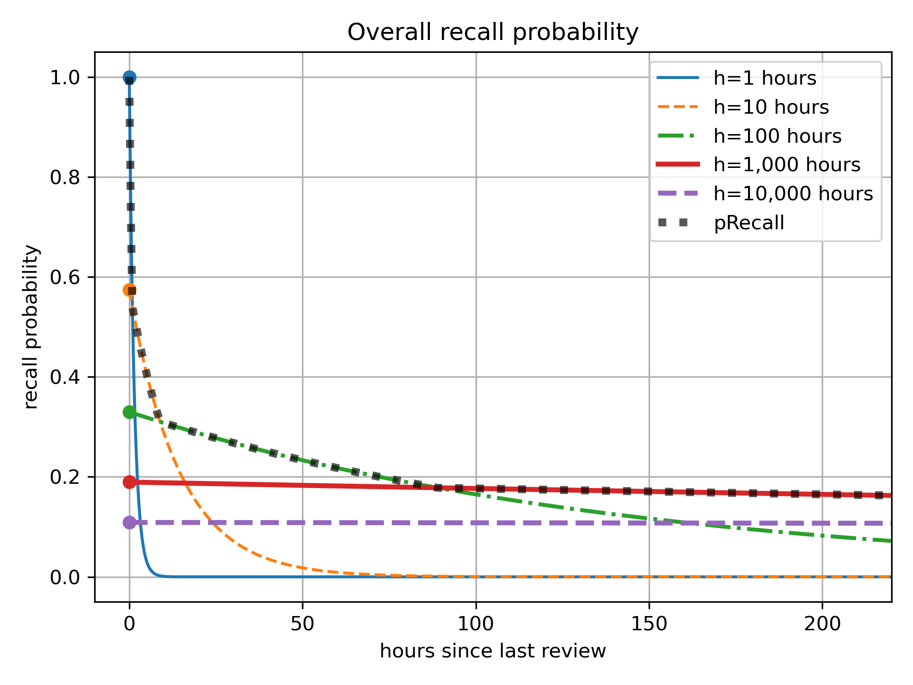
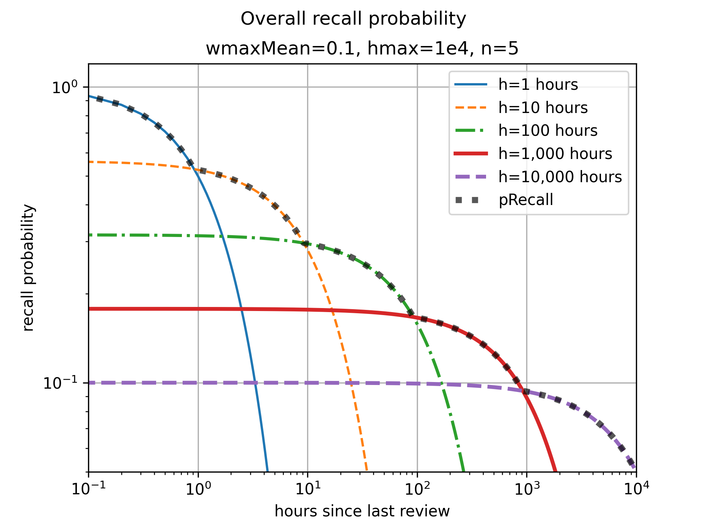

# Ebisu: intelligent quiz scheduling

- [Ebisu: intelligent quiz scheduling](#ebisu-intelligent-quiz-scheduling)
  - [Introduction](#introduction)
  - [Install](#install)
  - [API quickstart](#api-quickstart)
  - [How it works](#how-it-works)
  - [The Math](#the-math)
    - [Exponential decay](#exponential-decay)
    - [Noisy-binary quizzes](#noisy-binary-quizzes)
    - [Power laws](#power-laws)
    - [Data model](#data-model)
    - [Predict recall probability](#predict-recall-probability)
    - [Update after a quiz](#update-after-a-quiz)
    - [How long till a model reaches some probability?](#how-long-till-a-model-reaches-some-probability)
  - [Source code](#source-code)
  - [Bibliography](#bibliography)
  - [Acknowledgments](#acknowledgments)


## Introduction
- [Literate document](https://fasiha.github.io/ebisu/)
- [GitHub repo](https://github.com/fasiha/ebisu)
- [PyPI package](https://pypi.python.org/pypi/ebisu/)
- [Changelog](https://github.com/fasiha/ebisu/blob/gh-pages/CHANGELOG.md)
- [Contact](https://fasiha.github.io/#contact)

Consider a student memorizing a set of facts.

- Which facts need reviewing?
- How does the student’s performance on a review change the fact’s future review schedule?

Ebisu is an open-source public-domain library that answers these two questions. It is intended to be used by software developers writing quiz apps, and provides a simple API to deal with these two aspects of scheduling quizzes, centered on two functions:
- `predictRecall` gives the current recall probability for a given fact.
- `updateRecall` adjusts the belief about future recall probability given a quiz result.

Behind this simple API, Ebisu is using a simple yet powerful model of forgetting, a model that is founded on Bayesian statistics and sum-of-exponentials (power law) forgetting. Thanks to these probabilistic foundations, Ebisu is able to handle quite a rich variety of quiz types:
- of course you have your binary quizzes, i.e., pass/fail;
- you also have Duolingo-style quizzes where the student got X points out of a maximum of Y points (binomial quizzes);
- you can even customize the probability that the student “passed” the quiz even if they forgot the fact—this is handy for deweighting multiple-choice quizzes, and also for reader apps where the readers can click on words they don’t know (“the dog that didn’t bark”).

So with Ebisu, quiz applications can move away from “daily review piles” caused by less flexible scheduling algorithms. For instance, a student might have only five minutes to study today, so an app using Ebisu can ensure that only the facts most in danger of being forgotten are reviewed. And since every flashcard always has a recall probability at any given time, Ebisu also enables apps to provide an infinite stream of quizzes for students who are cramming. Thus, Ebisu intelligently handles over-reviewing as well as under-reviewing.

Ebisu also has been able to support creative quiz apps that move beyond simple pass/fail flashcards.

So. This document contains both a detailed mathematical description of the underlying algorithm as well as the software API it exports. Separate implementations in other languages are detailed below.

The next sections are installation and an [API Quickstart](#qpi-quickstart). See these if you know you want to use Ebisu in your app.

Then in the [How It Works](#how-it-works) section, I contrast Ebisu to other scheduling algorithms and describe, non-technically, why you should use it.

Then there’s a long [Math](#the-math) section that details Ebisu’s algorithm mathematically. If you like nonlinear-transformed Gamma-distributed random variables, modified Bessel functions of the second kind, and incomplete Gamma functions, this is for you.

> Nerdy details in a nutshell: Ebisu posits that your memory for a flashcard decays according to a power law, which it models with a *sequence* of weighted exponentials with halflives following Gamma random variables. Your probability of recall at any given time is the *maximum* of this array weighted exponentials (what Mozer et al. call “leaky integrators” (see [bibliography](#bibliography))), and which we approximate with a simple arithmetic expression that can be run even in SQL. Next, a *quiz* is treated as Bernoulli, binomial, or a neat “noisy-binary” trial; after the Bayesian update, each halflife’s posterior is moment-matched to the closest Gamma random variable. Based on the strength of the posterior update, the weights for each halflife are updated.

Finally, in the [Source Code](#source-code) section, we describe the software testing done to validate the math, including tests comparing Ebisu’s output to Monte Carlo sampling.

A quick note on history—more information is in the [Changelog](https://github.com/fasiha/ebisu/blob/gh-pages/CHANGELOG.md). This document discusses Ebisu v3, with its Gammas-on-halflives model. Versions 2 and before used a different model (a Beta-on-recall-probability) which didn’t capture the fact that memory is *strengthened* by review—it just viewed future recall probability as an *unknown but static* quantity, leading to pessimistic predictions of recall probability. If you are interested, see the [Changelog](https://github.com/fasiha/ebisu/blob/gh-pages/CHANGELOG.md) for details and a migration guide.

## Install
```sh
python -m pip install ebisu
```

## API quickstart
> This is intended to be a quick refresher for those already familiar with the Ebisu API. If it doesn't make sense, jump to the full [API](#api-and-math) section!

**Step 0.** `import ebisu`

**Step 1.** Create an Ebisu `Model` for each flashcard when a student learns it:
```py
def initModel(
    halflife: float,  # hours
    finalHalflife=1e5,  # hours
    n: int = 10,
    weightsHalflifeGammas: Optional[list[tuple[float, HalflifeGamma]]] = None,
    now: Optional[float] = None,  # totally separate
) -> Model
```
If you want to do the minimal amount of work to create a model, just provide `halflife` in hours. This is your best guess of how long it will take for this flashcard’s memory to decay to 50% (the “half” in “halflife”).

This will create a sequence of `n=10` decaying exponentials (“leaky integrators” in Mozer et al.’s terminology) whose halflives are Gamma random variables. The means of these Gammas are logarithmically-spaced from some fraction of `halflife` to `finalHalflife` of 1e5 hours (more than 11 years), and their standard deviations are some proportion of the mean. This will also assign each of these Gamma random variables a weight that logarithmically-decreases from 1.0 such that the overall probability of recall has your provided `halflife`.

If you dislike any of the above defaults, you can tune them using the keyword arguments, or, for total control, pass in `weightsHalflifeGammas`, a list of tuples containing each leaky integrator’s weight and `HalflifeGamma` (a tuple of `alpha, beta` parameters of each Gamma random variable).

`now` is when this fact was learned (milliseconds in the Unix epoch, midnight UTC on 1 January, 1970). If you don’t provide it, the current timestamp is used.

**Step 2.** Find the `Model` with the lowest recall probability. You can do this in SQL (see below!) or use:
```py
def predictRecall(
    model: Model,
    now: Optional[float] = None,
    logDomain=True,
) -> float
```
`now` is again milliseconds since the Unix epoch started. If omitted, the current timestamp is used. By default this returns the *log* of the recall probability (from -∞ to 0, higher is more likely to recall). If you pass in `logDomain=False`, we will call `exp2` at the end to give you linear probability from 0 to 1. We keep the calculations in the log-domain to avoid numerical issues and by default give you the log-probability only because `exp2` (and in general powers of any base) are slow on most CPUs compared to arithmetic.

**Step 3.** After you show the student a flashcard and grade their answer, update the `Model`:
```py
def updateRecall(
    model: Model,
    successes: Union[float, int],
    total: int = 1,
    q0: Optional[float] = None,
    now: Optional[float] = None,
) -> Model
```
This is a pure function: the input `Model` is left untouched, so you can replace it with the returned `Model`. It supports two quiz modes:
- a binary/binomial quiz is denoted by integer `successes` (points received) out of `total` points possible. 
- A noisy-binary quiz is implied by `total=1` and uses `0 < successes < 1`, a float and optionally `q0` to specify its parameters.

`now` is as before milliseconds in the Unix epoch.

**Bonus** It can be useful to know when a `Model`’s memory will decay to some probability:
```py
def hoursForRecallDecay(model: Model, percentile=0.5) -> float
```
With the default `percentile=0.5`, the returned value corresponds to the halflife (in hours).

## How it works

There are many flashcard scheduling schemes, e.g.,

- [Anki](https://apps.ankiweb.net/), an open-source Python flashcard app (and a closed-source mobile app),
- the [SuperMemo](https://www.supermemo.com/help/smalg.htm) family of algorithms ([Anki’s](https://faqs.ankiweb.net/what-spaced-repetition-algorithm.html) is a derivative of SM-2),
- [Memrise.com](https://www.memrise.com), a closed-source webapp,
- [Duolingo](https://www.duolingo.com/) has published a [blog entry](http://making.duolingo.com/how-we-learn-how-you-learn) and a [conference paper/code repo](https://github.com/duolingo/halflife-regression) on their half-life regression technique,
- the Leitner and Pimsleur spacing schemes (also discussed in some length in Duolingo’s paper).
- Also worth noting is Michael Mozer’s team’s Bayesian multiscale models, specifically Mozer et al. (2009) and, by the same team, Lindsey et al. (2014) (see [bibliography](#bibliography)).

Memory research began with Hermann Ebbinghaus’ discovery of the [forgetting curve](https://en.wikipedia.org/w/index.php?title=Forgetting_curve&oldid=766120598#History), published in 1885, when he was thirty-five. He [memorized random](https://en.wikipedia.org/w/index.php?title=Hermann_Ebbinghaus&oldid=773908952#Research_on_memory) consonant–vowel–consonant trigrams (‘PED’, e.g.) and found, among other things, that his recall decayed logarithmically. More recent research has shown, apparently conclusively, that *forgetting* follows a power law decay.

Anki and SuperMemo are extremely popular flashcard apps. They use carefully-tuned mechanical rules to schedule a fact’s future review immediately after its current review. The rules can get complicated—I wrote a little [field guide](https://gist.github.com/fasiha/31ce46c36371ff57fdbc1254af424174) to Anki’s, with links to the source code—since they are optimized to minimize daily review time while maximizing retention. However, because each fact has simply a date of next review, these algorithms do not gracefully accommodate over- or under-reviewing. Even when used as prescribed, they can schedule many facts for review on one day but few on others. (I must note that all three of these issues—over-reviewing (cramming), under-reviewing, and lumpy reviews—have well-supported solutions in Anki by tweaking the rules and third-party plugins.)

Duolingo’s half-life regression explicitly models the probability of you recalling a fact as an exponential, $2^{-Δ/h}$ where Δ is the time since your last review and $h$ is a *half-life*. In this model, your chances of passing a quiz after $h$ days is 50%, which drops to 25% after $2 h$ days, and so on. They estimate this half-life by combining your past performance and fact metadata in a large-scale machine learning technique called half-life regression (a variant of logistic regression or beta regression, more tuned to this forgetting curve). With each fact associated with a half-life, they can predict the likelihood of forgetting a fact if a quiz was given right now. The results of that quiz (for whichever fact was chosen to review) are used to update that fact’s half-life by re-running the machine learning process with the results from the latest quizzes.

The Mozer group’s algorithms (MCM (their 2009 paper) and DASH (their 2014 paper; see [bibliography](#bibliography))) also curve-fit a large quantity of quiz data to high-dimensional models, including, in DASH’s case, a hierarchical Bayesian model that takes into account inter-fact and inter-student variability.

Like Duolingo and Mozer et al., Ebisu explicitly tracks a forgetting curve for each flashcard, enabling it to sort a list of flashcards from most to least likely to be forgotten. However, Ebisu formulates the problem very differently—while memory is understood to decay according to a specific formula, Ebisu posits *probability distributions* on the halflives governing this decay and uses quiz results to update its beliefs about those halflives in a fully Bayesian way. These updates, while a bit more computationally-burdensome than Anki’s scheduler, are much lighter-weight than Duolingo’s industrial-strength approach.

Being Bayesian grants Ebisu some really useful features:
1. Quiz app authors can encode quite specific beliefs about their students’ initial memory of a flashcard. If you have a reason to believe that vocabulary item A is much more easy to learn than item B, you can specify that exactly and quantitatively.
2. You can *always* ask, “what is the expected recall probability of this fact”. Therefore you can *always* sort a set of flashcards from most likely to be forgotten to least likely.
3. Being Bayesian lets us support a rich variety of quizzes fully analytically: 
    - binary quizzes—pass/fail,
    - binomial quizzes—e.g., three points out of four,
    - even exotic noisy-binary quizzes that let you fully specify the odds of the student “passing” the quiz when they actually don’t know the answer (handy for deweighting multiple-choice vs. active recall, as well as for reader apps described above).

Note that Ebisu treats each flashcard’s memory as independent of the others. It can’t handle flashcard correlation or interference, alas, so you have to handle this in your application.

The hope is that Ebisu can be used by flashcard apps that continue to unleash the true potential of personalized learning and spaced reptition practice. 

Now let’s jump into a more formal description of the mathematics and the resultant Ebisu Python API.

## The Math
### Exponential decay
While much psychological literature has identified that forgetting follows power-law decay (e.g., probability of recall $t$ time units after last review $p(t) = (t+1)^{-α}$ for some positive shape parameter $α$), we start by discussing a simpler case, exponential decay, because we will use a string of exponentially-decaying functions to approximate a power law.

So let’s imagine a flashcard with halflife in hours $h ∼ \mathrm{Gamma}(α, β)$, that is, a Gamma random variable with known parameters $α$ and $β$.

This flashcard’s probability of recall after $t$ hours since last encountering it is
$$p(t) = 2^{-t/h}.$$
At the halflife, the recall probability $p(h) = 0.5$ has decayed to half-strength. At twice the halflife, $p(2 h) = 0.25$, and so on.

For any given time elapsed $t$, we can compute the expected value of this recall probability via the law of the unconscious statistician ([LOTUS](https://en.wikipedia.org/wiki/Law_of_the_unconscious_statistician)), whereby for random variable $X$, $E[g(X)] = ∫_{-∞}^∞ g(x) f_X(x) \,\mathrm{d}x$, that is, the expectation of a function ($g$) of a random variable involves integrating that function and the random variable’s density ($f_X$). In our case we use the Gamma’s density:
$$
E\left[p(t) = 2^{-t/h}\right] = \frac{β^α}{Γ(α)}  ∫_0^∞ 2^{-t/h} h^{α - 1} e^{β h} \,\mathrm{d}h.
$$
This is not as ferocious as it first looks. Since $2^x = e^{x \log 2}$ (where $\log$ is the natural log, with base $e$), we can absorb terms, and then let <a name="sympy-integral"></a>Sympy do all the heavy lifting: it turns out that for positive constants $a$, $b$, and $c$,
$$
  ∫_0^∞ h^{a - 1} e^{-b h - c / h} \,\mathrm{d}h = 2 \left(\frac{c}{b}\right)^{a/2} K_{a}(2\sqrt{b c}).
$$
$K_ν(z)$ here is the modified Bessel function of the second kind with order $ν$ (lol which is Greek letter “nu”) and argument $z$. Frankly, I don’t know much about this function but [Scipy](https://docs.scipy.org/doc/scipy/reference/generated/scipy.special.kv.html) provides it—lucky!

> For completeness, note that when $c=0$ (which can happen in our application when the time elapsed since last quiz is $t=0$), there’s a simpler solution. The integrand is just the Gamma distribution’s density, so $∫_0^∞ h^{a-1} e^{-b h} \,\mathrm{d}h = b^{-a}Γ(a)$, i.e., the reciprocal of the normalizing constant in the Gamma density.

Therefore, we have
$$
  E\left[p(t) \right] = \frac{2 β^α}{Γ(α)} \left(\frac{t \log 2}{β}\right)^{α/2} K_{α}(2\sqrt{β t \log 2}),
$$
which could be simplified a bit more but I’ll leave it like this because it uses the result of the Sympy integral above, which we’ll have occasion to invoke later.

Nota bene, Ebisu doesn’t actually use this expectation anywhere since it never has a single Gamma-distributed halflife (only a series of them). I’ve belabored this derivation mainly because it introduces some results we’ll use next—quizzes.

So. Suppose at time $t$ hours since last review, we obtain a  binomial quiz:
$$k|h ∼ \mathrm{Binomial}(n, p(t) = 2^{-t/h})$$
In words: the student got $k$ points out of $n$ total where each point was independent and had probability $p(t)$. (For $n=1$ of course the binomial trial simplifies to a Bernoulli trial, i.e., a binary quiz.)

What is the posterior, $P(h | k)$? By Bayes, we have
$$P(h|k) = \frac{P(k|h) P(h)}{\int_0^∞ P(k|h) P(h) \,\mathrm{d}h}$$
In words: the posterior is proportional to the likelihood $P(k|h)$ (the binomial distribution’s probability mass function) scaled by the prior $P(h)$ (the Gamma distribution’s probability density function), normalized by a constant to ensure everything sums to 1.

We can rewrite things in terms of base $e$ to consolidate. Since $2^x = e^{(\log 2) x}$, where $\log(⋅)$ denotes natural log (base $e$), the numerator
$$
\begin{split}
P(k|h)P(h) &∝ \left(e^{-(\log 2)  t/h}\right)^k \left(1-e^{-(\log 2) t/h}\right)^{n-k} h^{α - 1} e^{-β h}
\\
  &∝ \left(1-e^{-(\log 2) t/h}\right)^{n-k} h^{α - 1} e^{-β h - k(\log 2) t/h}.
\end{split}
$$
Recall the “$∝$” symbol is “proportional to”, and it lets us drop constants that will cancel out anyway when we normalize by the denominator above.

This is the form of the posterior $P(h|k)$, and we will eventually want to compute the moments of this (its mean and variance) in order to moment-match to a new Gamma random variable and treat that as the *new* prior for the *next* quiz. To get there, let’s define a series of useful constants: for integer $N≥0$,
$$
m_N = ∫_0^∞ h^N ⋅  \left(1-e^{-(\log 2) t/h}\right)^{n-k} h^{α - 1} e^{-β h - k(\log 2) t/h} \,\mathrm{d}h.
$$
(Note how $m_0$ is simply equal to the normalizing denominator of the overall posterior, hint hint.) Despite appearing fearsome, this is actually close to being manageable. The major annoyance is that $(1-e^{-(\log 2)t/h})^{n-k}$ term. We can simplify that via the [binomial theorem](https://en.wikipedia.org/w/index.php?title=Binomial_theorem&oldid=944317290#Theorem_statement): in general,
$$
  ∫_0^∞ f(x) (1-g(x))^n \, \mathrm{d}x = \sum_{i=0}^{n} \left[ (-1)^i \binom{n}{i} ∫_0^∞ g(x)^i ⋅ f(x) \, \mathrm{d}x \right],
$$
that is, we can replace the polynomial with a sum:
$$
m_N = ∑_{i=0}^{n-k} \left[
  (-1)^i \binom{n-k}{i}
  ∫_0^∞ h^{α + N - 1} e^{-β h - (k-i)(\log 2) t / h} \,\mathrm{d}h
\right].
$$
Note that the inner integral is in the same form as the one we solved with Sympy [above](#sympy-integral), for the expected probability of recall. So the constant is
$$m_N = ∑_{i=0}^{n-k}
  (-1)^i \binom{n-k}{i}
  2 \left(\frac{(k-i)(\log 2) t}{β}\right)^{(α+N)/2} K_{α+N}(2\sqrt{β  (k-i)(\log 2) t})
.$$
This is… good! I promise! We’ll see later how this is implemented quite carefully in Python using `gammaln` and `kve` and `logsumexp` to maintain numerical accuracy but for now note how this is really useful because the moments of the posterior $P(h|k)$ follow very straightforwardly from the way we’ve constructed $m_N$. The mean
$$E[h|k] = μ = \frac{1}{m_0} ∫_0^∞ h \left(1-e^{-(\log 2) t/h}\right)^{n-k} h^{α - 1} e^{-β h - k(\log 2) t/h}$$
is simply $μ = \frac{m_1}{m_0}$. The second non-central moment $E[(h|k)^2] = \frac{m2}{m_0}$, so the variance is $σ^2 = m_2/m_0 - μ^2$.

With the mean and variance of the posterior $h|k$ in place, we can moment-match to a Gamma random variable with the same mean and variance: that is, with
- $α' = μ^2/ σ^2$ for mean $μ$ and variance $σ^2$ as above, and
- $β' = μ / σ^2$,

$\mathrm{Gamma}(α', β')$ is a reasonable approximation for the true posterior halflife.

Let’s stop and take stock of where we are and how we got here.
1. We began with a prior on the halflife of a fact: in hours, $h ∼ \mathrm{Gamma}(α, β)$ for known parameters $α$ and $β$.
2. After $t$ hours since last seeing this fact, the student underwent a quiz and got $k$ points out of a possible $n$. We treated this as a binomial trial with underlying probability $2^{-t/h}$.
3. We went through the Bayesian machinery to obtain the moments of the posterior $h | k$, that is, our new belief about the distribution of the fact’s halflife in light of the quiz.
4. With those moments, we created a new distribution $\mathrm{Gamma}(α', β')$ which matches the true posterior in mean and variance. We can now return to step 1!

Let’s take a quick detour and look at how to handle the other quiz type Ebisu supports—the noisy-binary quiz—before seeing how to use this exponential decay to construct power-law decay.

### Noisy-binary quizzes
Can we imagine a quiz type where the student could score 0 or 1 point (out of max 1) but also somewhere in between? As luck would have it, Stack Exchange user [@mef](https://stats.stackexchange.com/a/419320) has invented a lovely way to model this and it is quite useful in capturing some advanced quiz types.

Let $x ∼ \mathrm{Bernoulli}(p(t))$ be a “true” Bernoulli draw representing the answer to the question, “does the student *really* know this fact?” ($p(t)=2^{-t/h}$ here is the same exponential recall probability as before.)

But this random variable is hidden from us: we don’t observe $x$. Rather, we observe a quiz, a “noisy report”, $z|x ∼ \mathrm{Bernoulli}(q_x)$ where
- $q_1 = P(z = 1 | x = 1)$, that is, the probability of us observing a successful quiz when the student *really* knows the fact, while
- $q_0 = P(z = 1 | x = 0)$, i.e., the probability of us observing a successful quiz when the student has in fact forgotten the fact.

In signal processing terms, the true but hidden result $x$ goes through a noisy channel, which might flip the bit, and what we observe is the output of that channel, $z$.

In the plain binary case without fuzziness, $q_1 = 1$ and $q_0 = 0$, but in the soft-binary case, these two parameters are independent and free for you to specify as any numbers between 0 and 1 inclusive.

Given $h∼\mathrm{Gamma}(α, β)$ and known $α$, $β$, $q_1$, and $q_0$, we can ask what the posterior $h | z$ is, we can use the fact that the likelihood
$$
\begin{split}
P(z|h) &= P(z|x) ⋅ P(x|h)
  \\
  &= \mathrm{Bernoulli}(z; q_x) ⋅ \mathrm{Bernoulli}\left(x; p(t)=2^{-t/h}\right).
\end{split}
$$
Then, as before,
$$
P(h|z) = \frac{P(z|h)P(h)}{∫_0^∞ P(z|h)P(h) \,\mathrm{d}h},
$$
and this time we can break things up into the two cases, where $z=1$ vs $z=0$:
$$
P(z|h)P(h) ∝  \begin{cases}
   h^{α - 1} e^{-β h} \left( (q_1 - q_0)e^{-(\log2) t / h} + q_0\right) &\text{if } z=1 \\
   h^{α - 1} e^{-β h} \left( (q_0 - q_1)e^{-(\log2) t / h} + (1-q_0)\right) &\text{if } z=0
\end{cases}
$$
As before, we can define a sequence of pseudo-moments $m_N$ for integer $N≥0$ for the noisy-binary case—the calculus we derived for the binomial quiz case above helps us immensely and we just give the result here:
$$
m_N = 2 \left(\frac{(\log 2) t}{β}\right)^{(α+N)/2} K_{α+N}(2\sqrt{β(\log 2) t}) ⋅ r_z + s_z \frac{Γ(α+N)}{β^{α + N}}
$$
for constants
$$
r_z = \begin{cases}
q_1 - q_0 &\text{if } z=1 \\
q_0 - q_1 &\text{if } z=0
\end{cases}
$$
and
$$
s_z = \begin{cases}
  q_0 &\text{if } z=1 \\
1-q_0 &\text{if } z=0.
\end{cases}
$$
(You can verify that these simplify to the binary quiz case, i.e., the binomial $n=1$ case, for $q_0=0$ and $q_1=1$!)

The rest is the same as before, from the binomial quiz case. The mean (the first moment) of the posterior $E[h|z]=μ=\frac{m_1}{m_0}$ while the second non-central moment is $E[(h|z)^2]=\frac{m_2}{m_0}$, yielding a variance that is $σ^2 = \frac{m_2}{m_0} - μ^2$. This mean and variance can again be moment-matched to a new $\mathrm{Gamma}(α' =  μ^2/ σ^2, β' = μ / σ^2)$.

We should note here that both $q_1 = P(z = 1 | x = 1)$ and $q_0 = P(z = 1 | x = 0)$ are *free* parameters, and apps have total flexibility in specifying these. In Ebisu’s API presented [above](#api-quickstart) (step 3), both $z$ and $q_1$ are encoded without loss of generality in `0 <= successes <= 1`:
- $z=1$ if `successes > 0`, otherwise $z=0$.
- $q_1$ is `max(successes, 1 - successes)`.

Therefore if `successes = 0.1`, then we know $z=0$ and $q_1 = 0.9$.

$q_0$ is provided in a keyword argument and for the sake of developer experience, $q_0=1-q_1$ is picked as a default when none is provided.

> While this choice for the default $q_0$ is ad hoc, it does have the nice property that `successes` between 0 and 1 will smoothly and symmetrically (around 0.5) scale the posterior halflife between the binary fail/pass cases. Also, as a satisfying bonus, a *totally* uninformative quiz with  `successes = 0.5` results in *no change* to the prior, i.e., $α' = α$ and $β' = β$!

### Power laws
So we’ve derived the mathematical specifics of two quiz styles for the *exponential* forgetting model, where our beliefs about the halflife of a fact $h$ are converted to recall probabilities via $p(t) = 2^{-t/h}$, even though considerable research has shown forgetting is a power-law phenomenon. In this section, we will show how a staggered sequence of exponentials leads us to the power law we’d like to govern Ebisu recall.

To set the stage first—recall that exponential decay, where the time factor $t$ is in the exponent, is truly *fundamentally* different than power-law decay where $t$ is in the base. $2^{-t}$ decays *incredibly* quickly—you will recall what Einstein apparently said about exponentials being the most powerful force in the universe. After seven halflives, the probability of recall has dropped less than 1%: $2^{-7} = 1/128$. Meanwhile, power laws decay much more slowly: $(t+1)^{-1}$ has the same halflife as $2^{-t}$ (both have decayed to 0.5 at $t=1$) but after seven halflives, the probability of recall for the power law is still $1/8$, i.e., 12.5%, an order of magnitude higher than 0.8%!

Mozer et al. in both their 2009 NIPS conference paper and their 2014 <cite>Psychological Science</cite> journal article (see [bibliography](#bibliography)) propose a model recall that uses a *series* of exponentials, which they call a “cascade of leaky integrators”. Here’s what that could look like, for a notional example: we have a sequence of five decaying exponentials whose halflives are logarithmically-spaced from one hour to `1e4` hours (1.4 years), and each exponential is scaled by a exponentially-decreasing weight, from 1.0 down. Here’s a plot of these five weighted exponentials, superimposed on which is a line (thick, dotted, gray) representing the *max* of any of these at any point in time:



At the left-most part of the plot, the first leaky integrator with the shortest time constant (blue solid line) dominates but also very quickly fades away due to the crush of its fast exponential. But as it decays, the second leaky integrator (orange dotted line), with a strictly lower starting value/weight, steps up to keep the recall probability from collapsing. And so on till the last leaky integrator.

Switching the above plot’s x and y scales to log-log gives and zooming out to see more time gives us this:



By taking the *max* of the output of each leaky integrator, we get this *sequence* of bumps, which describe a bumpy power law for times ranging between minutes to 1+ year. A *true* power law would, in a log-log plot such as this, be a straight line for all time—not only is ours bumpy, it’s also flat at either end (horizontal on the left, vertical on the right). At very short intervals, this makes sense—we can’t have probability of recall exceed 1—but for times beyond a year, after we’ve run out of leaky integrators, the probability of recall collapses quickly to zero under the crush of the exponential (Einstein’s most powerful force in the universe and all that).

Nevertheless, this is very encouraging. Instead of probability of recall $p(t) = 2^{-t/h}$ for a *single* unknown halflife which we discussed previously, we can consider 
$$p(t) = \max_{i=1}^{n} \left\lbrace w_i ⋅ 2^{-t/h_i} \right\rbrace$$
for $h_i ∼ \mathrm{Gamma}(α_i, β_i)$. That is, we have $n$ Gamma-distributed random variables with known parameters $(α_i, β_i)$ whose means $μ_i = \frac{α_i}{β_i}$ are logarithmically-spaced between a low and high of our choice (e.g., one hour to `1e4` hours in the plot above).

We also assume that $n$ weights, $w_i$, are known and deterministic—this is a modeling choice to keep Ebisu’s posterior inference lightweight in a manner that seems psychologically plausible. So while we need $w_i ∈ [0, 1]$, we are otherwise quite free in choosing these weights. Mozer et al.’s (2009, see [bibliography](#bibliography)) model proposes exponentially-spaced weights, so we have
$$w_i = (w_n)^{\frac{i-1}{n-1}}$$
for some fixed final weight $w_n$, thereby setting the first weight on our shortest/fastest leaky integrator to 1.

Note that we have assiduously avoided calling our collection of $n$ Gamma random variables a mixture model, because we don’t want the weights to sum to one and we don’t want the overall recall probability to be a weighted-mean of the random variables. The `max` operator is preferable to the classic mixture model because we very much want 


### Data model
```py
def initModel(
    wmaxMean: Optional[float] = None,
    hmin: float = 1,
    hmax: float = 1e5,
    n: int = 10,
    initHlMean: Optional[float] = None,
    now: Optional[float] = None,
) -> Model
```
For each fact in your quiz app, create an Ebisu `Model` via `initModel`. The optional keyword arguments, `wmaxMean`, `hmin`, `hmax`, and `n`, govern the collection of leaky integrators (weighted exponentials) that are at the heart of the Ebisu framework. Let’s describe these in prose before looking at some clarifying plots.

1. There are `n` leaky integrators (decaying exponentials), each with a halflife that’s strictly logarithmically increasing, starting at `hmin` hours (default 1) and ending at `hmax` hours (default `1e5` or roughly 11 years).
2. Each of the `n` leaky integrators also has a weight, indicating its maximum recall probability at time 0. The weights are strictly exponentially decreasing: the first leaky integrator gets a weight of 1 and the `n`th gets `wmaxMean`.

> A bit more formally, let the vector of halflives be `h = np.logspace(np.log10(hmin), np.log10(hmax), n)` where [`np.logspace`](https://numpy.org/doc/stable/reference/generated/numpy.logspace.html) is provided by Numpy. And let each weight be $w_i = \left(w_{max}\right)^{\frac{i-1}{n-1}}$, for the index $i$ running from 1 to `n`. (For reasons that will become clear in a second, the weights are *not* normalized to sum to 1: the `n` leaky integrators do *not* constitute a mixture.)

A single leaky integrator predicts a recall probability $p_i(t) = w_i ⋅ 2^{-t / h_i}$ (here $t$ indicates hours since last review).

Ebisu considers the *max* of each leaky integrator to be this flashcard’s probability of recall:

$p(t) = \max_i(w_i ⋅ 2^{-t / h_i}).$

For example, with `n=5` leaky integrators going from `hmin=1` hour to `hmax=1e4` hours (13.7-ish months), and with the last longest-duration exponential getting a weight of `wmaxMean=0.1`, we have this profile of weights:


Note how first weight above is 1.0 and the last is 0.1 (`wmaxMean`).

The next plot shows each of the five leaky integrators individually as well as the max among them—the thick gray dotted line—which indicates the overall probability of recall:


Note how each of the five leaky integrators start at elapsed time $t=0$ at exactly their weights (logarithmically spaced from 1 to `wmaxMean`, here 0.1), and decay from there.

At the left-most part of the plot, the first leaky integrator with the shortest time constant dominates, but very quickly fades away due to the crush of its fast exponential. As it decays however, the second leaky integrator, with a strictly lower starting value (weight), steps up to keep the recall probability from collapsing. And so on till the last leaky integrator.

Switching the above plot’s x and y scales to log-log gives and zooming out to see more time gives us this:


By taking the *max* of the output of each leaky integrator, we get this *sequence* of bumps which roughly follow the ubiquitous memory *power law*, for times between 6 minutes and 1+ year. A true power law would, in a log-log plot such as this, be a straight line, and as `n` and `hmax` increase, the bumpy thick black dotted line (representing the probability of recall) can be expected to converge to a power law (proof by visualization 🙃).

After the last leaky integrator (i.e., when the time since review exceeds `hmax`), the probability of recall collapses quickly to zero due to the weight of exponential decay (“the most powerful force in the world”). This can be staved off by using higher `hmax`, and this is why the default `hmax=1e5`, i.e., 11.4-ish years.

Sharp-eyed readers will have noticed that when I described the weights as $w_i = \left(w_{max}\right)^{\frac{i-1}{n-1}}$ for \$i$ running from 1 to `n`, I glossed over what $w_max$ really was. Let’s formally nail that down: $w_{max}$ is a Beta-distributed random variable which governs the entire set of weights.

The powers of $w_{max}$ ensure that $w_1=1$ (a constant) and $w_n=w_{max}$ (the Beta-distributed random variable).

You can you can give `initModel` the mean of the finalweight , $E[w_{max}]$, via the `wmaxMean` keyword argument. But given the high odds that you have *no* interest thinking about this strange random variable, but rather you have a *lot* of thoughts on this fact’s *halflife*. Therefore, `initModel` also lets you specify `initHlMean`, your best guess as to this fact’s initial memory halflife, in hours.

> Math note: upfront we just let you specify the *mean* of the final weight $E[w_{max}]$, i.e., `wmaxMean`, and not a full Beta distribution. We will eventually ask you for a full prior on the weights later, when we get quizzes, but don’t use that for just predicting recall. We will discuss this in the next section, on `predictRecall`.
> 
> Math note 2: if you just provide `initHlMean`, we convert this to `wmaxMean` through a quick function minimization (see `hoursForModelDecay` below for how we convert an Ebisu `Model` to the halflife).

`now` is milliseconds since the Unix epoch (midnight UTC, Jan 1, 1970). Provide this to customize when the student learned this fact, otherwise Ebisu will use the current time.

You can serialize this `Model` with the `to_json` method provided by [Dataclasses-JSON](https://github.com/lidatong/dataclasses-json), which also provides its complement, `from_json`. Therefore, this will work:
```py
ebisu.Model.from_json(ebisu.initModel(0.1).to_json())
```

It's expected that apps using Ebisu will save the serialized JSON to a database. The model contains all historic quiz information and numbers describing the probabilistic configuration.

### Predict recall probability
```py
def predictRecall(
    model: Model,
    now: Optional[float] = None,
    logDomain=True,
) -> float
```
This functions answers one of the core questions any flashcard app asks: what fact is most in danger of being forgotten? You give function an Ebisu `Model`, with an optional `now` (milliseconds in the Unix epoch), to get a log-base-2-probability of recall. A higher number implies more likely to recall, and so the lower the number, the more risk of of forgetting.

If you pass in `logDomain=False`, this function will call `exp2` to convert log-base-2-probability (-∞ to 0) to actual probability (0 to 1). (This is not done by default because `exp2`, floating-point power, is actually expensive compared to arithmetic. No, I don’t have an explicit reference. Yes, profiling is important.)

**Nota bene** if you’re storing Ebisu models as JSON in SQL, you might not need this function! The following snippet selects all columns and a new column, called `logPredictRecall`, assuming a SQLite table called `mytable` with Ebisu models in a column called `model_json`:
```sql
SELECT
  t.id,
  t.model_json,
  MAX(
    (
      JSON_EXTRACT(value, '$[0]') - (
        (?) - JSON_EXTRACT(model_json, '$.pred.lastEncounterMs')
      ) / JSON_EXTRACT(value, '$[1]')
    )
  ) AS logPredictRecall
FROM
  mytable t,
  JSON_EACH(JSON_EXTRACT(t.model_json, '$.pred.forSql'))
GROUP BY t.id
```
The placeholder `(?)` is for you to pass in the current timestamp (milliseconds since Unix epoch; in SQLite you can get this via `strftime('%s','now') * 1000`).

As mentioned above in the discussion of `initModel`, we just ask you to specify the mean of $w_{max}$, `wmaxMean` (and just pretend we know the “true values” of the weights even though they’re really random variables) so that the above SQL works—so that the equivalent `predictRecall` function is fast and straightforward to implement.

> More formally, for purposes of predicting recall, Ebisu naively pretends that the expected probability of recall after $t$ hours, $E[p(t)] = E\left[\max_i \left\lbrace w_i ⋅ 2^{-t / h_i} \right\rbrace\right]$, is:
> $E[p(t)] = E\left[\max_i \left\lbrace(w_{max})^{\frac{i-1}{n-1}} ⋅ 2^{-t / h_i} \right\rbrace\right] ≈ \max_i \left\lbrace E[w_i] ⋅ 2^{-t / h_i} \right\rbrace,$
> that is, even though $w_i$ are actually random variables (because $w_{max}$ is Beta-distributed), Ebisu simplifies and approximates the expectation by moving it inside the `max` and power, for computational efficiency and convenience.
> 
> In general, via [Jensen’s inequality](https://en.wikipedia.org/wiki/Jensen's_inequality), $E[f(w_n)] ≠ f(E[w_n])$ when $f$ is nonlinear: you can’t just move the expectation inside a nonlinear function. (An easy way to see this: what’s $E[N^2]$ where $N$ follows a standard Normal (Gaussian) distribution? It’s certainly not $E[N]^2$ which is $0^2$!) However, the approximation is pretty accurate, and we will revisit this in an appendix.
>
> Strictly as a bonus, and not part of the official Ebisu API, this Python module provides `predictRecallBayesian` that accepts a full Bayesian prior in the form of a Beta distribution around $w_{max}$: you can pass in the variance and mean, though both are optional. If you omit the mean, we use the `wmaxMean` you specified in `initModel` (or that Ebisu estimates in `updateRecall` below). If you don’t provide a variance, Ebisu will compute the highest-variance “reasonable” Beta distribution that meets that mean, where “reasonable” means unimodal (α and β both greater than 2):
> ```py
> def predictRecallBayesian(
>     model: Model,
>     wmaxVar: float,
>     now: Optional[float] = None,
> ) -> float
> ```
> As mentioned, in an appendix we’ll evaluate this decision to collapse the variability around the weights to just the mean weights and see that the cost of flouting Jensen’s inequality is not bad.

### Update after a quiz
```py
def updateRecall(
    model: Model,
    successes: Union[float, int],
    total: int = 1,
    q0: Optional[float] = None,
    wmaxPrior: Optional[tuple[float, float]] = None,
    now: Optional[float] = None,
) -> Model
```
The other really important question flashcard apps ask is: “I've done a quiz, now what?” This `updateRecall` function handles this crucial step.

As alluded to in the introduction, Ebisu supports **two** distinct kinds of quizzes.
- With `total>1` you get *binomial* quizzes, meaning out of a `total` number of points the student could have gotten, she got `successes` (both integers). 
- With `total=1` you get *noisy-binary* (or *soft-binary*) quizzes where `0 <= successes <= 1` can be a float. This supports some pretty complex workflows!

§ Example 1. For the bog-standard flashcard review, where you show the student a flashcard and they get it right (or wrong), you can pass in `successes=1` (or `successes=0`), and use the default `total=1`. You get binary quizzes.

§ Example 2. For a Duolingo-style review, where you review the same fact multiple times in a single short quiz session, you provide the number of `successes` and `total>1` (the number of points received versus the maximum number of points, both integers). Ebisu treats this as a binomial quiz. 

> Math note: a binary experiment, formally called a Bernoulli experiment, is just a special case of the binomial experiment. Though the math is different, the numbers come out the same for binary quizzes, whether we use the binomial or the noisy-binary route (see next paragraph). Both also have comparable runtime, but technically Ebisu stores plain binary quizzes as the noisy-binary.

§ Example 3. For more complex apps, where you have deep probabilistic insight into the student’s performance, you can specify noisy-binary quizzes by passing in `total=1` with a float `0 < successes < 1`, and optionally a float `0 <= q0 <= 1`.

In the noisy-binary model, we can separate the actual quiz result (a pass/fail) with whether the student *actually* remembers the fact by specifying two independent numbers:
- `Probability(passed quiz | actually remembers)`, or $q_1$ in the derivation below, is the probability that, assuming the student *actually* remembers the fact, they got the quiz right? This should be 1.0 (100%), especially if your app is nice and lets students change their grade (typos, etc.), but might be less if your app doesn’t allow this. Second, you can specify
- `Probability(passed quiz | actually forgot)`, or $q_0$ that is, given the student actually forgot the fact, what’s the probability they passed the quiz? This might be greater than zero if, for example, you provided multiple-choice quizzes and the student only remembered the answer because they recognized it in the list of choices. Or consider a foreign language reader app where users can read texts and click on words they don’t remember: imagine they read a sentence without clicking on any words—you’d like to be able to model the situation where, if you actually quizzed them on one of the words, they would fail the quiz, but all you know is they didn’t click on a word to see its definition.

In Ebisu, you identify these two values via:
- $q_1$ or `Probability(passed quiz | actually remembers)` is: `max(successes, 1 - successes)`. I.e., if `successes=0.9`, then this conditional probability $q_1$ is 0.9 and you are indicating that the student passed the quiz. If `successes=0.1`, $q_1=0.9$ still and you’re indicating the student failed this review.
- $q_0$ or `Probability(observed pass | real quiz failed)` can be passed in as the `q0` keyword argument. It defaults to the complement of $q_1$, i.e, by default $q_0=1-q_1$. In code, `q0=1 - max(successes, 1 - successes)`.

Let’s revisit that foreign language reader quiz app. The student read a word in a sentence and did *not* click on it to see the definition.
- What should $q_1$ or `Probability(did not ask for definition | they know the word) = successes` be? I would guess 1.0—that is, if they know the word, they would never ask for the definition, so `successes=1.0`. But maybe your quiz is really cool and your student is very conscientious, and they tell you that they weren’t 100% sure, in which case you assign $q_1=0.9$, i.e., `successes=0.9`.
- What should $q_0$, or `Probability(did not ask for definition | they forgot the word)` be? If they actually had forgotten the word, there’s a low but non-zero chance of observing the same behavior (didn’t ask for the definition), so I might pass in `q0=0.1` (10% chance of this).

With `successes`, `total`, and `q0`, Ebisu can handle a rich range of quiz results robustly and quantitatively.

This update function is performs a full Bayesian analysis to estimate a new $w_{max}$, the final leaky integrator’s weight, which therefore governs the weights of all `n` leaky integrators and thus the effective halflife of the memory.

An important part of Bayesian analysis is your prior belief on what values $w_{max}$ takes on, before you’ve looked at any data, before you look at the actual quiz results. You can provide `wmaxPrior`, a 2-tuple $(α, β)$ representing the parameters of the Beta distribution representing your prior for this weight (we follow [Wikipedia](https://en.wikipedia.org/wiki/Beta_distribution)’s definition).

This is optional—if you don’t provide `wmaxPrior`, we will find the highest-variance “reasonable” Beta distribution that implies a halflife equal to the student’s *maximum inter-quiz interval*. “Reasonable” here means a unimodal Beta prior (both $α, β ≥ 2$).

In other words, if you don’t provide a prior (and we imagine very few of you will actually have enough of an opinion on the weights, as abstract and distant a concept that they are), we will pick a prior for you by cheating a tiny bit: we will look at the data but only to find the longest the student has gone between quizzes and assume that’s the mean halflife of the quiz.

In practice, this works well, and follows Lindsey, et al. (see [bibliography](#bibliography)) by applying “a bias that additional study in a given time window helps, but has logarithmically diminishing returns” (2014). (Lindsey, et al., is the same team whose leaky integrator NIPS 2009 paper is the core inspiration for Ebisu.)

If you repeatedly review the same flashcard on a weekly basis, and you call `updateRecall` with `wmaxPrior=None` (the default), Ebisu *will* estimate a posterior $w_{max}$ that implies a *slowly* strenghening memory. You can only convince Ebisu that you *durably* know this fact by showing us you remember it at increasing intervals.

As with other functions above, `updateRecall` also accepts `now`, milliseconds since the Unix epoch.

### How long till a model reaches some probability?
```py
def hoursForRecallDecay(model: Model, percentile=0.5) -> float
```
This is sometimes useful for quizzes that seek to schedule a review in the future when a fact’s memory is expected to have decayed to some probability. This `hoursForRecallDecay`, in converting probability to time (hours), is sort of the inverse of `predictRecall` which converts time (hours) to probability. By default the probability is 0.5, so this function returns the halflife of a `Model`.

That’s it. Four functions in the API.


## Source code

## Bibliography

While most citations are given inline above, this section contains academic papers, to whose PDFs I want to provide multiple links.

Lindsey, R. V., Shroyer, J. D., Pashler, H., & Mozer, M. C. (2014). Improving Students’ Long-Term Knowledge Retention Through Personalized Review. <cite>Psychological Science</cite>, 25(3), 639–647. [DOI](https://doi.org/10.1177/0956797613504302), [academic copy](https://home.cs.colorado.edu/~mozer/Research/Selected%20Publications/reprints/LindseyShroyerPashlerMozer2014Published.pdf), [local copy](./LindseyShroyerPashlerMozer2014Published.pdf). The authors also share some very interesting mathematical details as “Additional Methods” under [Supplemental Material](https://journals.sagepub.com/doi/10.1177/0956797613504302#supplementary-materials) on SagePub.

Michael C. Mozer, Harold Pashler, Nicholas Cepeda, Robert Lindsey, and Ed Vul. 2009. Predicting the optimal spacing of study: a multiscale context model of memory. In <cite>Proceedings of the 22nd International Conference on Neural Information Processing Systems (NIPS'09)</cite>. Curran Associates Inc., Red Hook, NY, USA, 1321–1329. [DOI](https://dl.acm.org/doi/10.5555/2984093.2984242), [academic copy](https://home.cs.colorado.edu/~mozer/Research/Selected%20Publications/reprints/MozerPashlerCepedaLindseyVul2009.pdf), [local copy](./MozerPashlerCepedaLindseyVul2009.pdf).


## Acknowledgments

A huge thank you to [bug reporters and math experts](https://github.com/fasiha/ebisu/issues?utf8=%E2%9C%93&q=is%3Aissue) and [contributors](https://github.com/fasiha/ebisu/graphs/contributors)!

Many thanks to [mxwsn and commenters](https://stats.stackexchange.com/q/273221/31187) as well as [jth](https://stats.stackexchange.com/q/272834/31187) for their advice and patience with my statistical incompetence.

Many thanks also to Drew Benedetti for reviewing this manuscript.

John Otander’s [Modest CSS](http://markdowncss.github.io/modest/) is used to style the Markdown output.
