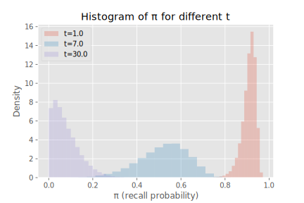
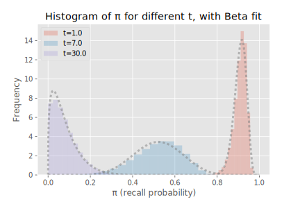

# Ebisu: intelligent quiz scheduling

## Introduction

Given a set of facts that a student is memorizing,

- which facts need reviewing?, and
- how does the student’s performance on a quiz of those facts affect the latter’s future review schedule?

Ebisu is a public-domain library that answers these two questions for developers writing quiz apps.

It aims to provide a simple API to deal with these two aspects of scheduling quizzes.

Under the hood, though, it uses a simple and powerful statistical model of forgetting. It’s recommendations are backed by principled application of Bayesian statistics.

Because of this, Ebisu allows you to ask, at any given moment, “what is the probability that the student has forgotten this fact?”, and it responds with a percentage. Furthermore, Ebisu gives a *confidence interval* around that percentage, giving you an estimate of how sure it is about about its recall score (kind of a “probability about my estimated probability of recall”—meta).

This opens the way for quiz applications to move away from “daily review piles” caused by scheduling algorithms that expect the student to review all the facts scheduled for that day. For instance, a student might have only five minutes to study today—an app using Ebisu can ensure that only the facts most in danger of being forgotten are reviewed. Apps can also provide an infinite stream of quizzes (nightmare!) for students cramming: Ebisu intelligently updates its estimate of memory even when over-reviewing.

Currently, this library comes with a Python implementation, as well as detailed mathematical notes. I plan on porting the algorithm to at least:

- JavaScript, or a compiled-to-JavaScript language, for browsers, and
- PostgreSQL.

This first version was built in Python because of the numerical batteries provided by Scipy, Numpy, PyMC, etc.

## How it works

There are many scheduling schemes, e.g.,

- [Anki](https://apps.ankiweb.net/), an open-source Python flashcard app (and a closed-source mobile app),
- the [SuperMemo](https://www.supermemo.com/help/smalg.htm) family of algorithms ([Anki’s](https://apps.ankiweb.net/docs/manual.html#what-algorithm) is a derivative of SM-2),
- [Memrise.com](https://www.memrise.com), a closed-source webapp,
- [Duolingo](https://www.duolingo.com/), which has published a [blog entry](http://making.duolingo.com/how-we-learn-how-you-learn) and a [conference paper/code repo](https://github.com/duolingo/halflife-regression) on their half-life regression technique,
- the Leitner and Pimsleur spacing schemes (also discussed in some length in Duolingo’s paper).

Many of these are inspired by Hermann Ebbinghaus’ discovery of the [exponential forgetting curve](https://en.wikipedia.org/w/index.php?title=Forgetting_curve&oldid=766120598#History), published in 1885, when he was thirty-five. He [memorized random](https://en.wikipedia.org/w/index.php?title=Hermann_Ebbinghaus&oldid=773908952#Research_on_memory) consonant–vowel–consonant trigrams (‘PED’, e.g.) and found, among other things, that his recall decayed exponentially with some time-constant.

Anki and SuperMemo use carefully-tuned mechanical rules to schedule a fact’s future review immediately after its current review. The rules can get complicated—I wrote a little [field guide](https://gist.github.com/fasiha/31ce46c36371ff57fdbc1254af424174) to Anki’s, with links to the source code—but they are optimized to minimize daily review time while maximizing retention. But because each fact has simply a date of next review, these algorithms do not gracefully accommodate over- or under-reviewing. Even when used as prescribed, they can schedule many facts for review on one day but few on others. (I must note that all three of these issues—over-reviewing (cramming), under-reviewing, and lumpy reviews—have well-supported solutions in Anki: they are tweaks on the rules.)

Duolingo’s half-life regression explicitly models the probability of you recalling a fact as $2^{-Δ/h}$, where Δ is the time since your last review and $h$ is a *half-life*. In this model, your chances of failing a quiz after $h$ days is 50%, which drops to 25% after $2 h$ days. They estimate this half-life by combining your past performance and fact metadata in a machine learning technique called half-life regression (a variant of logistic regression or beta regression, more tuned to this forgetting curve). With each fact associated with a half-life, they can predict the likelihood of forgetting a fact if a quiz was given right now. The results of that quiz (for whichever fact was chosen to review) are used to update that fact’s half-life by re-running the machine learning process with the results from the latest quizzes.

Like Duolingo’s approach, Ebisu can provide a sorted list of facts, from most in danger of being forgotten to least, by explicitly tracking the exponential forgetting curve. However, Ebisu formulates the problem very differently—while memory is understood to decay exponentially, Ebisu posits a *probability distribution* on the half-life and uses quiz results to continually update its beliefs about the half-life in a fully Bayesian way. These updates, while a little more computationally-burdensome than Anki’s scheduler, are much lighter-weight than Duolingo’s industrial-strength approach.

This gives small quiz apps the same intelligent scheduling as Duolingo’s approach—recall probabilities for each fact—but with fast incorporation of quiz results.

> Nerdy details in a nutshell: Ebisu posits a [Beta prior](https://en.wikipedia.org/wiki/Beta_distribution) on recall probabilities. As time passes, the recall probability decays exponentially, and Ebisu handles that nonlinearity exactly and analytically—it evaluates the [Gamma function](http://mathworld.wolfram.com/GammaFunction.html) to predict the current recall probability. A *quiz* is modeled as a Beroulli trial, whose underlying probability prior is this non-conjugate nonlinearly-transformed Beta. Ebisu approximates the true non-standard posterior with a new Beta posterior by matching its mean and variance. This mean and variance are analytically tractable, and again require a few evaluations of the Gamma function.

Currently, Ebisu treats each fact as independent, very much like Ebbinghaus’ nonsense syllables: it does not understand how cards are related the way Duolingo can with its data. However, Ebisu can be used in combination with other techniques to accommodate extra information about relationships between facts.

## This document

This document is a literate program. It contains not only source code (currently only Python; JavaScript/compile-to-JavaScript and PostgreSQL versions are planned), but also an explanation of the statistics and mathematics underlying the algorithm.

Therefore, there are three major parts of this document.

1. A brief “too long; didn’t read” section that helps you get going with the library, with minimum of fuss.
1. The math—if you like Beta-distributed random variables, conjugate priors, and marginalization, you’ll want to read this part. If you don’t, I’ll highlight the formulas that Ebisu actually implements.
1. And finally, the source code itself, annotated and explained. If you want to hack on Ebisu’s code, this is the section for you.


# WIP

The rest of this document is a work-in-progress.


## TL;DR

Setup instructions go here

## The math

Let us begin with the exponential decay forgetting curve. The probability of recall is
$$π = 2^{-t/h},$$
where $t > 0$ denotes time since the last review of a given fact, and $h > 0$ our best guess of the half-life of that fact. Both $t$ and $h$ must be in consistent units (let’s assume days). Notice that $0 ≤ π ≤ 1$.   Immediately after reviewing a fact, when $t = 0$, the probability of recall is 1. A million years after the last review, as $t→∞$, the recall probability goes to 0.

After first teaching a new fact to a student, we can put a probability distribution on the half-life $h$ of this newest fact. We’ll see that it doesn’t at all matter what that distribution is, but for sake of exposition let’s say we believe the half-life $h$ to follow a [Gamma distribution](https://en.wikipedia.org/wiki/Gamma_distribution) with some shape and scale, that is, the random variable
$$H ∼ Gamma(shape, scale).$$
(I’m not even defining variables for those parameters to emphasize that this is hypothetical.)

Let’s say we draw thousands of random samples from this Gamma distribution. We can use the forgetting curve to convert these samples to samples from the distribution that $π$ comes from. $t$ then is the time elapsed since this fact was first taught to the student (or her most-recent review).
```py
import matplotlib.pyplot as plt
plt.style.use('ggplot')
plt.rcParams['svg.fonttype'] = 'none'


def generatePis(t, shape=7.0, scale=1.0):
  import scipy.stats as stats
  h = stats.gamma.rvs(shape, scale, size=50*1000)
  pis = 2 ** (-t / h)
  plt.hist(pis, bins=20, label='t={}'.format(t), alpha=0.25, normed=True)
  return pis

generatePis(1.)
generatePis(7.)
generatePis(30.)
plt.xlabel('π (recall probability)')
plt.ylabel('Density')
plt.title('Histogram of π for different t')
plt.legend(loc=0)
plt.savefig('figures/pis.svg')
plt.show()
```


This plot shows the histograms of $π$, the recall probability, a day and a week and a month after the most recent review. The distributions of $π$ move leftwards, from high recall probabilities to low, as the time increases.

So far so good. This gives us an average recall probability (say, the mean of these samples) and a confidence interval, and can be repeated for all the facts the student has learned.

Now, say we have picked a fact to quiz the student on. We’ll model this as a [Bernoulli experiment](https://en.wikipedia.org/wiki/Bernoulli_distribution), i.e., a coin flip with a weighted coin: let $x ∈ \{0, 1\}$ be the result of the quiz, 1 for pass, 0 for fail, a draw from the random variable
$$X ∼ Bernoulli(π).$$
$π$ itself still follows a histogram like the one above, i.e., it depends on the distribution chosen for the half-life $h$ and the time since last review, $t$.

(The fact that quizzes are Bernoulli experiments is important—that piece of the model holds for everything that follows.)

How can we incorporate the quiz result $x$ on the distribution on recall probability $π$ and therefore the distribution on half-life $h$? Recall that a [Beta distribution](https://en.wikipedia.org/wiki/Beta_distribution) is a conjugate prior for the Bernoulli distribution, i.e.,
- *if* $π ∼ Beta(α, β)$
  - (this is called the *prior* distribution because it’s our belief about the distribution of $π$ before new data comes in),
- then $(π | x) ∼ Beta(α + x, β + 1 - x)$.
  - (This is the *posterior* distribution, since we’ve updated the our beliefs about $π$ with new data $x$.)
  - (Notice that since $x$ is either 0 or 1, $(α + x, β + 1 - x)$ is $(α, β + 1)$ when the quiz was a fail, and $(α + 1, β)$ when it was a pass.)

> **Aside** I realize the folly in explaining what a “prior” and “posterior” are and not explaining how Bayesian statistics works. Sorry. If I can beg off with a few Wikipedia links, this all works because the posterior probability
> $$P(π | x) = \frac{P(x | π) · P(π)}{P(x)}.$$
> We can ignore the denominator since it’s not a function of $π$ and just serves to normalize the numerator, so the numerator sums to 1. Usually we write
> $$P(π | x) ∝ P(x | π) · P(π),$$
> where that “∝” is read “proportional to”, i.e., there is a normalizing constant that we’re omitting.
>
> So when the prior $P(π)$ is a Beta density and the “likelihood” $P(x|π)$ is a Bernoulli density, then the posterior $P(π |x)$ is Beta again. And then as another quiz result comes in, the process is repeated, but your prior/posterior on $π$ remains Beta. That’s what it means to have [conjugate priors](https://en.wikipedia.org/wiki/Conjugate_prior), and they’re a big deal in Bayesian statistics.
>
> (When I was a student, my statistics department had a new course called “Bayesian analysis”. If that’s still a thing, and you can take it, go take it. I fear that, with the acknowledged importance of Bayesian approaches, it’s contents might be distributed among several classes, and not readily available in just one.)

What we could do is to fit a Beta distribution to these histograms of $π$ for different times that we made earlier.
```py
def pisToBeta(pis):
  import scipy.stats as stats
  import numpy as np
  alpha, beta, _, _ = stats.beta.fit(pis, floc=0, fscale=1)
  p = np.linspace(0, 1, num=1000)
  plt.plot(p, stats.beta.pdf(p, alpha, beta), ls='dotted', lw=3, alpha=0.5, color='0.5')


plt.figure()
list(map(pisToBeta, map(generatePis, [1., 7., 30.])))
plt.xlabel('π (recall probability)')
plt.ylabel('Frequency')
plt.title('Histogram of π for different t, with Beta fit')
plt.legend(loc=0)
plt.savefig('figures/pis-betas.svg')
plt.show()
```


Here we’ve done just this. Note that the fits aren’t perfect, nor should they be, since this particular nonlinear function of a Gamma random variable is not Beta-distributed.

Nonetheless, through this approximation we get a conjugate prior for our Bernoulli-distributed quiz result.


## Source code

```py
# export ebisu/__init__.py #
from .ebisu import *
from . import alternate
from . import montecarlo
```

```py
# export ebisu/alternate.py #
import numpy as np

def recallProbabilityMode(alpha, beta, t, tnow):
  """Returns the mode of the immediate (pseudo-Beta) prior"""
  # [peak] [WolframAlpha result](https://www.wolframalpha.com/input/?i=Solve%5B+D%5Bp%5E((a-t)%2Ft)+*+(1-p%5E(1%2Ft))%5E(b-1),+p%5D+%3D%3D+0,+p%5D) for `Solve[ D[p**((a-t)/t) * (1-p**(1/t))**(b-1), p] == 0, p]`
  dt = tnow / t
  pr = lambda p: p**((alpha-dt)/dt) * (1-p**(1/dt))**(beta-1)

  # See [peak]. The actual mode is `modeBase ** dt`, but since `modeBase` might be negative or otherwise invalid, check it.
  modeBase = (alpha - dt) / (alpha + beta - dt - 1)
  if modeBase >= 0 and modeBase <= 1:
    # Still need to confirm this is not a minimum (anti-mode). Do this with a coarse check of other points likely to be the mode.
    mode = modeBase ** dt
    modePr = pr(mode)

    eps = 1e-3
    others = [eps,
              mode - eps if mode > eps else mode / 2,
              mode + eps if mode < 1 - eps else (1 + mode) / 2,
              1 - eps]
    otherPr = map(pr, others)
    if max(otherPr) <= modePr:
      return mode
  # If anti-mode detected, that means one of the edges is the mode, likely caused by a very large or very small `dt`. Just use `dt` to guess which extreme it was pushed to. If `dt` == 1.0, and we get to this point, likely we have malformed alpha/beta (i.e., <1)
  return 0.5 if dt == 1. else (0. if dt > 1 else 1.)

def recallProbabilityMedian(alpha, beta, t, tnow, percentile=0.5):
  """"""
  # [cdf] [WolframAlpha result](https://www.wolframalpha.com/input/?i=Integrate%5Bp%5E((a-t)%2Ft)+*+(1-p%5E(1%2Ft))%5E(b-1)+%2F+t+%2F+Beta%5Ba,b%5D,+p%5D) for `Integrate[p**((a-t)/t) * (1-p**(1/t))**(b-1) / t / Beta[a,b], p]`
  from scipy.optimize import brentq
  from scipy.special import beta as fbeta
  from scipy.special import hyp2f1

  dt = tnow / t

  # See [cdf]. If the mode doesn't exist (or can't be found), find the median (or `percentile`) using a root-finder and the cumulative distribution function.
  # N.B. I prefer to try to find the mode (above) because it will be much faster than this.
  cdfPercentile = lambda p: (p**(alpha/dt) *
                             hyp2f1(alpha, 1 - beta, 1 + alpha, p**(1/dt)) /
                             alpha /
                             fbeta(alpha,beta)) - percentile
  return brentq(cdfPercentile, 0, 1)
#
def recallProbabilityMean(alpha, beta, t, tnow):
  from scipy.special import beta as fbeta
  dt = tnow / t
  return fbeta(alpha + dt, beta) / fbeta(alpha, beta)

def recallProbabilityVar(alpha, beta, t, tnow):
  from scipy.special import beta as fbeta
  dt = tnow / t
  m = recallProbabilityMean(alpha, beta, t, tnow)
  # `Integrate[p^((a - t)/t) * (1 - p^(1/t))^(b - 1) * (p-m)^2, {p, 0, 1}]`
  # FIXME fewer fbeta calls if we combine the expression below with m
  return dt * (m**2 * fbeta(alpha, beta)
             - 2 * m * fbeta(alpha + dt, beta)
             + fbeta(alpha + 2 * dt, beta))

def recallProbabilityMonteCarlo(alpha, beta, t, tnow, N=10000):
  import scipy.stats as stats
  tPrior = stats.beta.rvs(alpha, beta, size=N)
  tnowPrior = tPrior ** (tnow / t)
  freqs, bins = np.histogram(tnowPrior,'auto')
  bincenters = bins[:-1] + np.diff(bins) / 2
  return dict(mean=np.mean(tnowPrior),
              median=np.median(tnowPrior),
              mode=bincenters[freqs.argmax()],
              var=np.var(tnowPrior))

# So we have several ways of evaluating the posterior mean/var:
# - Monte Carlo
# - Quadrature integration
# - Analytic expression, with several hyp2f1
# - Simplified analytic expression with fewer hyp2f1 (recurrence relations)

def posteriorAnalytic(alpha, beta, t, result, tnow):
  from scipy.special import beta as fbeta

  dt = tnow / t
  if result == 1:
    # `Integrate[p^((a - t)/t)*(1 - p^(1/t))^(b - 1)*p, {p,0,1}]`
    marginal = dt * fbeta(alpha+dt, beta)
    # `Integrate[p^((a - t)/t)*(1 - p^(1/t))^(b - 1)*p*p, {p,0,1}]`
    mu = dt * fbeta(alpha + 2*dt, beta) / marginal
    # `Integrate[p^((a - t)/t)*(1 - p^(1/t))^(b - 1)*p*(p - m)^2, {p,0,1}]`
    var = dt * (mu**2 * fbeta(alpha + dt, beta)
              - 2 * mu * fbeta(alpha+ 2*dt, beta)
              + fbeta(alpha+ 3*dt, beta)) / marginal
  else:
    # Mathematica code is same as above, but replace one `p` with `(1-p)`
    # `Integrate[p^((a - t)/t)*(1 - p^(1/t))^(b - 1)*(1-p), {p,0,1}]`
    marginal = dt * (fbeta(alpha, beta) - fbeta(alpha+dt, beta))
    # `Integrate[p^((a - t)/t)*(1 - p^(1/t))^(b - 1)*(1-p)*p, {p,0,1}]`
    mu = dt * (fbeta(alpha + dt, beta) - fbeta(alpha + 2*dt, beta)) / marginal
    # `Integrate[p^((a - t)/t)*(1 - p^(1/t))^(b - 1)*(1-p)*(p - m)^2, {p,0,1}]`
    var = dt * (mu**2 * fbeta(alpha, beta)
              - mu * (2 + mu) * fbeta(alpha+dt, beta)
              + (1 + 2 * mu) * fbeta(alpha+2*dt, beta)
              - fbeta(alpha+3*dt, beta)) / marginal

  newAlpha, newBeta = meanVarToBeta(mu, var)
  return newAlpha, newBeta, tnow


def posteriorQuad(alpha, beta, t, result, tnow, analyticMarginal=True, maxiter=100):
  """Update a time-dependent Beta distribution with a new data sample"""
  from scipy.integrate import quadrature

  dt = tnow / t

  if result == 1:
    marginalInt = lambda p: p**((alpha-dt)/dt) * (1-p**(1/dt))**(beta-1)*p
  else:
    # difference from above: -------------------------------------------^vvvv
    marginalInt = lambda p: p**((alpha-dt)/dt) * (1-p**(1/dt))**(beta-1)*(1-p)

  if analyticMarginal:
    from scipy.special import beta as fbeta
    if result == 1:
      marginal = dt * fbeta(alpha+dt, beta)
    else:
      marginal = dt * (fbeta(alpha, beta) - fbeta(alpha+dt, beta))
  else:
    marginalEst = quadrature(marginalInt, 0, 1, maxiter=maxiter)
    marginal = marginalEst[0]

  muInt = lambda p: marginalInt(p) * p
  muEst = quadrature(muInt, 0, 1, maxiter=maxiter)
  mu = muEst[0] / marginal

  varInt = lambda p: marginalInt(p) * (p - mu)**2
  varEst = quadrature(varInt, 0, 1, maxiter=maxiter)
  var = varEst[0] / marginal

  newAlpha, newBeta = meanVarToBeta(mu, var)
  return newAlpha, newBeta, tnow


def meanVarToBeta(mean, var):
  # [betaFit] https://en.wikipedia.org/w/index.php?title=Beta_distribution&oldid=774237683#Two_unknown_parameters

  tmp = mean * (1 - mean) / var - 1
  alpha = mean * tmp
  beta = (1 - mean) * tmp
  return alpha, beta


def posteriorMonteCarlo(alpha, beta, t, result, tnow, N=10000):
  """Update a time-dependent Beta distribution with a new data sample"""
  # [bernoulliLikelihood] https://en.wikipedia.org/w/index.php?title=Bernoulli_distribution&oldid=769806318#Properties_of_the_Bernoulli_Distribution, third (last) equation
  # [weightedMean] https://en.wikipedia.org/w/index.php?title=Weighted_arithmetic_mean&oldid=770608018#Mathematical_definition
  # [weightedVar] https://en.wikipedia.org/w/index.php?title=Weighted_arithmetic_mean&oldid=770608018#Weighted_sample_variance
  import scipy.stats as stats

  tPrior = stats.beta.rvs(alpha, beta, size=N)

  # To see where this comes from, read the rest of this document!
  tnowPrior = tPrior ** (tnow / t)

  # This is the Bernoulli likelihood [bernoulliLikelihood]
  weights = (tnowPrior)**result * ((1 - tnowPrior)**(1 - result))

  # See [weightedMean]
  weightedMean = np.sum(weights * tnowPrior) / np.sum(weights)
  # See [weightedVar]
  weightedVar = np.sum(weights * (tnowPrior - weightedMean)**2) / np.sum(weights)

  newAlpha, newBeta = meanVarToBeta(weightedMean, weightedVar)

  return newAlpha, newBeta, tnow

def priorToHalflife(alpha, beta, t, percentile=0.5, maxt=100, mint=0):
  from scipy.optimize import brentq
  h = brentq(lambda now: recallProbabilityMean(alpha, beta, t, now) - percentile,
             mint, maxt)
  # `h` is the expected half-life, i.e., the time at which recall probability drops to 0.5.
  # To get the variance about this half-life, we have to convert probability variance (around 0.5) to a time variance. This is a really dumb way to do that:
  # - `v` is the probability variance around 0.5, so `sqrt(v)` is the standard deviation
  # - find the times for which `0.5 +/- sqrt(v)`. This is a kind of one-sigma confidence interval in time
  # - convert these times to a 'time variance' by taking their mean-absolute-distance to `h` and squaring that.
  # Open to suggestions for improving this. The second 'variance' number should not be taken seriously, but it can be used for notional plotting.
  v = recallProbabilityVar(alpha, beta, t, h)
  h2 = brentq(lambda now: recallProbabilityMean(alpha, beta, t, now) - (percentile - np.sqrt(v)),
              mint, maxt)
  h3 = brentq(lambda now: recallProbabilityMean(alpha, beta, t, now) - (percentile + np.sqrt(v)),
              mint, maxt)

  return h, ((np.abs(h2 - h) + np.abs(h3 - h)) / 2)**2

```

```py
import scipy.stats as stats
import matplotlib.pyplot as plt

plt.style.use('ggplot')
plt.rcParams['svg.fonttype'] = 'none'


betaa = 4./3
betab = 4./3

betaa = 12.
betab = 12.

t0 = 7.
dt = 3.3
# dt=.01

print([posteriorMonteCarlo(betaa, betab, t0, 1., t0 * dt, N=100000), posteriorQuad(betaa, betab, t0, 1., t0 * dt, analyticMarginal=True), posteriorQuad(betaa, betab, t0, 1., t0 * dt, analyticMarginal=False), posteriorAnalytic(betaa, betab, t0, 1., t0 * dt)])

print([posteriorMonteCarlo(betaa, betab, t0, 0., t0 * dt, N=100000), posteriorQuad(betaa, betab, t0, 0., t0 * dt, analyticMarginal=True), posteriorQuad(betaa, betab, t0, 0., t0 * dt, analyticMarginal=False), posteriorAnalytic(betaa, betab, t0, 0., t0 * dt)])

print('gamma pass', priorToHalflife(*posteriorAnalytic(betaa, betab, t0, 1., t0 * dt)))
print('gamma fail', priorToHalflife(*posteriorAnalytic(betaa, betab, t0, 0., t0 * dt)))

def priorToHalflifeMonteCarlo(a, b, t, N=10000):
  pis = stats.beta.rvs(a, b, size=N)
  hs = -t / np.log2(pis)
  return np.mean(hs), np.var(hs)


print('MC gamma pass', priorToHalflifeMonteCarlo(*posteriorAnalytic(betaa, betab, t0, 1., t0 * dt)))
print('MC gamma fail', priorToHalflifeMonteCarlo(*posteriorAnalytic(betaa, betab, t0, 0., t0 * dt)))

alls = [recallProbabilityMean(betaa,betab,t0, dt*t0), recallProbabilityMedian(betaa,betab,t0, dt*t0), recallProbabilityMode(betaa,betab,t0, dt*t0), recallProbabilityVar(betaa,betab,t0, dt*t0), recallProbabilityMonteCarlo(betaa,betab,t0, dt*t0)]
alls
print(alls)
# All 2.5 methods above (mode doesn't make sense for PDFs going to infinity) are about equally fast. Which to use?

v2s = lambda var: np.sqrt(var)

ts = np.arange(1, 31.)

plt.close('all')
plt.figure()
ax = plt.subplot(111)
plt.axhline(y=t0, linewidth=1, color='0.5')
[plt.errorbar(ts,
          np.array(list(map(lambda t: priorToHalflife(*posteriorAnalytic(a, a, t0, xobs, t))[0],
                            ts))),
          v2s(np.array(list(map(lambda t: priorToHalflife(*posteriorAnalytic(a, a, t0, xobs, t))[1],
                            ts)))),
          fmt='x-' if xobs == 1 else 'o-',
          color='C{}'.format(aidx),
          label='a=b={}, {}'.format(a, 'pass' if xobs==1 else 'fail'))
 for (aidx, a) in enumerate([3, 6, 12])
 for xobs in [1, 0]]
plt.grid(True)
plt.legend(loc=0)
plt.title('New interval, for old interval={} days'.format(t0))
plt.xlabel('Time test taken (days)')
plt.ylabel('New interval (days)')
plt.savefig('figures/halflife.svg')
plt.savefig('figures/halflife.png',dpi=150)
plt.show()


```

```py

plt.figure();
modelA = posteriorAnalytic(3., 3., 7., 1, 15.)
modelB = posteriorAnalytic(12., 12., 7., 1, 15.)
hlA = priorToHalflife(*modelA)
hlB = priorToHalflife(*modelB)
plt.errorbar(ts,
             recallProbabilityMean(*modelA, ts),
             v2s(recallProbabilityVar(*modelA, ts)),
             fmt='.-', label='Model A', color='C0')
plt.plot(ts, 2**(-ts / hlA[0]), '--', label='approx A', color='C0')
plt.errorbar(ts,
             recallProbabilityMean(*modelB, ts),
             v2s(recallProbabilityVar(*modelB, ts)),
             fmt='.-', label='Model B', color='C1')
plt.plot(ts, 2**(-ts / hlB[0]), '--', label='approx B', color='C1')
plt.legend(loc=0)
plt.ylim([0, 1])
plt.grid(True)
plt.xlabel('Time (days)')
plt.ylabel('Recall probability')
plt.title('Predicted forgetting curves (A: a=b=3, B: a=b=12)')
plt.savefig('figures/forgetting-curve.svg')
plt.savefig('figures/forgetting-curve.png',dpi=150)
plt.show()


```


### Details (😱😪)
```py
import numpy as np
import scipy.stats as stats
import pylab

from pymc3 import Model, Gamma, Bernoulli
from pymc3 import NUTS, sample
from pymc3 import traceplot


t = 3.
xobs = 1.

def unscented(a,b,dt):
  # https://www.mitre.org/sites/default/files/pdf/vanzandt_unscented.pdf
  mean = a/(a+b)
  var = a*b/((a+b)**2*(a+b+1))
  xset = np.array([-1., 1.]) * np.sqrt(var) + mean
  yset = xset**dt
  mean2 = np.mean(yset)
  var2 = np.var(yset)
  a2 = mean2 * (mean2*(1-mean2)/var2 - 1)
  b2 = (1-mean2) * (mean2*(1-mean2)/var2 - 1)
  return a2, b2


def up(pis,t0,t,xobs):
  pis2 = pis ** (t / t0)
  b2, a2, pis3 = piposterior(pis2, xobs)
  return pis2gammaest(pis3, t)

t0 = 7.
betaa = 12.
betab = 12.
betaa = 4.
betab = 4.
pis = stats.beta.rvs(betaa, betab, size=50000)
pis2 = pis ** (t / t0)
_, _, pis3 = piposterior(pis2, xobs)

dt = t/t0
ps = np.linspace(0 + np.spacing(1), 1 - np.spacing(1))

newprior = lambda dt: mkpdf(ps, stats.beta.pdf(ps**(1/dt), betaa-dt+1, betab))
# via wolfram alpha: zeros of derivative of "new prior"
peakpi = lambda dt: ((betaa - dt)/(betaa + betab - dt - 1))**dt
peakpi(3/7.)


[np.mean(pis3), np.var(pis3)]
w = (pis2)**xobs*(1-pis2)**(1-xobs)
foo = [np.sum(w*pis2) / np.sum(w), np.sum(w * (pis2 - foo[0])**2) / np.sum(w)]
foo


stats.beta.fit(w, floc=0,fscale=1)
pylab.close('all')
pylab.figure()
# pylab.hist(pis,20,normed=True,alpha=.25,label='prior');
# pylab.hist(pis2,20,normed=True,alpha=.25,label='new prior');
pylab.hist(pis3,20,range=[0,1.],normed=True,alpha=.25, label='posterior');
pylab.hist(pis2,20,weights=w,range=[0,1.], normed=True,alpha=.25, label='weighted');
pylab.legend(loc=0);
# pylab.hist(w,20,normed=True,alpha=.5);

##
pispost = stats.beta.rvs(betaa+xobs, betab+1-xobs, size=50000)
foo = stats.beta.pdf(pis, betaa+xobs, betab+1-xobs) / stats.beta.pdf(pis, betaa, betab)
pylab.figure()
pylab.hist(pispost,20,normed=True,alpha=.5);
pylab.hist(pis,20,weights=foo,normed=True,alpha=.5);

##


up(pis, t0, t, xobs)
up(pis, t0, 40, 1)
up(pis, t0, 40, 0)
up(pis, t0, .1, 1)

stats.beta.fit(pis, floc=0,fscale=1)
stats.beta.fit(stats.beta.rvs(betaa, betab, size=50000)**(t/t0), floc=0,fscale=1)
stats.beta.fit(stats.beta.rvs(betaa, betab, size=500)**(t/t0), floc=0,fscale=1)
unscented(betaa, betab, t/t0)

pylab.close('all')
pylab.hist(pis2, 50, alpha=0.5,normed=True, range=[0,1.]);
pylab.hist(pis3, 50, alpha=0.33, normed=True, range=[0,1.]);

stats.beta.fit(pis3, floc=0,fscale=1)

# true PDF of posterior, likely not Beta
dt = t/t0
ps = np.linspace(0 + np.spacing(1), 1 - np.spacing(1))

pylab.plot(ps, stats.beta.pdf(ps**(1/dt), betaa, betab) * ps**(1/dt-1)/dt);

from scipy.special import beta
def mkpdf(x,f):
  return f / f.sum() / (x[1]-x[0])

pylab.hist(pis2, 50, alpha=0.5,normed=True, range=[0,1.]);
pylab.hist(pis3, 50, alpha=0.33, normed=True, range=[0,1.]);
# this is the "new" prior
pylab.plot(ps, mkpdf(ps, stats.beta.pdf(ps**(1/dt), betaa, betab) * ps**(1/dt-1)/dt), '.-');
pylab.plot(ps, mkpdf(ps, stats.beta.pdf(ps**(1/dt), betaa-dt+1, betab)),'--');

# this is the posterior, after Bernoulli likelihood
pylab.plot(ps, mkpdf(ps,ps**(xobs + (betaa-dt)/dt) * (1-ps)**(1-xobs) * (1-ps**(1/dt))**(betab-1) / t / beta(betaa, betab)));

post = mkpdf(ps,ps**(xobs + (betaa-dt)/dt) * (1-ps)**(1-xobs) * (1-ps**(1/dt))**(betab-1) / t / beta(betaa, betab))
postbare = ps**(xobs + (betaa-dt)/dt) * (1-ps)**(1-xobs) * (1-ps**(1/dt))**(betab-1)
from numpy.linalg import lstsq

import scipy.linalg as sla
Amat = np.vstack([np.log(ps), np.log(1-ps)]).T
apm1, bpm1 = lstsq(Amat, np.log(post))[0]
ap, bp = apm1 + 1, bpm1 + 1

import scipy.optimize as opt
apo, bpo = opt.leastsq(lambda v: stats.beta.pdf(ps, v[0], v[1]) - post, np.array([10., 3.5]))
apo, bpo
stats.beta.fit(pis3, floc=0,fscale=1)


##

pylab.close('all')
pylab.hist(pis3, 50, alpha=0.33, normed=True, range=[0,1.], label='post beta');
pylab.plot(ps, mkpdf(ps,ps**(xobs + (betaa-dt)/dt) * (1-ps)**(1-xobs) * (1-ps**(1/dt))**(betab-1)), label='true post');
pylab.plot(ps, stats.beta.pdf(ps, ap, bp), label='fit post')
pylab.legend(loc=0)

ts = np.arange(1,40)
success = np.array(list(map(lambda t: up(pis,t0,t,1.), ts)))
fail = np.array(list(map(lambda t: up(pis,t0,t,0.), ts)))
pylab.close('all')
pylab.errorbar(ts, success[:,0], yerr=success[:,1]/3,fmt='x-');
pylab.errorbar(ts, fail[:,0], yerr=fail[:,1]/3,fmt='o-');
pylab.grid(True)

pylab.grid(True)


def anki(i, d=0, m=1., m4=1.3, f=1.3):
  i2 = max(i + 1, (i + d/4) * 1.2 * m)
  i3 = max(i2 + 1, (i + d/2) * (f / 1000) * m)
  i4 = max(i3 + 1, (i + d) * (f / 1000) * m * m4)
  return (i2, i3, i4)

anki(7)
anki(7,-3)
anki(7,3)

def piposterior(priorpis, x):
  betaa, betab, _, _ = stats.beta.fit(priorpis, floc=0, fscale=1)
  betaa2 = betaa + x
  betab2 = betab + 1 - x
  postsamples = stats.beta.rvs(betaa2, betab2, size=hs.size)
  return betaa2, betab2, postsamples


def pis2gammaest(pis, t):
  h2s = -t / np.log2(pis)
  alpha2, _, beta2inv = stats.gamma.fit(h2s, floc=0)
  beta2 = 1 / beta2inv

  uh2, vh2 = (alpha2/beta2, alpha2 / beta2**2)
  return (uh2, np.sqrt(vh2))


pis2gammaest(pis, t0)
pis2gammaest(pis2, t)
pylab.close('all')
pylab.hist(pis,40)
pylab.hist(pis2,40)
pylab.show()


uh = 7. # days (mean)
vh = 4. # days**2 (variance)

beta = uh / vh
alpha = vh * beta**2

assert(np.isclose(uh, alpha / beta))
assert(np.isclose(vh, alpha / beta**2))

hs = stats.gamma.rvs(alpha, scale=1/beta, size=50000)
hs.mean()
hs.var()

def newMeanVar(t):
  π = 2.**(-t/hs)

  betaa, betab, _, _ = stats.beta.fit(π,floc=0,fscale=1)

  betaa2 = betaa + xobs
  betab2 = betab + 1 - xobs

  beta2s = stats.beta.rvs(betaa2, betab2, size=hs.size)
  h2s = -t / np.log2(beta2s)
  alpha2, _, beta2inv = stats.gamma.fit(h2s, floc=0)
  beta2 = 1 / beta2inv

  uh2, vh2 = (alpha2/beta2, alpha2 / beta2**2)
  return (uh2, vh2)

ts = np.arange(1,20)
news = np.array(list(map(newMeanVar, ts)))
pylab.plot(ts,news,'.-')
pylab.grid(True)

pylab.plot(ts,news,'.-')
pylab.grid(True)

betas = stats.beta.rvs(betaa, betab, size=10000)
pylab.close('all')
pylab.hist(π,40)
pylab.hist(betas,40)
pylab.hist(beta2s,40)
pylab.show()


basic_model = Model()
with basic_model:
  h = Gamma('h', alpha, beta)
  pi = 2 ** (-t / h)
  x = Bernoulli('x', pi, observed=xobs)

with basic_model:
  trace = sample(5000)
[trace['h'].mean(), trace['h'].var()]

# [6.6263918353576061, 2.0113573783697993] with vh = 2 & x=0, t=3
# [6.4593888708603382, 3.512451646364334] with vh = 4 & x = 0, t=3
# [7.1920570690327379, 3.7075010758265678] with v=4 & x = 1, t=3
# [7.6331225997896226, 4.0075803038947049] with v=4 & x = 1 & t=12
# [6.7015398215486259, 3.5228654317357759] v=4, x=0, t=12

pylab.ion()
traceplot(trace);

pylab.close('all')
pylab.figure()
pylab.hist(posteriors, bins=100)
pylab.show()

```
## Implementation thoughts

Lua, Erlang, Elixir, Red, F#, OCaml, Reason, PureScript, JS, TypeScript, Rust, …

Postgres (w/ or w/o GraphQL), SQLite, LevelDB, Redis, Lovefield, …
