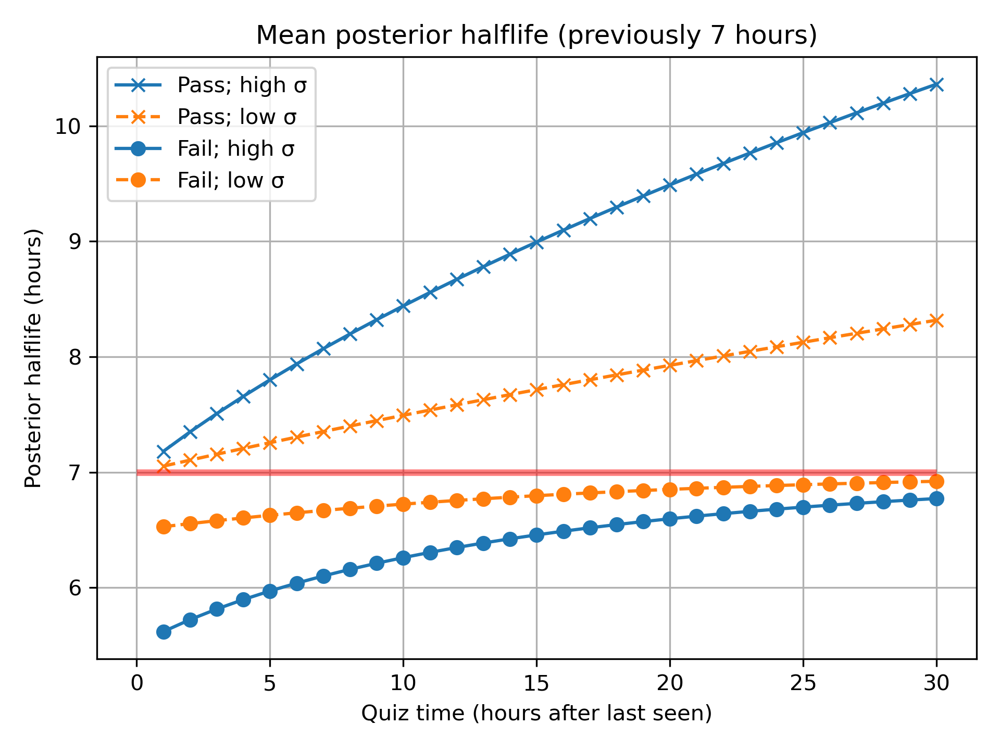
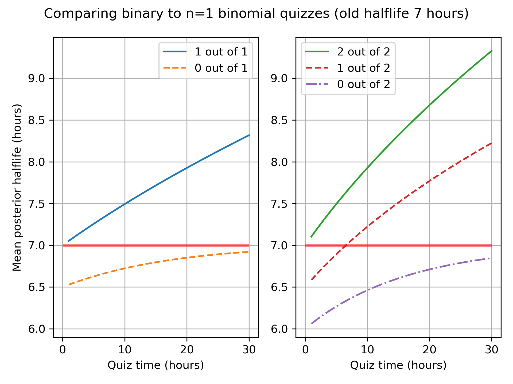
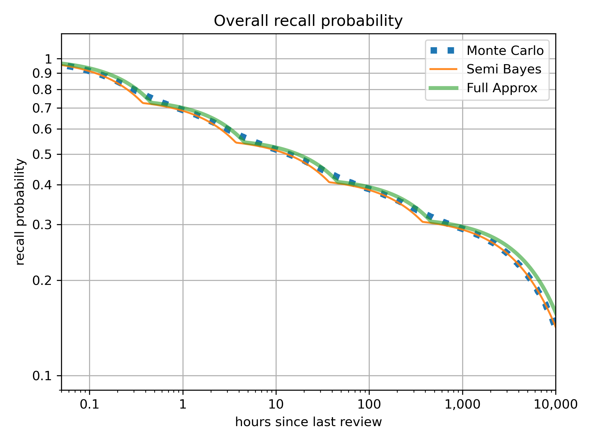

# Ebisu: intelligent quiz scheduling

- [Ebisu: intelligent quiz scheduling](#ebisu-intelligent-quiz-scheduling)
  - [Introduction](#introduction)
  - [Install](#install)
  - [API quickstart](#api-quickstart)
  - [How it works](#how-it-works)
  - [The Math](#the-math)
    - [Exponential decay](#exponential-decay)
    - [Noisy-binary quizzes](#noisy-binary-quizzes)
    - [Power laws](#power-laws)
    - [Leaky integrators: recall probability](#leaky-integrators-recall-probability)
    - [Recall probability in SQL](#recall-probability-in-sql)
    - [Leaky integrators: update recall](#leaky-integrators-update-recall)
  - [Source code](#source-code)
  - [Bibliography](#bibliography)
  - [Acknowledgments](#acknowledgments)


## Introduction
- [Literate document](https://fasiha.github.io/ebisu/)
- [GitHub repo](https://github.com/fasiha/ebisu)
- [PyPI package](https://pypi.python.org/pypi/ebisu/)
- [Changelog](https://github.com/fasiha/ebisu/blob/gh-pages/CHANGELOG.md)
- [Contact](https://fasiha.github.io/#contact)

Consider a student memorizing a set of facts.

- Which facts need to be reviewed?
- How does the student’s performance on a review change the fact’s future review schedule?

Ebisu is an open-source public-domain library that answers these two questions. It is intended to be used by software developers writing quiz apps, and provides a simple API to deal with these two aspects of scheduling quizzes, centered on two functions:
- `predictRecall` gives the recall probability for a given fact *right now* (or at any given timestamp).
- `updateRecall` adjusts the belief about *future* recall given a quiz result.

Behind this simple API, Ebisu is using a simple yet powerful model of forgetting, a model that is founded on Bayesian statistics and series-of-exponentials (power law) forgetting. Thanks to these probabilistic foundations, Ebisu allows quiz applications to move away from “daily review piles” caused by less flexible scheduling algorithms. For instance, a student might have only five minutes to study today—an app using Ebisu can ensure that only the facts most in danger of being forgotten are presented for review. And since every fact always has a recall probability at any given time, Ebisu also enables apps to provide an infinite stream of quizzes for students who are cramming. Thus, Ebisu intelligently handles over-reviewing as well as under-reviewing.

The probabilistic foundation also allows Ebisu to handle quite a rich variety of quiz types:
- of course you have your binary quizzes, i.e., pass/fail;
- you also have Duolingo-style quizzes where the student got X points out of a maximum of Y points (binomial quizzes);
- you can even customize the probability that the student “passed” the quiz even if they forgot the fact—this is handy for deweighting multiple-choice quizzes, or for reader apps where the readers can click on words they don’t know, or not.

In a nutshell, Ebisu has been able to support creative quiz apps with innovative review systems, not just simple pass/fail flashcards.

This document contains both a detailed mathematical description of the underlying algorithm as well as the software API it exports. Separate implementations in other languages are detailed below.

The next sections are installation and an [API Quickstart](#api-quickstart). See these if you know you want to use Ebisu in your app.

Then in the [How It Works](#how-it-works) section, I contrast Ebisu to other scheduling algorithms and describe, non-technically, why you should use it.

Then there’s a long [Math](#the-math) section that details Ebisu’s algorithm mathematically. If you like nonlinear-transformed Gamma-distributed random variables, modified Bessel functions of the second kind, and incomplete Gamma functions, this is for you.

> Nerdy details in a nutshell: Ebisu posits that your memory for a flashcard decays according to a power law, which it models with a *sequence* of weighted exponentials with halflives following Gamma random variables. Your probability of recall at any given time is the *maximum* of this array weighted exponentials (what Mozer et al. call “leaky integrators” (see [bibliography](#bibliography))), and which we approximate with a simple arithmetic expression that can be run even in [SQL](#recall-probability-in-sql). Next, a *quiz* is treated as Bernoulli, binomial, or a neat “noisy-binary” trial; after the Bayesian update, each halflife’s posterior is moment-matched to the closest Gamma random variable. Based on the strength of the posterior update, the weights for each halflife are updated.

Finally, in the [Source Code](#source-code) section, we describe the software testing done to validate the math, including tests comparing Ebisu’s output to Monte Carlo sampling.

A quick note on history. This document discusses Ebisu v3, with its Gammas-on-halflives model. Versions 2 and before used a different model (a Beta-on-recall-probability) which didn’t capture the fact that memory is *strengthened* by review—it just viewed future recall probability as an *unknown but static* quantity, leading to pessimistic predictions of recall probability. If you are interested, see the [Changelog](https://github.com/fasiha/ebisu/blob/gh-pages/CHANGELOG.md) for details and a migration guide.

## Install
```sh
python -m pip install ebisu
```

## API quickstart
**Step 0.** `import ebisu`

**Step 1.** Create an Ebisu `Model` for each flashcard when a student learns it:
```py
def initModel(
    halflife: Optional[float] = None,  # hours
    finalHalflife=1e5,  # hours
    n: int = 10,
    weightsHalflifeGammas: Optional[list[tuple[float, HalflifeGamma]]] = None,
    now: Optional[float] = None,
) -> Model
```
If you want to do the minimal amount of work to create a model, just provide `halflife` in hours. This is your best guess of how long it will take for this flashcard’s memory to decay to 50% (the “half” in “halflife”).

> Mathy details: this will create a sequence of `n=10` decaying exponentials (“leaky integrators” in Mozer et al.’s terminology) whose halflives are Gamma random variables. The means of these Gammas are logarithmically-spaced from some fraction of `halflife` to `finalHalflife` of 1e5 hours (more than 11 years), and their standard deviations are some proportion of the mean. This will also assign each of these Gamma random variables a weight that logarithmically-decreases from 1.0 such that the overall probability of recall has your provided `halflife`.
>
> If you dislike any of the above defaults, you can tune them using the keyword arguments, or, for total control, pass in `weightsHalflifeGammas`, a list of tuples containing each leaky integrator’s weight and `HalflifeGamma` (a tuple of `alpha, beta` parameters of each Gamma random variable).

`now` is when this fact was learned (milliseconds in the Unix epoch, midnight UTC on 1 January, 1970). If you don’t provide it, the current timestamp is used.

**Step 2.** Find the `Model` with the lowest recall probability. You can do this in SQL (see [below](#recall-probability-in-sql)!) or use:
```py
def predictRecall(
    model: Model,
    now: Optional[float] = None,
    logDomain=True,
) -> float
```
`now` is again milliseconds since the Unix epoch started. If omitted, the current timestamp is used. By default this returns the *log* of the recall probability (from -∞ to 0, higher is more likely to recall). If you pass in `logDomain=False`, we will call `exp2` at the end to give you linear probability from 0 to 1. We prefer the log-domain to avoid numerical issues and because floating-point powers like `exp2` are slow on most CPUs compared to arithmetic.

<a name="step-3">**Step 3.**</a> After you show the student a flashcard and grade their answer, update the `Model`:
```py
def updateRecall(
    model: Model,
    successes: Union[float, int],
    total: int = 1,
    q0: Optional[float] = None,
    now: Optional[float] = None,
) -> Model
```
This is a pure function: the input `Model` is left untouched, so you can replace it with the returned `Model`. It supports two quiz modes:
- a binary/binomial quiz is denoted by integer `successes` (points received) out of `total` points possible. 
- A noisy-binary quiz is implied by `total=1` and uses `0 < successes < 1`, a float and optionally `q0` to specify its parameters.

`q0 = P(successful quiz | actually forgot)`, that is, the probability that the quiz was successful given the student actually has actually forgotten the fact. Notionally there exists `q1 = P(successful quiz | actually remembers)`, the probability of successful quiz given the student truly remembers the fact, and is independent of `q0`. But `q1` is taken to be `max(successes, 1 - successes)`. So `successes=0.1` and `successes=0.9` both encode the `q1 = 0.9` case but overall quiz fail and pass, respectively. (See the [math section](#noisy-binary-quizzes) for more details, I know this can be confusing!)

`now` is as before milliseconds in the Unix epoch.

**Bonus** It can be useful to know when a `Model`’s memory will decay to some probability:
```py
def hoursForRecallDecay(model: Model, percentile=0.5) -> float
```
With the default `percentile=0.5`, the returned value corresponds to the halflife (in hours).

## How it works

There are many flashcard scheduling schemes, e.g.,

- [Anki](https://apps.ankiweb.net/), an open-source Python flashcard app (and a closed-source mobile app),
- the [SuperMemo](https://www.supermemo.com/help/smalg.htm) family of algorithms ([Anki’s](https://faqs.ankiweb.net/what-spaced-repetition-algorithm.html) is a derivative of SM-2),
- [Memrise.com](https://www.memrise.com), a closed-source webapp,
- [Duolingo](https://www.duolingo.com/) has published a [blog entry](http://making.duolingo.com/how-we-learn-how-you-learn) and a [conference paper/code repo](https://github.com/duolingo/halflife-regression) on their half-life regression technique,
- the Leitner and Pimsleur spacing schemes (also discussed in some length in Duolingo’s paper).
- Also worth noting is Michael Mozer’s team’s Bayesian multiscale models, specifically Mozer et al. (2009) and, by the same team, Lindsey et al. (2014) (see [bibliography](#bibliography)).

Memory research began with Hermann Ebbinghaus’ discovery of the [forgetting curve](https://en.wikipedia.org/w/index.php?title=Forgetting_curve&oldid=766120598#History), published in 1885, when he was thirty-five. He [memorized random](https://en.wikipedia.org/w/index.php?title=Hermann_Ebbinghaus&oldid=773908952#Research_on_memory) consonant–vowel–consonant trigrams (‘PED’, e.g.) and found, among other things, that his recall decayed logarithmically. More recent research has shown, apparently conclusively, that *forgetting* follows a power law decay.

Anki and SuperMemo are extremely popular flashcard apps. They use carefully-tuned mechanical rules to schedule a fact’s future review immediately after its current review. The rules can get complicated—I wrote a little [field guide](https://gist.github.com/fasiha/31ce46c36371ff57fdbc1254af424174) to Anki’s, with links to the source code—since they are optimized to minimize daily review time while maximizing retention. However, because each fact has simply a date of next review, these algorithms do not gracefully accommodate over- or under-reviewing. Even when used as prescribed, they can schedule many facts for review on one day but few on others. (I must note that all three of these issues—over-reviewing (cramming), under-reviewing, and lumpy reviews—have well-supported solutions in Anki by tweaking the rules and third-party plugins.)

Duolingo’s half-life regression explicitly models the probability of you recalling a fact as an exponential, $2^{-Δ/h}$ where Δ is the time since your last review and $h$ is a *half-life*. In this model, your chances of passing a quiz after $h$ days is 50%, which drops to 25% after $2 h$ days, and so on. They estimate this half-life by combining your past performance and fact metadata in a large-scale machine learning technique called half-life regression (a variant of logistic regression or beta regression, more tuned to this forgetting curve). With each fact associated with a half-life, they can predict the likelihood of forgetting a fact if a quiz was given right now. The results of that quiz (for whichever fact was chosen to review) are used to update that fact’s half-life by re-running the machine learning process with the results from the latest quizzes.

The Mozer group’s algorithms (MCM (their 2009 paper) and DASH (their 2014 paper; see [bibliography](#bibliography))) also curve-fit a large quantity of quiz data to high-dimensional models, including, in DASH’s case, a hierarchical Bayesian model that takes into account inter-fact and inter-student variability.

Like Duolingo and Mozer et al., Ebisu explicitly tracks a forgetting curve for each flashcard, enabling it to sort a list of flashcards from most to least likely to be forgotten. However, Ebisu formulates the problem very differently—while memory is understood to decay according to a specific formula, Ebisu posits *probability distributions* on the halflives governing this decay and uses quiz results to update its beliefs about those halflives in a fully Bayesian way. These updates, while a bit more computationally-burdensome than Anki’s scheduler, are much lighter-weight than Duolingo’s industrial-strength approach.

Being Bayesian grants Ebisu some really useful features:
1. Quiz app authors can encode quite specific beliefs about their students’ initial memory of a flashcard. If you have a reason to believe that vocabulary item A is much more easy to learn than item B, you can specify that exactly and quantitatively.
2. You can *always* ask, “what is the expected recall probability of this fact”. Therefore you can *always* sort a set of flashcards from most likely to be forgotten to least likely.
3. Being Bayesian lets us support a rich variety of quizzes fully analytically: 
    - binary quizzes—pass/fail,
    - binomial quizzes—e.g., three points out of four,
    - even exotic noisy-binary quizzes that let you fully specify the odds of the student “passing” the quiz when they actually don’t know the answer (handy for deweighting multiple-choice vs. active recall, as well as for reader apps described above).

Note that Ebisu treats each flashcard’s memory as independent of the others. It can’t handle flashcard correlation or interference, alas, so you have to handle this in your application.

The hope is that Ebisu can be used by flashcard apps that continue to unleash the true potential of personalized learning and spaced reptition practice. 

Now let’s jump into a more formal description of the mathematics and the resultant Ebisu Python API.

## The Math
### Exponential decay
While much psychological literature has identified that forgetting follows power-law decay (e.g., probability of recall $t$ time units after last review $p(t) = (t+1)^{-α}$ for some positive shape parameter $α$), we start by discussing a simpler case, exponential decay, because we will [eventually](#power-laws) use a string of exponentially-decaying functions to approximate a power law.

So let’s imagine a flashcard with halflife in hours $h ∼ \mathrm{Gamma}(α, β)$, that is, a Gamma random variable with known parameters $α$ and $β$.

This flashcard’s probability of recall after $t$ hours since last encountering it is
$$p(t) = 2^{-t/h}.$$
At the halflife, the recall probability $p(h) = 0.5$ has decayed to half-strength. At twice the halflife, $p(2 h) = 0.25$, and so on.

For any given time elapsed $t$, we can compute the expected value of this recall probability via the law of the unconscious statistician ([LOTUS](https://en.wikipedia.org/wiki/Law_of_the_unconscious_statistician)), whereby for random variable $X$, $E[g(X)] = ∫_{-∞}^∞ g(x) f_X(x) \,\mathrm{d}x$, that is, the expectation of a function ($g$) of a random variable involves integrating that function and the random variable’s density ($f_X$). In our case we use the Gamma’s density:
$$
E\left[p(t) = 2^{-t/h}\right] = \frac{β^α}{Γ(α)}  ∫_0^∞ 2^{-t/h} h^{α - 1} e^{β h} \,\mathrm{d}h.
$$
This is not as ferocious as it first looks. Since $2^x = e^{x \log 2}$ (where $\log$ is the natural log, with base $e$), we can absorb terms, and then let <a name="sympy-integral"></a>Sympy do all the real work: it turns out that for positive constants $a$, $b$, and $c$,
$$
  ∫_0^∞ h^{a - 1} e^{-b h - c / h} \,\mathrm{d}h = 2 \left(\frac{c}{b}\right)^{a/2} K_{a}(2\sqrt{b c}).
$$
$K_ν(z)$ here is the modified Bessel function of the second kind with order $ν$ (lol which is Greek letter “nu”) and argument $z$. Frankly, I don’t know much about this function but [Scipy](https://docs.scipy.org/doc/scipy/reference/generated/scipy.special.kv.html) provides it—lucky!

> For completeness, note that when $c=0$ (which can happen in our application when the time elapsed since last quiz is $t=0$), there’s a simpler solution. The integrand is just the Gamma distribution’s density, so $∫_0^∞ h^{a-1} e^{-b h} \,\mathrm{d}h = b^{-a}Γ(a)$, i.e., the reciprocal of the normalizing constant in the Gamma density.

<a name="expectation-p-recall"></a>Therefore, for $h ∼ \mathrm{Gamma}(α, β)$, we have
$$
  E\left[2^{-t/h} \right] = \frac{2 β^α}{Γ(α)} \left(\frac{t \log 2}{β}\right)^{α/2} K_{α}(2\sqrt{β t \log 2}),
$$
which could be simplified a bit more but I’ll leave it like this because it uses the result of the Sympy integral above, which we’ll have occasion to invoke later.

Nota bene, Ebisu doesn’t actually use this expectation anywhere since it never has a single Gamma-distributed halflife (only a series of them). I’ve belabored this derivation mainly because it introduces some results we’ll use next—quizzes.

So. Suppose at time $t$ hours since last review, we obtain a  binomial quiz:
$$k|h ∼ \mathrm{Binomial}(n, p(t) = 2^{-t/h})$$
In words: the student got $k$ points out of $n$ total where each point was independent and had probability $p(t)$. (For $n=1$ of course the binomial trial simplifies to a Bernoulli trial, i.e., a binary quiz.)

What is the posterior, $P(h | k)$? By Bayes, we have
$$P(h|k) = \frac{P(k|h) P(h)}{\int_0^∞ P(k|h) P(h) \,\mathrm{d}h}$$
In words: the posterior is proportional to the likelihood $P(k|h)$ (the binomial distribution’s probability mass function, PMF) scaled by the prior $P(h)$ (the Gamma distribution’s probability density function, PDF), normalized by a constant to ensure everything sums to 1.

Let’s rewrite things in terms of base $e$ to consolidate. The numerator
$$
\begin{split}
P(k|h)P(h) &∝ \left(e^{-(\log 2)  t/h}\right)^k \left(1-e^{-(\log 2) t/h}\right)^{n-k} h^{α - 1} e^{-β h}
\\
  &∝ \left(1-e^{-(\log 2) t/h}\right)^{n-k} h^{α - 1} e^{-β h - k(\log 2) t/h}.
\end{split}
$$
Recall the “$∝$” symbol is “proportional to”, and it lets us drop constants that will cancel out anyway when we normalize by the denominator above.

This is the form of the posterior $P(h|k)$, and we will eventually want to compute the moments of this (its mean and variance) in order to moment-match to a new Gamma random variable and treat that as the *new* prior for the *next* quiz. To get there, let’s define a series of useful constants: for integer $N≥0$,
$$
m_N = ∫_0^∞ h^N ⋅  \left(1-e^{-(\log 2) t/h}\right)^{n-k} h^{α - 1} e^{-β h - k(\log 2) t/h} \,\mathrm{d}h.
$$
(Note how $m_0$ is simply equal to the normalizing denominator of the overall posterior, hint hint.) Despite appearing fearsome, this is actually close to being manageable. The major annoyance is that $(1-e^{-(\log 2)t/h})^{n-k}$ term. We can simplify that via the [binomial theorem](https://en.wikipedia.org/w/index.php?title=Binomial_theorem&oldid=944317290#Theorem_statement): in general,
$$
  ∫_0^∞ f(x) (1-g(x))^n \, \mathrm{d}x = \sum_{i=0}^{n} \left[ (-1)^i \binom{n}{i} ∫_0^∞ g(x)^i ⋅ f(x) \, \mathrm{d}x \right],
$$
that is, we can replace the polynomial in $m_N$’s integrand with a sum:
$$
m_N = ∑_{i=0}^{n-k} \left[
  (-1)^i \binom{n-k}{i}
  ∫_0^∞ h^{α + N - 1} e^{-β h - (k-i)(\log 2) t / h} \,\mathrm{d}h
\right].
$$
Note that the inner integral is in the same form as the one we solved with Sympy [above](#sympy-integral), for the expected probability of recall. So the constant is
$$m_N = ∑_{i=0}^{n-k}
  (-1)^i \binom{n-k}{i}
  2 \left(\frac{(k-i)(\log 2) t}{β}\right)^{(α+N)/2} K_{α+N}(2\sqrt{β  (k-i)(\log 2) t})
.$$
This is… good! I promise! We’ll see later how this is implemented quite carefully in Python using `gammaln` and `kve` and `logsumexp` to maintain numerical accuracy but for now note how this is really useful because the moments of the posterior $P(h|k)$ follow very straightforwardly from the way we’ve constructed $m_N$. The mean
$$E[h|k] = μ = \frac{1}{m_0} ∫_0^∞ h \left(1-e^{-(\log 2) t/h}\right)^{n-k} h^{α - 1} e^{-β h - k(\log 2) t/h}$$
is simply $μ = \frac{m_1}{m_0}$. The second non-central moment $E[(h|k)^2] = \frac{m2}{m_0}$, so the variance is $σ^2 = m_2/m_0 - μ^2$.

With the mean and variance of the posterior $h|k$ in place, we can moment-match to a Gamma random variable with the same mean and variance: that is, with
- $α' = μ^2/ σ^2$ for mean $μ$ and variance $σ^2$ as above, and
- $β' = μ / σ^2$,

$\mathrm{Gamma}(α', β')$ is a reasonable approximation for the true posterior halflife.

Let’s stop and take stock of where we are and how we got here.
1. We began with a prior on the halflife of a fact: in hours, $h ∼ \mathrm{Gamma}(α, β)$ for known parameters $α$ and $β$.
2. After $t$ hours since last seeing this fact, the student underwent a quiz and got $k$ points out of a possible $n$. We treated $k ∼ \mathrm{Binomial}(k; n, 2^{-t/h})$, as a binomial trial with underlying probability $2^{-t/h}$.
3. We went through the Bayesian machinery to obtain the moments of the posterior $h | k$, that is, our new belief about the distribution of the fact’s halflife in light of the quiz.
4. With those moments, we created a new distribution $\mathrm{Gamma}(α', β')$ which matches the true posterior in mean and variance. We can now return to step 1!

To get some feel for this behavior, consider two models—two Gamma random variables—with the same mean, seven hours. One has standard deviation of 4.5 and the other 10.5 hours—call these the “low σ” and “high σ” models, respectively. Below we see the mean posterior after a binary $n=1$ quiz for a range of times $t$ (hours after last review).<a name="binom-updates-plot"></a>



This shows some nice properties of Ebisu:
- failures strictly reduce the halflife while successes strictly increase it.
- However, a failure far beyond the halflife barely budges the halflife: we expected that quiz to fail, so it isn’t that informative about our belief of the true halflife.
- Similarly, very early successes also only slightly increase the halflife, for the same reason.
- Conversely, early *failures* and late *successes* result in large posterior updates because they are so unexpected.
  - Do note that this isn’t coded up anywhere. This is simply the result of the Bayesian framework doing it’s thing: updating prior beliefs in light of new data.
- The high σ model encodes more uncertainty about the halflife so it gets a far more aggressive update in either direction compared to the low σ model, whose prior is more insistent on the true halflife being seven hours.
  - This too is a crucial aspect of Bayesian methods: your prior is your anchor. If you have strong reasons to believe that a flashcard has a certain halflife, you can encode this in the α and β of the Gamma distribution you pick. If your belief about the true halflife is only vague, this is valuable information too—in this situation, the Bayesian formulation naturally will elevate data over prior.

Compare this binary case to the binomial $n=2$ case, for the low σ model:



The left plot shows the same two lines as the low σ model above. On the right, we show three curves, for $k=2$ to $k=0$.

Only the $k=0$ case, i.e., zero points out of max two, has the property that its posterior mean halflife remains strictly below the prior’s mean (seven hours). And similarly the $k=2$ case’s posterior mean is strictly *above* the prior mean.

For $k=1$, however, the posterior mean is less than or greater than the prior mean, depending on how much time elapsed the quiz and the last encounter with this fact. It’s also bounded between the pass and fail curves of the binary case.

Furthermore, the $k=0$ and $k=2$ cases lead to much more pronounced updates than the binary $n=1$ model’s results on the left. Therefore, the binomial $n>1$ updates might be used by quiz apps to potentially encode “difficulty”. While ad hoc, a “very easy” or “very hard” binary quiz could be encoded as a $k=2$ or $k=0$ binomial trial for $n=2$, respectively.

Now. Let’s take a quick detour to look at how to handle the other quiz type Ebisu supports—the noisy-binary quiz—before seeing how to use this exponential decay to construct power-law decay.

### Noisy-binary quizzes
Can we imagine a quiz type where the student could score 0 or 1 point (out of max 1) but also somewhere in between? As luck would have it, Stack Exchange user [@mef](https://stats.stackexchange.com/a/419320) has invented a lovely way to model this and it is quite useful in capturing some advanced quiz types.

Let $x ∼ \mathrm{Bernoulli}(p(t))$ be a “true” Bernoulli draw representing the answer to the question, “does the student *really* know this fact?” ($p(t)=2^{-t/h}$ here is the same exponential recall probability as before.)

But this random variable is hidden from us: we don’t observe $x$. Rather, we observe a quiz, a “noisy report”, $z|x ∼ \mathrm{Bernoulli}(q_x)$ where
- $q_1 = P(z = 1 | x = 1)$, that is, the probability of us observing a successful quiz when the student *really* knows the fact, while
- $q_0 = P(z = 1 | x = 0)$, i.e., the probability of us observing a successful quiz when the student has in fact forgotten the fact.

In signal processing terms, the true but hidden result $x$ goes through a noisy channel, which might flip the bit, and what we observe is the output of that channel, $z$.

In the plain binary case without fuzziness, $q_1 = 1$ and $q_0 = 0$, but in the soft-binary case, these two parameters are independent and free for you to specify as any numbers between 0 and 1 inclusive.

Given $h∼\mathrm{Gamma}(α, β)$ and known $α$, $β$, $q_1$, and $q_0$, we can ask what the posterior $h | z$ is. We can use the fact that the likelihood is
$$
\begin{split}
P(z|h) &= P(z|x) ⋅ P(x|h)
  \\
  &= \mathrm{Bernoulli}(z; q_x) ⋅ \mathrm{Bernoulli}\left(x; p(t)=2^{-t/h}\right).
\end{split}
$$
Then, as before,
$$
P(h|z) = \frac{P(z|h)P(h)}{∫_0^∞ P(z|h)P(h) \,\mathrm{d}h},
$$
and this time we can break things up into the two cases, where $z=1$ vs $z=0$:
$$
P(z|h)P(h) ∝  \begin{cases}
   h^{α - 1} e^{-β h} \left( (q_1 - q_0)e^{-(\log2) t / h} + q_0\right) &\text{if } z=1 \\
   h^{α - 1} e^{-β h} \left( (q_0 - q_1)e^{-(\log2) t / h} + (1-q_0)\right) &\text{if } z=0
\end{cases}
$$
These expressions are the Gamma density and the expansion of the likelihood $P(z|h)$, a product of two Bernoulli probability mass functions.

As before, we can define a sequence of pseudo-moments $m_N$ for integer $N≥0$ for the noisy-binary case—the calculus we derived for the binomial quiz case above helps us immensely and we just give the result here:
$$
m_N = 2 \left(\frac{(\log 2) t}{β}\right)^{(α+N)/2} K_{α+N}\left(2\sqrt{β(\log 2) t}\right) ⋅ r_z + s_z \frac{Γ(α+N)}{β^{α + N}}
$$
for constants
$$
r_z = \begin{cases}
q_1 - q_0 &\text{if } z=1 \\
q_0 - q_1 &\text{if } z=0
\end{cases}
$$
and
$$
s_z = \begin{cases}
  q_0 &\text{if } z=1 \\
1-q_0 &\text{if } z=0.
\end{cases}
$$
(You can verify that these simplify to the binary quiz case, i.e., the binomial $n=1$ case, for $q_0=0$ and $q_1=1$!)

The rest is the same as before, from the binomial quiz case. The mean (the first moment) of the posterior $E[h|z]=μ=\frac{m_1}{m_0}$ while the second non-central moment is $E[(h|z)^2]=\frac{m_2}{m_0}$, yielding a variance that is $σ^2 = \frac{m_2}{m_0} - μ^2$. This mean and variance can again be moment-matched to a new $\mathrm{Gamma}(α' =  μ^2/ σ^2, β' = μ / σ^2)$.

We should note here that both $q_1 = P(z = 1 | x = 1)$ and $q_0 = P(z = 1 | x = 0)$ are *free* parameters, and apps have total flexibility in specifying these. In Ebisu’s API presented [above](#step-3) (step 3), both $z$ and $q_1$ are encoded without loss of generality in `0 <= successes <= 1`:
- $z=1$ if `successes > 0`, otherwise $z=0$.
- $q_1$ is `max(successes, 1 - successes)`.

Therefore if `successes = 0.1`, then we know $z=0$ and $q_1 = 0.9$.

$q_0$ is provided in a keyword argument and for the sake of developer experience, $q_0=1-q_1$ is picked as a default when none is provided.

> While this choice for the default $q_0$ is ad hoc, it does have the nice property that `successes` between 0 and 1 will smoothly and symmetrically (around 0.5) scale the posterior halflife between the binary fail/pass cases. Also, as a satisfying bonus, a *totally* uninformative quiz with  `successes = 0.5` results in *no change* to the prior, i.e., $α' = α$ and $β' = β$!

### Power laws
So we’ve derived the mathematical specifics of two quiz styles for the *exponential* forgetting model, where our beliefs about the halflife of a fact $h$ are converted to recall probabilities via $p(t) = 2^{-t/h}$, even though considerable research has shown forgetting is a power-law phenomenon. In this section, we will show how a staggered sequence of exponentials leads us to the power law we’d like to govern Ebisu recall.

To set the stage first—recall that there is a truly *fundamental* difference between *exponential* decay, where the time factor $t$ is in the exponent, versus power-law decay, where $t$ is in the base. An exponential like $2^{-t}$ decays *incredibly* quickly—you will recall what Einstein apparently said about exponentials being the most powerful force in the universe. After seven halflives, the probability of recall has dropped less than 1%: $2^{-7} = 1/128$. Meanwhile, power laws decay much more slowly: $(t+1)^{-1}$ has the same halflife as $2^{-t}$ (both have decayed to 0.5 at $t=1$) but after seven halflives, the probability of recall for the power law is still $1/8$, i.e., 12.5%, an order of magnitude higher than 0.8%!

> This captures the experience we’ve all had where lots of things just “stick in your head”, i.e., have very durable memories, despite having not studied them intensively.

Mozer et al. in both their 2009 NIPS conference paper and their 2014 <cite>Psychological Science</cite> journal article (see [bibliography](#bibliography)) propose a model of recall that uses a *series* of exponentials, which they call a “cascade of leaky integrators”. Here’s our take on that: instead of a *single* random halflife that governs the current probability of recall (which we’ve discussed above), let us consider
- $N$ unknown random variables $h ∼ \mathrm{Gamma}(α_i, β_i)$, with parameters $α_i$ and $β_i$ known, and
- $N$ known weights: we follow Mozer et al. in exponentially-spaced weights, so $w_i = (w_N)^\frac{i-1}{N-1}$.

This expression for weights results in them starting at $w_1 = 1$ and decaying to some known final $w_N$, picked to set the overall probability of recall to a desired halflife—and that overall probability is a weighted power $q$-[mean](https://en.wikipedia.org/wiki/Generalized_mean) (or $q$-norm):
$$p(t) = \left( ∑_{i=1}^N \tilde w_i 2^{-q t/h_i}  \right)^{1/q}$$
where $\tilde w_i = w_i / ∑_{i=1}^N w_i$ is just the weights normalized to 1.

Here’s a plot of $N=4$ weighted exponentials, $w_i 2^{-t / h_i}$, for $h_1$ one hour and $h_4$ 1000 hours (42 days), and $w_i$s chosen so the overall halflife is a hundred hours, i.e., $p(100) = 0.5$ when $q=4$, as well as the final resulting probability of recall $p(t)$:


At the left-most part of the plot, the first leaky integrator with the shortest time constant (blue solid line) dominates but also very quickly fades away due to the crush of its fast exponential. But as it decays, the second leaky integrator (orange dotted line), with a strictly lower starting value/weight, steps up to keep the recall probability from collapsing. And so on till the last leaky integrator.

This march of weighted exponentials ensures the overall probability of recall decays slowly. Switching the above plot’s x and y scales to log-log gives and zooming out to see more time gives us this—recall that in a log-log plot, a true power law is a straight line:


On a log-log scale, we see our four colorful exponentials collapse very quickly at times beyond their halflives (1 hour to 1000 hours), but their weighted power $q$-norm (thick gray dotted line) describes a straight-if-wobbly line that approximates a power law over several orders of magnitude. It does collapse to zero beyond the last leaky integrator of course, and the wobble is due to the norm moving from exponential-to-exponential, but this is a promising way to extend the work we’ve done on the single-exponential case to a power law.

### Leaky integrators: recall probability

So let us take stock.
- We have $N$ different Gamma-distributed halflives, $h_i ∼ \mathrm{Gamma}(α_i, β_i)$ with known parameters, and whose means are logarithmically-spaced, and
- $N$ corresponding weights $w_i = (w_n)^\frac{i-1}{N-1}$, for $i$ running from 1 to $N$, also known.
- And we have the probability of recall $p(t) = \left( ∑_{i=1}^N \tilde w_i 2^{-q t/h_i}  \right)^{1/q}$ for some fixed and known $q$.

Let us answer the two questions at the heart of Ebisu—what’s the recall probability at time $t$ and what does a quiz do?

The expected recall $E[p(t)]$ is hard to compute exactly: via the law of the unconscious statistician ([LOTUS](https://en.wikipedia.org/wiki/Law_of_the_unconscious_statistician)), we have
$$
\begin{split}
E[p(t)] 
&= ∫_0^∞ ∫_0^∞ \cdots ∫_0^∞ p(t) P(h_1, h_2, \cdots, h_N) \, \mathrm{d}h_1 \mathrm{d}h_2 \cdots \mathrm{d}h_N
\\
&= ∫_{\mathbb{R}^{N+}} 
  \left[ ∑_{i=1}^N w_i 2^{-q t / h_i} \right]^{1/q} f_1(h_1) \cdots f_N(h_N)
\, \mathrm{d}h_1 \cdots \mathrm{d}h_N,
\end{split}
$$
where we’ve taken some notational liberties with how we represent the $N$-dimensional integral and where $f_i(h_i)$ is the $i$th Gamma distribution’s probability density function (PDF). Because each of the random variables are indpendent, the joint density has simplified: $P(h_1, h_2, \cdots, h_N) = P(h_1) P(h_2) \cdots P(h_N)$. But the exponent $1/q$ makes this impossible to evaluate further, because we’d like to handle $q ≠ 1$.

We know via [Jensen’s inequality](https://mathworld.wolfram.com/JensensInequality.html) that for random variable $X$ and some nonlinear function $f$, in general $E[f(X)] ≠ f(E[X])$. You can’t just move the expectation inside a nonlinear expression—my mnemonic for this is, for $X ∼ \mathrm{Normal}(0, 1)$ the unit normal/Gaussian, $E[X^2]$ is *something*, but, whatever it is, it’s not $(E[X])^2 = 0$!

However, we have no choice but to approximate the expectation—
- $E\left[ \left( ∑_{i=1}^N \tilde w_i 2^{-q t/h_i}  \right)^{1/q} \right]$ seems impossible to evaluate analytically 😵. But
- $E\left[  ∑_{i=1}^N \tilde w_i 2^{-q t/h_i} \right]^{1/q} = \left( ∑_{i=1}^N \tilde w_i E\left[ 2^{-q t/h_i}\right]\right)^{1/q}$ is doable! We evaluated the inner expectation [above](#expectation-p-recall), and it needs Bessel and Gamma functions but it’s doable—call this the “semi-Bayes” approximation. We can even consider a more aggressive approximation:
  - $\left( ∑_{i=1}^N \tilde w_i E\left[ 2^{-t/h_i}\right]^q \right)^{1/q}$ is a further approximation of the above.
- $\left( ∑_{i=1}^N \tilde w_i 2^{-q t/E[h_i]} \right)^{1/q}$. Here we’ve pulled the expectation *all* the way in, but this is… trivial! We could do this in [SQL](#predict-recall-sql).

How bad are these approximations? Not too bad! All choices are shown below for a notional model (the first leaky integrator has mean halflife of $E[h_1]=1$ hour and the last has $E[h_5]$ is 10,000 hours, or 1.1 years, the overall halflife of 100 hours, and $q=4$). The exact expectation computed via Monte Carlo overlaps tightly with the two “semi-Bayes” approximations and the full approximation. We also show a plot comparing the ratios of these two approximations over the ideal (Monte Carlo).



While the semi-Bayes approximations are quite good (over different parts of the x axis), the full approximation, using just $E[h_i]$s, is acceptable, varying from the Monte Carlo ideal by at most 2 percent, for $t<1000$ hours. Because of the immense computational simplicity of this fully-approximated expectations, where the expectation operator is moved all the way inside, Ebisu’s `predictRecall` function uses it.

### Recall probability in SQL
As promised, this can be done in SQL! Assuming you have a SQLite table `mytable` with a column `json_column` contaiing your JSON-encoded Ebisu models, the following returns row IDs, the JSON, and a third value called `logPredictRecall` below computing `predictRecall`.
```sql
SELECT
  t.id,
  t.json_column,
  SUM(
    POW(2,
      json_extract(value, '$[0]') - (
        (?) - json_extract(json_column, '$.pred.lastEncounterMs')
      ) * json_extract(value, '$[1]')
    )
  ) AS logPredictRecall
FROM
  mytable t,
  json_each(json_extract(t.json_column, '$.pred.forSql'))
GROUP BY t.id
```
This matches the output of `ebisu.predictRecall` (with `logDomain=False`) up to a constant power—if your app needs to know if the recall probability is less than some fixed threshold, you can either apply the final power in SQL or better yet, apply the inverse power to your threshold. Check the bundled script [`sql-example.py`](./sql-example.py) for a fully-worked example.

### Leaky integrators: update recall
In this section, we describe our simple way to extend the *single*  Gamma-distributed halflife situation (the [binomial](#exponential-decay) and [noisy-binary](#noisy-binary-quizzes) cases above) to a *series* of $n$ leaky integrators, i.e., $n$ weighted Gamma random variables governing halflife. The approach is not probabilistically motivated and therefore is ad hoc, but it has some attractive properties to commend it.

Here’s how it works.
1. We start with $n$ leaky integrators, i.e., $h_i ∼ \mathrm{Gamma}(α_i, β_i)$ for $i$ from 1 to $n$ with all parameters known, as well as corresponding weights $w_i$, also known.
2. At time $t$ we get a [binomial](#exponential-decay) or [noisy-binary](#noisy-binary-quizzes) quiz result with underlying probability $p(t) = \max_i \lbrace w_i ⋅ 2^{-t/h_i} \rbrace$.
3. We update each leaky integrator with the quiz result, i.e., find $\mathrm{Gamma}(α_i', β_i')$ that best approximate each posterior $h_i | \mathrm{quiz}$.
    - This gives us a scalar $Δ_i = μ_i' / μ_i$ where $μ_i = α_i / β_i$ and its primed version $μ_i' = α_i' / β_i'$ are the mean of the $i$th prior and posterior, respectively.
4. This is the magic (i.e., ad hoc) part: update the weights, $w_i'=\max(Δ_i w_i, 1)$.
    - (¡Small print applies, see below!)


The scale factor $Δ_i > 0$ represents the strengthening or weakening ($Δ_i > 1$ or $Δ_i < 1$, respectively) of the posterior over the prior due to the quiz. More specifically, it is the change in our belief about the $i$th halflife as a *purely static quantity*: in the basic Bayesian analysis above ([§ binomial](#exponential-decay) and [§ noisy-binary](#noisy-binary-quizzes)), the random variable $h_i$ is unknown but *fixed*. However, we know that memory is actually strengthened through the act of recall, which the posterior update represented by $Δ_i$ fails to capture. 

By scaling the $i$th leaky integrator’s weight $w_i$ with $Δ_i$, we attempt to recapture this psychological reality. There is nothing Bayesian about this, and we use it because it’s an inexpensive way to quantitatively boost the leaky integrator to capture the dynamicity of the problem, and one that seems to work well for a variety of quiz histories and simulations.

However, we need some small print because the above simple weight update doesn’t work well as is (given that it’s totally ad hoc, that isn’t surprising). To see why, note that we don’t want to *always* scale the weights—consider when a student first learns a flaschard, their memory is weak and they are likely to fail some initial quizzes. However, a long-halflife leaky integrator would find such failures very surprising and drastically reduce it’s posterior halflife (refer again to the [binary updates plot](#binom-updates-plot)). We don’t want this. We don’t want long-duration leaky integrators to be responding to very early quizzes. We want them to be there to prop up the probability of recall at long timescales (power law!), which is defeated by them becoming low-weight, short-timescale leaky integrators.

Similarly recall that a successful quiz with a very short amount of time elapsed since last review can result in a posterior mean that’s slightly higher than the prior. We would also prefer early *successes* to avoid “polluting” long-duration leaky integrators.

In short, we want a leaky integrator to smoothly kick in and begin updating itself with quizzes when quiz delays have reached and exceeded its halflife.

In practice, Ebisu keeps a boolean representing “weight reached” for each leaky integrator. If the boolean is `True`, this leaky integrator has been reached and its weight should be updating per $w_i'=\max(Δ_i w_i, 1)$. Otherwise its $Δ_i$ is ignored and its weight *and* model $(α_i, β_i)$ are left untouched. Initially only the first shortest-duration leaky integrator has its “wegiths reached” flag set to `True`.

A leaky integrator’s “weight reached” flag is set from `False` to `True` when
- $w_l ≤ Δ_i ≤ 1$ or
- $1 ≤ w_r ≤ Δ_i$.

Currently $w_l = 0.95$ (the “left” bound) and $w_r = 1.01$ (the “right” bound). Assuming the $i$th leaky integrator’s “weight reached” flag is `False`, consider
- $Δ_i = 0.5$: this is likely an early failed quiz that this leaky integrator shouldn’t respond to.
- $Δ_i = 0.99$: this is likely a genuine failed quiz that this leaky integrator *should* respond to. It will respond to all future quizzes too, by applying the weight update: it’s “weight reached” is now `True`.
- $Δ_i = 1.001$: this is likely an early success and the leaky integrator doesn’t need to bother with.
- $Δ_i = 1.5$: this quiz exceeded the halflife of this leaky integrator. It should definitely incorporate this quiz and future ones by setting its “weight reached” to `True`.

Once the “weights reached” flag is set `True`, it is never unset.

## Source code

## Bibliography

While most citations are given inline above, this section contains academic papers, to whose PDFs I want to provide multiple links.

Lindsey, R. V., Shroyer, J. D., Pashler, H., & Mozer, M. C. (2014). Improving Students’ Long-Term Knowledge Retention Through Personalized Review. <cite>Psychological Science</cite>, 25(3), 639–647. [DOI](https://doi.org/10.1177/0956797613504302), [academic copy](https://home.cs.colorado.edu/~mozer/Research/Selected%20Publications/reprints/LindseyShroyerPashlerMozer2014Published.pdf), [local copy](./LindseyShroyerPashlerMozer2014Published.pdf). The authors also share some very interesting mathematical details as “Additional Methods” under [Supplemental Material](https://journals.sagepub.com/doi/10.1177/0956797613504302#supplementary-materials) on SagePub.

Michael C. Mozer, Harold Pashler, Nicholas Cepeda, Robert Lindsey, and Ed Vul. 2009. Predicting the optimal spacing of study: a multiscale context model of memory. In <cite>Proceedings of the 22nd International Conference on Neural Information Processing Systems (NIPS'09)</cite>. Curran Associates Inc., Red Hook, NY, USA, 1321–1329. [DOI](https://dl.acm.org/doi/10.5555/2984093.2984242), [academic copy](https://home.cs.colorado.edu/~mozer/Research/Selected%20Publications/reprints/MozerPashlerCepedaLindseyVul2009.pdf), [local copy](./MozerPashlerCepedaLindseyVul2009.pdf).


## Acknowledgments

A huge thank you to [bug reporters and math experts](https://github.com/fasiha/ebisu/issues?utf8=%E2%9C%93&q=is%3Aissue) and [contributors](https://github.com/fasiha/ebisu/graphs/contributors)!

Many thanks to [mxwsn and commenters](https://stats.stackexchange.com/q/273221/31187) as well as [jth](https://stats.stackexchange.com/q/272834/31187) for their advice and patience with my statistical incompetence.

Many thanks also to Drew Benedetti for reviewing this manuscript.

John Otander’s [Modest CSS](http://markdowncss.github.io/modest/) is used to style the Markdown output.
