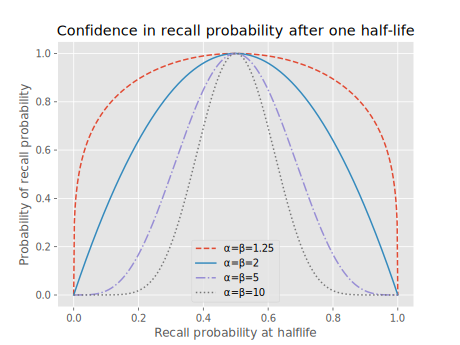

# Ebisu, version 3: the Ensemble, release candidate 1

- [Ebisu, version 3: the Ensemble, release candidate 1](#ebisu-version-3-the-ensemble-release-candidate-1)
  - [Release candidate quick-intro](#release-candidate-quick-intro)
    - [Setup](#setup)
    - [Usage](#usage)
  - [Introduction](#introduction)
  - [Install](#install)
  - [API](#api)
    - [Prelude: import](#prelude-import)
    - [1. Create a model](#1-create-a-model)
    - [2. Predict recall](#2-predict-recall)
    - [3. Update recall](#3-update-recall)
      - [Simple binary quizzes](#simple-binary-quizzes)
      - [Binomial quizzes](#binomial-quizzes)
      - [Noisy-binary quizzes](#noisy-binary-quizzes)
    - [Other update parameters](#other-update-parameters)
    - [Bonus: time to recall decay](#bonus-time-to-recall-decay)
    - [Bonus: rescale halflife](#bonus-rescale-halflife)
  - [Dev](#dev)
    - [Tests](#tests)
  - [Deploy to PyPI](#deploy-to-pypi)

## Release candidate quick-intro

This is a release candidate for Ebisu v3. For v2, see the docs at https://fasiha.github.io/ebisu/. This document assumes you know what Ebisu generally is, so please refer to that for the full details, but in a nutshell, it's a library that helps flashcard app authors schedule quizzes in a probabilistically-sound Bayesian approach.

Version 3 fixes a long-standing problem with how previous versions modeled human memory: see https://github.com/fasiha/ebisu/issues/43 but in another nutshell, Ebisu v2 modeled your memory of a flashcard as a _fixed but unknown_ quantity: as you reviewed that flashcard several times, getting it right or wrong, the model's estimate of your memory's strength fluctuated (so Ebisu's predictions of your recall probability increased the more you got it right, and decreased otherwise) but obviously in the real world, the act of reviewing a flashcard actually _changes_, strengthens, your memory of it. This modeling flaw led Ebisu v2 to dramatically pessimistic predictions of recall probability.

Ebisu version 3 proposes a straightforward statistically-motivated extension to v2 that fixes this problem (described in https://github.com/fasiha/ebisu/issues/62). Whereas v2 posited a _single_ Beta random variable to model memory, v3 posits an _ensemble_ of a few Beta random variables, with decreasing weights. This allows v3 to have much more reasonable predictions of instantaneous recall probability and enables quiz app authors to use strategies like, "schedule a quiz when the probability of recall drops to 75%" (instead of my preferred approach, which is, "don't schedule, just quiz on the flashcard most in danger of being forgotten _right now_").

### Setup

[Ebisu v2](https://fasiha.github.io/ebisu/) has detailed docs, recipes, and mathematical analyses but for the sake of getting this release candidate out, I'm foregoing documentation and giving barebones instructions for my beta testers—thank you!

To install this release candidate:

```sh
python -m pip install "ebisu>=3rc"
```

### Usage

```py
import ebisu

# create an Ebisu model when the student has learned this flashcard
model = ebisu.initModel(
    firstHalflife=10, lastHalflife=10e3, firstWeight=0.9, numAtoms=5, initialAlphaBeta=2.0)

# at some point later, ask Ebisu for this flashcard's recall probability
timeSinceLastReview = 20
probabilityRecall = ebisu.predictRecall(model, timeSinceLastReview)
print(probabilityRecall)

# administer a quiz, then update the model, overwriting the old one
timeSinceLastReview = 20.1
model = ebisu.updateRecall(model, successes=1, total=1, elapsedTime=timeSinceLastReview)

# that's a binary quiz. You can also do a binomial quiz:
model = ebisu.updateRecall(model, successes=1, total=2, elapsedTime=timeSinceLastReview)

# you can also do fuzzy-binary quizzes, see Ebisu v2 docs
model = ebisu.updateRecall(model, successes=0.85, total=1, elapsedTime=timeSinceLastReview, q0=0.1)

# how long do we expect it to take for recall to drop to 50%?
print(ebisu.modelToPercentileDecay(model, 0.5))

# how long till recall drops to 80%?
print(ebisu.modelToPercentileDecay(model, 0.8))

# sometimes the model is just too hard or too easy. There's an ad hoc backdoor to rescaling it:
easierModel = ebisu.rescaleHalflife(model, 0.25)  # new halflife = 0.25 * old halflife
harderModel = ebisu.rescaleHalflife(model, 4)  # new halflife = 4 * old halflife
```

The biggest difference from v2 is that the new data model for memory have to be bigger, since we have a weighted ensemble of random variables instead of a single one: `initModel` needs your best guess as to its initial halflife and what the max halflife you want to track, in consistent units. Above, we initialized the model to have an initial halflife of 10 hours, so the first atom in our ensemble will be at 10 hours, but we'll also create four other atoms (for a total of `numAtoms=5`), logarithmically-spaced, till `lastHalflife=10e3` hours (1.1 years).

We initialize the first atom (10 hours) to have weight `firstWeight=0.9` and the rest of the atoms have logarithmically-decreasing weights. Finally, each atom is initialized with a Beta random variable whose `α = β = initialAlphaBeta = 2.0` (see Ebisu [v2 docs](https://fasiha.github.io/ebisu/) for what this means).

There's only one tiny change between v2 and v3's `predictRecall` API: there's no extra argument for whether you want the result as log-probability or normal probability. This function always returns normal (linear) probability.

There is _no_ change to the API for

- `updateRecall`,
- `rescaleHalflife`, and
- `modelToPercentileDecay` (to calculate time till `predictRecall` drops to some value).

For details on the three types of quizzes mentioned above (binary, binomial, and fuzzy-noisy binary), see Ebisu [v2 docs](https://fasiha.github.io/ebisu/).

## Introduction

Consider a student memorizing a set of facts.

- Which facts need to be reviewed?
- How does the student’s performance on a review change the fact’s future review schedule?

Ebisu is an open-source public-domain library that answers these two questions. It is intended to be used by software developers writing quiz apps, and provides a simple API to deal with these two aspects of scheduling quizzes, centered on two functions:

- `predictRecall` gives the recall probability for a given fact _right now_ or at any given timestamp.
- `updateRecall` adjusts the belief about _future_ recall given a quiz result.

Behind this simple API, Ebisu is using a simple yet powerful model of forgetting, a model that is founded on Bayesian statistics and series-of-exponentials (power law) forgetting. Because of this probabilistic foundation, Ebisu allows quiz applications to move away from “daily review piles” caused by less flexible scheduling algorithms. For instance, a student might have only five minutes to study today—an app using Ebisu can ensure that only the facts most in danger of being forgotten are presented for review. And since you can query every fact's recall probability at any time, Ebisu also enables apps to provide an infinite stream of quizzes for students who are cramming. Thus, Ebisu intelligently handles over-reviewing as well as under-reviewing. That's not all!

The probabilistic foundation also allows Ebisu to handle quite a rich variety of _quiz types_:

- of course you have your binary quizzes, i.e., pass/fail;
- you also have Duolingo-style quizzes where the student got X points out of a maximum of Y points (binomial quizzes);
- you can even customize the probability that the student “passed” the quiz even if they forgot the fact—this is handy for deweighting multiple-choice quizzes, or for reader apps where the readers can click on words they don’t know, or not.

In a nutshell, Ebisu has been able to support creative quiz apps with innovative review systems, not just simple pass/fail flashcards.

## Install

```sh
python -m pip install ebisu
```

(But to install a release candidate, use `python -m pip install "ebisu>=3rc"`)

## API

### Prelude: import

**Step 0.** `import ebisu`

### 1. Create a model

**Step 1.** Create an Ebisu `Model` for each flashcard when the student learns it:

```py
def initModel(
    firstHalflife: float,
    lastHalflife: Optional[float] = None,  # default will be `10_000 * firstHalflife`
    firstWeight: float = 0.9,
    numAtoms: int = 5,
    initialAlphaBeta: float = 2.0,
) -> BetaEnsemble
```

The only required argument is `firstHalflife`, your best guess as to how much time it'll take for this student's probability of recall for this fact to drop to 50%. Ebisu doesn't care about what time units you use so you have to be consistent: pick hours or days or whatever, and use the same unit everywhere.

> Ebisu is Bayesian, so it doesn't treat `firstHalflife` as "the truth", but rather as your probabilistic belief. More specifically, you are telling Ebisu that that after `firstHalflife` time units have elapsed, the student's memory will decay to a `Beta(α, β)` random variable, with both parameters, `α` and `β`, set to `initialAlphaBeta > 1`. Here's what that looks like visually for a few different `initialAlphaBeta`:
>
> 
>
> This chart can be confusing if you're not used to thinking about probabilities on probabilities 😅! It shows that, no matter what you pick for `initialAlphaBeta`, the student's recall probability after one halflife is 50-50, since all four curves peak at 0.5. However, varying `initialAlphaBeta` encodes different beliefs about how _confident_ you are in your claim that this is the halflife. The default `initialAlphaBeta=2` gives you quite a lot of wiggle room: the student's probability of recall after one halflife might be as low as 20% or as high as 80%. However, setting a high `initialAlphaBeta` says "I'm _really_ confident that the halflife I tell you is really the halflife".

Morever, Ebisu creates not just one such Beta random variable but `numAtoms` of them, each with a halflife that logarithmically-decreases from `firstHalflife` to `lastHalflife`. (History note, this is the main innovation from Ebisu v2 to v3: more than one atom.) This is important because human memory is fat-tailed (more on this below in the math section!): sometimes a fact that you learned just now you'll remember for years without review, and having an atom encoding a halflife of a year can capture this.

However, we obviously believe that the recall probability is much more likely to be governed by the first atom than the last. That's why each atom has a logarithmically-decreasing weight, with the first main atom assigned `firstWeight`. By adjusting this, you can tune how quickly or slowly later atoms respond to quizzes.

> So for example if I pick `firstHalflife=10` hours, by default the five atoms will have
>
> 1. Halflife 10 hours; weight 90%
> 1. Halflife 4 days and 4 hours; weight 9%
> 1. Halflife 1 month and 10 days; weight 0.9%
> 1. Halflife 1 year and 1 month; weight 0.09%
> 1. Halflife 11 years; weight 0.009%
>
> If you divide each row's halflife (or weight) by the previous row's, you'll find the same ratio. That's thanks to the logarithmic spacing.

The model returned by `initModel` is easily encoded into JSON. I recommend you include it in your database along with the timestamp it was learned.

### 2. Predict recall

So, a student has learned a few facts, you've called `initModel` each time and saved all models in a database.

Now, what is the probability of recall for those flashcards?

```py
def predictRecall(
    prior: BetaEnsemble,
    elapsedTime: float,
    logDomain=True,
) -> float
```

Just give each model to the above function along with how long it's been since the student last saw this flashcard, `elapsedTime`; be sure to use the same units that you used for `initModel`!

(By default, this function will return the log-probability, to save an exponential. Pass in `logDomain=False` to get the normal probability. Log-probability goes from -∞ to 0 whereas regular probability goes from 0 to 1.)

If the student wants to review, you can pick the flashcard with the lowest `predictRecall` and quiz them on that. (If your app schedules a review for when the recall drops below some threshold, see below 👇 for `modelToPercentileDecay`.)

Ebisu also provides `predictRecallApprox` with the same API as `predictRecall` that uses a fast approximation.

### 3. Update recall

Now you've quizzed the student on a flashcard and you want to update the the model with the quiz results.

```py
def updateRecall(
    prior: BetaEnsemble,
    successes: Union[float, int],
    total: int,
    elapsedTime: float,
    q0: Optional[float] = None,
    updateThreshold=0.99,
    weightThreshold=0.49,
) -> BetaEnsemble
```

There are two-ish distinct quiz types that Ebisu supports thanks to its Bayesian formulation, so this function has a lot of potential arguments.

#### Simple binary quizzes

On success, `updateRecall(model, 1, 1, elapsedTime)`.

On failure, `updateRecall(model, 0, 1, elapsedTime)`. That is, `successes` is 0 or 1 out of a `total=1` and `elapsedTime` in units consistent with `predictRecall` and `initModel`.

#### Binomial quizzes

Binary quizzes are a special case of binomial quizzes, where, in a single quiz session, the student got some points out of a max number of points. For example, `updateRecall(model, 2, 3, elapsedTime)` for when a student gets 2 points out of 3.

> Ebisu is well-tested for up to `total=5` points, beyond which the algorithm might become numerically stable.

#### Noisy-binary quizzes

In this case, `total=1` and `0 < successes < 1` is a _float_. See the math section for more details but `successes` and the optional `q0` argument allow you to specify quizzes where you have doubts about the outcome you observed.

- `successes >= 0.5` implies the quiz was ostensibly a success
- `q1 = successes if successes >= 0.5 else 1 - successes` is the probability that the quiz was a success _assuming_ in reality the student knows the fact
- `q0` meanwhile is the probability that the quiz was a success when in fact the student has _forgotten_ this fact (by default `q0 = 1 - q1`)

This is useful for multiple choice quizzes where the student may have forgotten the answer but just guessed lucky, or for reading apps that observe the student _did not_ click on a word for a definition (they might not have needed the definition becuase they knew it, or maybe they forgot the word and didn't bother to click), and several other interesting niche applications.

> Note that the noisy-binary with default `q0` will smoothly interpolate between the binary success and binary failure mode as `successes` goes from 1.0 to 0.0.

> Note that one quiz mode we do _not_ directly support is Anki-style "easy, normal, hard" quizzes. An ad hoc way to do this might be to use a Binomial quiz, mapping
>
> - easy to `successes=2, total=2`,
> - normal to `successes=1, total=1`,
> - hard to `successes=1, total=2`?
>
> but you will want to experiment with this.

### Other update parameters

Two final `updateRecall` parameters we haven't talked about are:

- `updateThreshold` and
- `weightThreshold`.

Although the defaults are sane, advanced users may consider tweaking these values for their applications. And indeed, these are expected to be fixed for a given application (rather than varied card-to-card). These two parameters ensure that low-weight atoms with halflives in the far future don't get perturbed by high-impact quizzes. We dissect this in the math section below.

### Bonus: time to recall decay

Given an Ebisu model, this function calculates how long it takes the model to decay to some `percentile`. When `percentile=0.5`, the returned value is the halflife. The returned value has same units as used everywhere else.

```py
def modelToPercentileDecay(model: BetaEnsemble, percentile=0.5) -> float
```

### Bonus: rescale halflife

Everyone has had the experience where, they do a quiz and the memory model was just wrong: the quiz was too hard or too easy and you want some simple way to just scale the whole model. This function is designed for this:

```py
def rescaleHalflife(model: BetaEnsemble, scale: float) -> BetaEnsemble
```

For a model that is far too easy (quiz happened far too quickly), call with `scale > 1` to rescale its halflife by that amount, e.g., `scale=2` will rescale each atom's halflife by 2.

For a model that's too hard (quiz was too delayed), call with `scale < 1`, e.g., `scale=0.25` to rescale each halflife to a quarter of its old value.

This function is offered as a backdoor—this recsaling is totally ad hoc amounts to just throwing away the Bayesian priors that you encoded in `initModel` and updated through successive `updateRecall`s and just shifting everything around by `scale`. This is sometimes necessary though! Perhaps the student has suddenly solidified their understanding of a fact, or perhaps they've learned some new fact that's interfering with this fact.

An alternative to using this function might be to reconsider the parameters you initialized the model with in `initModel`. Perhaps the initial halflife was wrong, perhaps its starting weight was bad. Consider picking a better initialization and rerunning `updateRecall` on all quizzes you've done for this flashcard. This is also somewhat improper since `initModel` is supposed to be your best guess _before_ you see any data, and going back to adjust your priors after you've seen the data is a big Bayesian no-no.

---

That's it, that's the API!

## Dev

### Tests

To run tests, first install this package locally:

```sh
python -m pip install -e .
```

(The `-e` means this install is "editable", so changes here will be automatically updated in the installed location.)

Then simply run

```sh
pytest
```

## Deploy to PyPI

```sh
rm dist/* && python setup.py sdist bdist_wheel && python3 setup.py sdist bdist_wheel && twine upload dist/* --skip-existing
```
