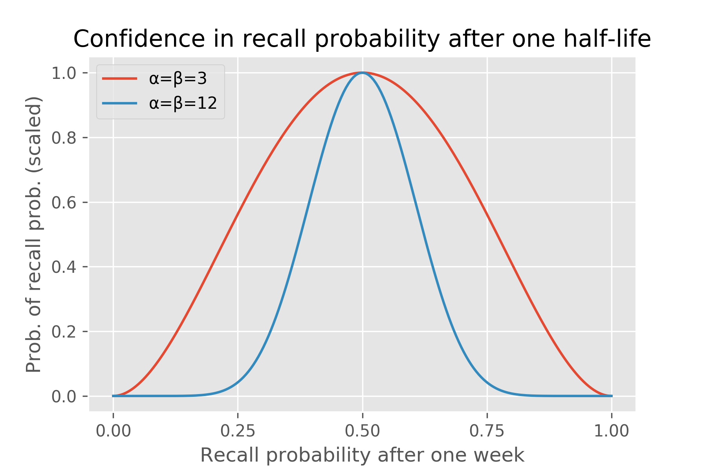
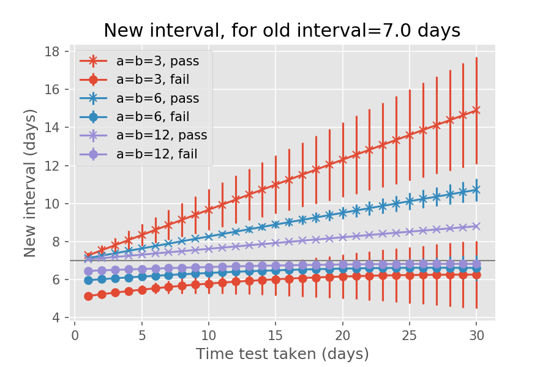
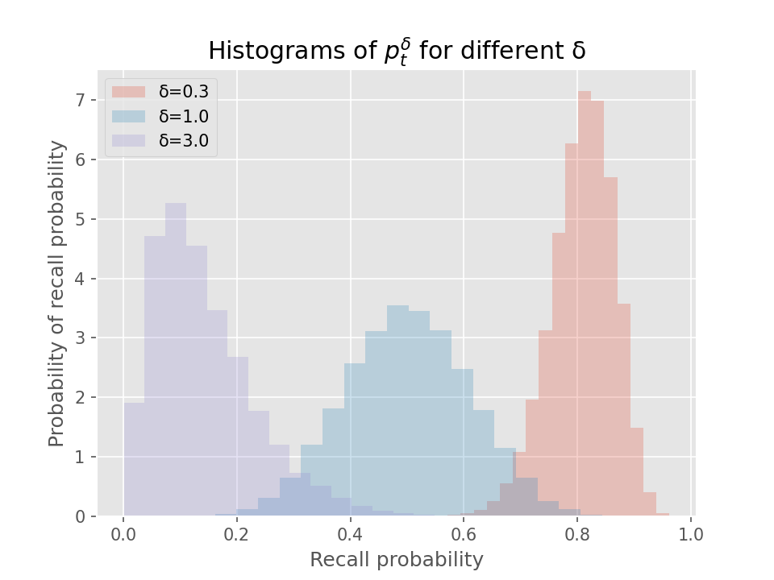
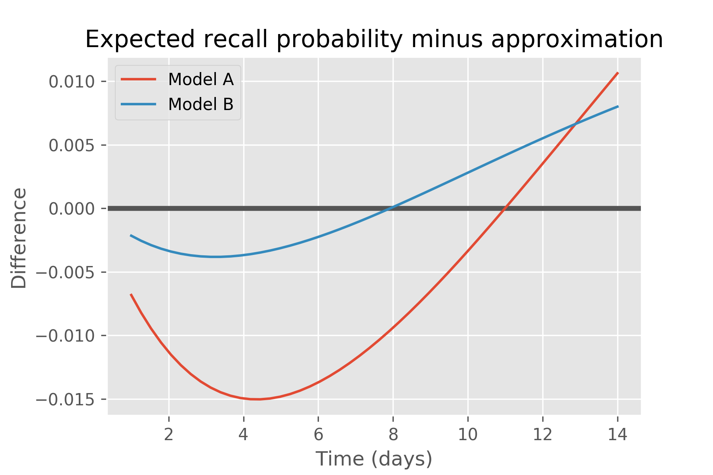

# Ebisu: intelligent quiz scheduling

## Important links

- [Literate document](https://fasiha.github.io/ebisu/)
- [GitHub repo](https://github.com/fasiha/ebisu)
- [IPython Notebook crash course](https://github.com/fasiha/ebisu/blob/gh-pages/EbisuHowto.ipynb)
- [PyPI package](https://pypi.python.org/pypi/ebisu/)
- [Contact](https://fasiha.github.io/#contact)

### Table of contents

<!-- TOC depthFrom:2 depthTo:3 withLinks:1 updateOnSave:1 orderedList:0 -->

- [Important links](#important-links)
	- [Table of contents](#table-of-contents)
- [Introduction](#introduction)
- [Quickstart](#quickstart)
- [How it works](#how-it-works)
- [The math](#the-math)
	- [Bernoulli quizzes](#bernoulli-quizzes)
	- [Moving Beta distributions through time](#moving-beta-distributions-through-time)
	- [Mean and variance of the recall probability right now](#mean-and-variance-of-the-recall-probability-right-now)
	- [Choice of initial model parameters](#choice-of-initial-model-parameters)
	- [Updating the posterior with quiz results](#updating-the-posterior-with-quiz-results)
- [Source code](#source-code)
	- [Core library](#core-library)
	- [Miscellaneous functions](#miscellaneous-functions)
	- [Test code](#test-code)
- [Demo codes](#demo-codes)
	- [Visualizing half-lives](#visualizing-half-lives)
	- [Why we work with random variables](#why-we-work-with-random-variables)
- [Requirements for building all aspects of this repo](#requirements-for-building-all-aspects-of-this-repo)
- [Acknowledgements](#acknowledgements)

<!-- /TOC -->

## Introduction

Consider a student memorizing a set of facts.

- Which facts need reviewing?
- How does the student’s performance on a review change the fact’s future review schedule?

Ebisu is a public-domain library that answers these two questions. It is intended to be used by software developers writing quiz apps, and provides a simple API to deal with these two aspects of scheduling quizzes:
- `predictRecall` gives the current recall probability for a given fact.
- `updateRecall` adjusts the belief about future recall probability given a quiz result.

Behind these two simple functions, Ebisu is using a simple yet powerful model of forgetting, a model that is founded on Bayesian statistics and exponential forgetting.

With this system, quiz applications can move away from “daily review piles” caused by less flexible scheduling algorithms. For instance, a student might have only five minutes to study today; an app using Ebisu can ensure that only the facts most in danger of being forgotten are reviewed.

Ebisu also enables apps to provide an infinite stream of quizzes for students who are cramming. Thus, Ebisu intelligently handles over-reviewing as well as under-reviewing.

This document is a literate source: it contains a detailed mathematical description of the underlying algorithm as well as source code for a Python implementation (requires Scipy and Numpy). Separate implementations in [JavaScript (Ebisu.js)](https://fasiha.github.io/ebisu.js/) and [Java (ebisu-java)](https://github.com/fasiha/ebisu-java) exist.

The next section is a [Quickstart](#quickstart) guide to setup and usage. See this if you know you want to use Ebisu in your app.

Then in the [How It Works](#how-it-works) section, I contrast Ebisu to other scheduling algorithms and describe, non-technically, why you should use it.

Then there’s a long [Math](#the-math) section that details Ebisu’s algorithm mathematically. If you like Beta-distributed random variables, conjugate priors, and marginalization, this is for you. You’ll also find the key formulas that implement `predictRecall` and `updateRecall` here.

> Nerdy details in a nutshell: Ebisu begins by positing a [Beta prior](https://en.wikipedia.org/wiki/Beta_distribution) on recall probabilities. As time passes, the recall probability decays exponentially, and Ebisu handles that nonlinearity exactly and analytically—it requires only a few [gamma function](http://mathworld.wolfram.com/GammaFunction.html) evaluations to predict the current recall probability. Next, a *quiz* is modeled as a [Bernoulli trial](https://en.wikipedia.org/wiki/Bernoulli_distribution) whose underlying probability prior is this non-conjugate nonlinearly-transformed Beta. Ebisu approximates the true non-standard posterior with a new Beta distribution by matching its mean and variance. This mean and variance are analytically tractable, and again require a few evaluations of the gamma function.

Finally, the [Source Code](#source-code) section presents the literate source of the library, including several tests to validate the math.

## Quickstart

**Install** `pip install ebisu` (both Python3 and Python2 ok 🤠).

**Data model** For each fact in your quiz app, you store a model representing a prior distribution. This is a 3-tuple: `(alpha, beta, t)` and you can create a default model for all newly learned facts with `ebisu.defaultModel`. (As detailed in the [Choice of initial model parameters](#choice-of-initial-model-parameters) section, `alpha` and `beta` define a Beta distribution on this fact’s recall probability `t` time units after it’s most recent review.)

**Predict a fact’s current recall probability** `ebisu.predictRecall(prior: tuple, tnow: float) -> float` where `prior` is this fact’s model, `tnow` is the current time elapsed since this fact’s most recent review, and the returned value is a probability between 0 and 1.

**Update a fact’s model with quiz results** `ebisu.updateRecall(prior: tuple, result: bool, tnow: float) -> tuple` where `prior` and `tnow` are as above, and where `result` is true if the student successfully answered the quiz, false otherwise. The returned value is this fact’s new prior model—the old one can be discarded.

**IPython Notebook crash course** For a conversational introduction to the API in the context of a mocked quiz app, see this [IPython Notebook crash course](https://github.com/fasiha/ebisu/blob/gh-pages/EbisuHowto.ipynb).

**Further information** [Module docstrings](https://github.com/fasiha/ebisu/blob/gh-pages/doc/doc.md) in a pinch but full details plus literate source below, under [Source code](#source-code).

**Alternative implementations** [Ebisu.js](https://fasiha.github.io/ebisu.js/) is a JavaScript port for browser and Node.js. [ebisu-java](https://github.com/fasiha/ebisu-java) is for Java and JVM languages.

## How it works

There are many scheduling schemes, e.g.,

- [Anki](https://apps.ankiweb.net/), an open-source Python flashcard app (and a closed-source mobile app),
- the [SuperMemo](https://www.supermemo.com/help/smalg.htm) family of algorithms ([Anki’s](https://apps.ankiweb.net/docs/manual.html#what-algorithm) is a derivative of SM-2),
- [Memrise.com](https://www.memrise.com), a closed-source webapp,
- [Duolingo](https://www.duolingo.com/) has published a [blog entry](http://making.duolingo.com/how-we-learn-how-you-learn) and a [conference paper/code repo](https://github.com/duolingo/halflife-regression) on their half-life regression technique,
- the Leitner and Pimsleur spacing schemes (also discussed in some length in Duolingo’s paper).
- Also worth noting is Michael Mozer’s team’s Bayesian multiscale models, e.g., [Mozer, Pashler, Cepeda, Lindsey, and Vul](http://www.cs.colorado.edu/~mozer/Research/Selected%20Publications/reprints/MozerPashlerCepedaLindseyVul2009.pdf)’s 2009 <cite>NIPS</cite> paper and subsequent work.

Many of these are inspired by Hermann Ebbinghaus’ discovery of the [exponential forgetting curve](https://en.wikipedia.org/w/index.php?title=Forgetting_curve&oldid=766120598#History), published in 1885, when he was thirty-five. He [memorized random](https://en.wikipedia.org/w/index.php?title=Hermann_Ebbinghaus&oldid=773908952#Research_on_memory) consonant–vowel–consonant trigrams (‘PED’, e.g.) and found, among other things, that his recall decayed exponentially with some time-constant.

Anki and SuperMemo use carefully-tuned mechanical rules to schedule a fact’s future review immediately after its current review. The rules can get complicated—I wrote a little [field guide](https://gist.github.com/fasiha/31ce46c36371ff57fdbc1254af424174) to Anki’s, with links to the source code—since they are optimized to minimize daily review time while maximizing retention. However, because each fact has simply a date of next review, these algorithms do not gracefully accommodate over- or under-reviewing. Even when used as prescribed, they can schedule many facts for review on one day but few on others. (I must note that all three of these issues—over-reviewing (cramming), under-reviewing, and lumpy reviews—have well-supported solutions in Anki by tweaking the rules and third-party plugins.)

Duolingo’s half-life regression explicitly models the probability of you recalling a fact as \\(2^{-Δ/h}\\), where Δ is the time since your last review and \\(h\\) is a *half-life*. In this model, your chances of passing a quiz after \\(h\\) days is 50%, which drops to 25% after \\(2 h\\) days. They estimate this half-life by combining your past performance and fact metadata in a large-scale machine learning technique called half-life regression (a variant of logistic regression or beta regression, more tuned to this forgetting curve). With each fact associated with a half-life, they can predict the likelihood of forgetting a fact if a quiz was given right now. The results of that quiz (for whichever fact was chosen to review) are used to update that fact’s half-life by re-running the machine learning process with the results from the latest quizzes.

The Mozer group’s algorithms also fit a hierarchical Bayesian model that links quiz performance to memory, taking into account inter-fact and inter-student variability, but the training step is again computationally-intensive.

Like Duolingo and Mozer’s approaches, Ebisu explicitly tracks the exponential forgetting curve to provide a list of facts sorted by most to least likely to be forgotten. However, Ebisu formulates the problem very differently—while memory is understood to decay exponentially, Ebisu posits a *probability distribution* on the half-life and uses quiz results to update its beliefs in a fully Bayesian way. These updates, while a bit more computationally-burdensome than Anki’s scheduler, are much lighter-weight than Duolingo’s industrial-strength approach.

This gives small quiz apps the same intelligent scheduling as Duolingo’s approach—real-time recall probabilities for any fact—but with immediate incorporation of quiz results, even on mobile apps.

To appreciate this further, consider this example. Imagine a fact with half-life of a week: after a week we expect the recall probability to drop to 50%. However, Ebisu can entertain an infinite range of beliefs about this recall probability: it can be very uncertain that it’ll be 50% (the “α=β=3” model below), or it can be very confident in that prediction (“α=β=12” case):



Under either of these models of recall probability, we can ask Ebisu what the expected half-life is after the student is quizzed on this fact a day, a week, or a month after their last review, and whether they passed or failed the quiz:



If the student correctly answers the quiz, Ebisu expects the new half-life to be greater than a week. If the student answers correctly after just a day, the half-life rises a little bit, since we expected the student to remember this fact that soon after reviewing it. If the student surprises us by *failing* the quiz just a day after they last reviewed it, the projected half-life drops. The more tentative “α=β=3” model aggressively adjusts the half-life, while the more assured “α=β=12” model is more conservative in its update. (Each fact has an α and β associated with it and I explain what they mean mathematically in the next section. Also, the code for these two charts is [below](#demo-codes).)

Similarly, if the student fails the quiz after a whole month of not reviewing it, this isn’t a surprise—the half-life drops a bit from the initial half-life of a week. If she does surprise us, passing the quiz after a month of not studying it, then Ebisu boosts its expectated half-life—by a lot for the “α=β=3” model, less for the “α=β=12” one.

> Currently, Ebisu treats each fact as independent, very much like Ebbinghaus’ nonsense syllables: it does not understand how facts are related the way Duolingo can with its sentences. However, Ebisu can be used in combination with other techniques to accommodate extra information about relationships between facts.

## The math

### Bernoulli quizzes

Let’s begin with a quiz. One way or another, we’ve picked a fact to quiz the student on, \\(t\\) days (the units are arbitrary since \\(t\\) can be any positive real number) after her last quiz on it, or since she learned it for the first time.

We’ll model the results of the quiz as a Bernoulli experiment, \\(x_t ∼ Bernoulli(p)\\); \\(x_t\\) can be either 1 (success) with probability \\(p_t\\), or 0 (fail) with probability \\(1-p_t\\). Let’s think about \\(p_t\\) as the recall probability at time \\(t\\)—then \\(x_t\\) is a coin flip, with a \\(p_t\\)-weighted coin.

The [Beta distribution](https://en.wikipedia.org/wiki/Beta_distribution) happens to be the [conjugate prior](https://en.wikipedia.org/wiki/Conjugate_prior) for the Bernoulli distribution. So if our *a priori* belief about \\(p_t\\) follow a Beta distribution, that is, if
\\[p_t ∼ Beta(α_t, β_t)\\]
for specific \\(α_t\\) and \\(β_t\\), then observing the quiz result updates our belief about the recall probability to be:
\\[p_t | x_t ∼ Beta(α_t + x_t, β_t + 1 - x_t).\\]

> **Aside 1** Notice that since \\(x_t\\) is either 1 or 0, the updated parameters \\((α + x_t, β + 1 - x_t)\\) are \\((α + 1, β)\\) when the student correctly answered the quiz, and \\((α, β + 1)\\) when she answered incorrectly.
>
> **Aside 2** Even if you’re familiar with Bayesian statistics, if you’ve never worked with priors on probabilities, the meta-ness here might confuse you. What the above means is that, before we flipped our \\(p_t\\)-weighted coin (before we administered the quiz), we had a specific probability distribution representing the coin’s weighting \\(p_t\\), *not* just a scalar number. After we observed the result of the coin flip, we updated our belief about the coin’s weighting—it *still* makes total sense to talk about the probability of something happening after it happens. Said another way, since we’re being Bayesian, something actually happening doesn’t preclude us from maintaining beliefs about what *could* have happened.

This is totally ordinary, bread-and-butter Bayesian statistics. However, the major complication arises when the experiment took place not at time \\(t\\) but \\(t_2\\): we had a Beta prior on \\(p_t\\) (probability of  recall at time \\(t\\)) but the test is administered at some other time \\(t_2\\).

How can we update our beliefs about the recall probability at time \\(t\\) to another time \\(t_2\\), either earlier or later than \\(t\\)?

### Moving Beta distributions through time

Our old friend Ebbinghaus comes to our rescue. According to the exponentially-decaying forgetting curve, the probability of recall at time \\(t\\) is
\\[p_t = 2^{-t/h},\\]
for some notional half-life \\(h\\). Let \\(t_2 = δ·t\\). Then,
\\[p_{t_2} = p_{δ t} = 2^{-δt/h} = (2^{-t/h})^δ = (p_t)^δ.\\]
That is, to fast-forward or rewind \\(p_t\\) to time \\(t_2\\), we raise it to the \\(δ = t_2 / t\\) power.

Unfortunately, a Beta-distributed \\(p_t\\) becomes not-Beta-distributed when raised to any positive power \\(δ\\).

In the code snippet below, we start out with \\(p_t ∼ Beta(12, 12)\\) and show the distribution of \\(p_t^δ\\) for various \\(δ\\). To make it concrete, imagine \\(t\\) is seven days. The \\(Beta(12, 12)\\) prior on recall probability seven days after the last review is the middle histogram (\\(δ = 1\\)). If the student is quizzed on this fact just two days after last review (\\(δ=0.3\\)), that density moves from the middle of the plot to the right, meaning a high probability of recall. However, if the student is quizzed three weeks after review, the original density moves to the left: it’s likely the student will fail the quiz.
```py
import matplotlib.pyplot as plt
plt.style.use('ggplot')
plt.rcParams['svg.fonttype'] = 'none'


def generatePis(deltaT, alpha=12.0, beta=12.0):
  import scipy.stats as stats

  piT = stats.beta.rvs(alpha, beta, size=50 * 1000)
  piT2 = piT**deltaT
  plt.hist(piT2, bins=20, label='δ={}'.format(deltaT), alpha=0.25, normed=True)


[generatePis(p) for p in [0.3, 1., 3.]]
plt.xlabel('p (recall probability)')
plt.ylabel('Probability(p)')
plt.title('Histograms of p_t^δ for different δ')
plt.legend(loc=0)
plt.savefig('figures/pidelta.svg')
plt.savefig('figures/pidelta.png', dpi=150)
plt.show()
```



You’ll have to take my word for it that the histograms where \\(δ≠1\\) are indeed not Beta. For these \\(α\\), \\(β\\), and \\(δ\\) used here, they are close to Beta, but especially when over- or under-reviewing, the histograms become skewed and are no longer well-matched by any Beta distribution.

So let’s derive analytically the probability density function (PDF) for \\(p_t^δ\\). Recall the conventional way to obtain the density of a [nonlinearly-transformed random variable](https://en.wikipedia.org/w/index.php?title=Random_variable&oldid=771423505#Functions_of_random_variables): let \\(x=p_t\\) and \\(y = g(x) = x^δ\\) be the forward transform, so \\(g^{-1}(y) = y^{1/δ}\\) is its inverse. Then, with \\(P_X(x) = Beta(x; α,β)\\),
\\[P_{Y}(y) = P_{X}(g^{-1}(y)) · \frac{∂}{∂y} g^{-1}(y),\\]
and this after some Wolfram Alpha and hand-manipulation becomes
\\[P_{Y}(y) = y^{(α-δ)/δ} · (1-y^{1/δ})^{β-1} / (δ · B(α, β)),\\]
where \\(B(α, β) = Γ(α) · Γ(β) / Γ(α + β)\\) is [beta function](https://en.wikipedia.org/wiki/Beta_function), also the normalizing denominator in the Beta density (confusing, sorry), and \\(Γ(·)\\) is the [gamma function](https://en.wikipedia.org/wiki/Gamma_function), a generalization of factorial.

> To check this, type in `y^((a-1)/d) * (1 - y^(1/d))^(b-1) / Beta[a,b] * D[y^(1/d), y]` at [Wolfram Alpha](https://www.wolframalpha.com).

Replacing the \\(X\\)’s and \\(Y\\)’s with our usual variables, we have the probability density for \\(p_{t_2} = p_t^δ\\) in terms of the original density for \\(p_t\\):
\\[P(p_t^δ) = \frac{p^{(α - δ)/δ} · (1-p^{1/δ})^{β-1}}{δ · B(α, β)}.\\]
We can show numerically that this density diverges from its best-approximating Beta density.

We will use the density of \\(p_t^δ\\) to reach our two most important goals:
- what’s the recall probability of a given fact right now?, and
- how do I update my estimate of that recall probability given quiz results?

### Mean and variance of the recall probability right now

Let’s see how to get the recall probability right now. Recall that we started out with a prior on the recall probabilities \\(t\\) days after the last review, \\(p_t ∼ Beta(α, β)\\). Let \\(δ = t_{now} / t\\), where \\(t_{now}\\) is the time currently elapsed since the last review. We derived the probability density for \\(p_t^δ\\) above and use it to obtain the expected recall probability right now:
\begin{align}
E[p_t^δ] \\&= \int_0^1 P(p_t^δ) · p \\, dp \\\\
         \\&= \frac{Γ(α + β)}{Γ(α)} · \frac{Γ(α + δ)}{Γ(α + β + δ)}.
\end{align}

> Mathematica code to verify on Wolfram Alpha: `Integrate[p^((a - d)/d) * (1 - p^(1/d))^(b - 1) / (d * Gamma[a]*Gamma[b]/Gamma[a+b]) * p, {p, 0, 1}]`.

We can also quantify the uncertainty in our belief about \\(p_t^δ\\): the variance of \\(p_t^δ\\) is
\\[\begin{align}
Var[p_t^δ] \\&= \int_0^1 P(p_t^δ) · (p - E[p_t^δ])^2 \\, dp \\\\
           \\&= E[p_t^{2 δ}] - (E[p_t^δ])^2.
\end{align}\\]

That first value \\(E[p_t^{2 δ}]\\) means evaluate the expected recall probability for \\(2 δ\\), that is, at another \\(t_{now}\\) days in the future. It might be just coincidence but the fact that \\(2 δ\\) shows up in this way surprised me.

> Verifying this in Mathematica/Wolfram Alpha is a bit more involved. First,
> `Assuming[a>0 && b>0 && t>0, {Integrate[p^((a - d)/d) * (1 - p^(1/d))^(b - 1) / (d * Gamma[a]*Gamma[b]/Gamma[a+b]) * (p-m)^2, {p, 0, 1}]}]` gives the result in terms of mean `m` = \\(E[p_t^δ]\\). Then plug in that value for `m` and simplify by hand.

So far we have found three analytical expressions. Suffice it to say that I tested both the derivations as well as my implementations by comparing them against quadrature integration as well as Monte Carlo analysis. Unit tests that demonstrate this are included below.

A quiz app can implement at least the expectation \\(E[p_t^δ]\\) above to identify the facts most at risk of being forgotten.

### Choice of initial model parameters
Mentioning a quiz app reminds me—you may be wondering how to pick the prior triple \\([α, β, t]\\) initially, for example when the student has first learned a fact. I propose setting \\(t\\) equal to your best guess of the fact’s half-life. In Memrise, the first quiz occurs four hours after first learning a fact; in Anki, it’s a day after. To mimic these, set \\(t\\) to four hours or a day, respectively. Then, set \\(α = β ≥ 2\\): the \\(α = β\\) part will center the Beta distribution for \\(p_t\\) at 0.5, and then the actual value will constrain the variability of \\(p_t\\). Specifically, the \\(Beta(α, β)\\) distribution has
- mean \\(α / (α + β)\\) or \\(0.5\\) if \\(α = β\\), and
- variance \\(α · β / (α + β)^ 2 / (α + β + 1)\\) which simplifies to \\(1/(4 (2 α + 1))\\) when \\(α = β\\).
    - (Recall the traditional explanation of \\(α\\) and \\(β\\) are the number of successes and failures, respectively, that have been observed by flipping a weighted coin—or in our application, the number of successful versus unsuccessful quiz results for a sequence of quizzes on the same fact \\(t\\) days apart.)

A higher value for \\(α = β\\) encodes *higher* confidence in the expected half-life \\(t\\), which in turn makes the model *less* sensitive to quiz results (as we’ll show in the next section). The experiment shown [above](#how-it-works) (with code [below](#demo-code)) contrasted the \\(α = β = 3\\) model (very sensitive and responsive) to the more conservative \\(α = β = 12\\) model. In the absence of strong feelings, a quiz app author can pick a number between these.

Now, let us turn to the final piece of the math, how to update our prior on a fact’s recall probability when a quiz result arrives.

### Updating the posterior with quiz results

One option could be this: since we have analytical expressions for the mean and variance of the prior on \\(p_t^δ\\), convert these to the [closest Beta distribution](https://en.wikipedia.org/w/index.php?title=Beta_distribution&oldid=774237683#Two_unknown_parameters) and straightforwardly update with the Bernoulli likelihood as mentioned [above](#bernoulli-quizzes). However, it is more accurate to do the likelihood update analytically, and delay fitting to a Beta until the last minute. Lucky for us, the posterior update is tractable, and we will see the boost in accuracy by doing it the hard way.

By application of Bayes rule, the posterior is
\\[Posterior(p|x) = \frac{Prior(p) · Lik(x|p)}{\int_0^1 Prior(p) · Lik(x|p) \\, dp},\\]
where “prior” refers to \\(P(p_t^δ)\\) derived above, \\(Lik\\) is the Bernoulli likelihood, and the denominator is the marginal probability of the observation \\(x\\). \\(Lik(x|p) = p\\) when \\(x=1\\) and \\(1-p\\) when \\(x=0\\). (Here we’re dropping the time-subscripts since all recall probabilities \\(p\\) and quiz results \\(x\\) are at the same \\(t_2 = t · δ\\).)

Next we compute the mean and variance of this posterior, because that’s how we’ll fit it to a Beta distribution to function as our subsequent prior. We’ll break this down into the \\(x=1\\) (success) and \\(x=0\\) (failure) cases. In the following, let \\(γ_n = Γ(α + n·δ) / Γ(α+β+n·δ)\\); this exposes numerical symmetries that an implementation can take advantage of.

\\[E[p | x=1] = \int_0^1 p · Posterior(p|x=1) \\, dp = γ_2 / γ_1.\\]

\\[\begin{align}
Var[p | x=1] \\&= \int_0^1 (p - E[p | x=1])^2 · Posterior(p|x=1) \\, dp \\\\
             \\&= γ_3 / γ_1 - (E[p|x=1])^2.
\end{align}\\]

The posterior mean and variance when \\(x=0\\) (failed quiz) are:

\\[E[p | x=0] = \frac{γ_2 - γ_1}{γ_1 - γ_0}.\\]

\\[Var[p | x=0] = \frac{γ_3 (γ_1 - γ_0) + γ_2 (γ_0 + γ_1 - γ_2) - γ_1^2}{(γ_1 - γ_0)^2}.\\]

> **Note 1** The Mathematica expressions used in deriving these are given in the source code below. Unlike the first few analytical results above, these required considerable hand-simplification, and we will double-check them against both Monte Carlo simulation and quadrature integration below.
>
> **Note 2** Something I haven’t commented on at all this whole while but that I must address with this expression for \\(Var[p | x=0]\\) staring at me. The gamma function is the generalization of factorial—it’s a rapidly-growing function. With double-precision floats, \\(Γ(19) ≈ 6·10^{15}\\) has lost precision to the ones place, that is, `np.spacing(gamma(19)) == 1.0`). In this regime, which we regularly encounter particularly when over- and under-reviewing, addition and subtraction are risky. Ebisu takes care to factor these expressions to allow the use of log-gamma, [`expm1`](https://docs.scipy.org/doc/numpy/reference/generated/numpy.expm1.html), and [`logsumexp`](https://docs.scipy.org/doc/scipy/reference/generated/scipy.misc.logsumexp.html), in order to minimize loss of precision.

With the mean and variance of the posterior in hand, it is straightforward to find a well-approximating Beta distribution using the [method of moments](https://en.wikipedia.org/w/index.php?title=Beta_distribution&oldid=774237683#Two_unknown_parameters):
- a new \\(α' = μ (μ (1-μ) / σ^2 - 1)\\) and
- \\(β' = (1-μ) (μ (1-μ) / σ^2 - 1)\\),
    - for \\(μ = E[p|x]\\) and \\(σ^2 = Var[p|x]\\).

The updated posterior becomes the new prior, parameterized by this \\([α', β', t_2]\\), where \\(t_2\\) is the time elapsed between this fact’s last quiz and the one just used in the update.

We are done. That’s all the math.


## Source code

Before presenting the source code, I must somewhat apologetically explain a bit more about my workflow in writing and editing this document. I use the [Atom](https://atom.io) text editor with the [Hydrogen](https://atom.io/packages/hydrogen) plugin, which allows Atom to communicate with [Jupyter](http://jupyter.org/) kernels. Jupyter used to be called IPython, and is a standard protocol for programming REPLs to communicate with more modern applications like browsers or text editors. With this setup, I can write code in Atom and send it to a behind-the-scenes Python or Node.js or Haskell or Matlab REPL for evaluation, which sends back the result.

Hydrogen developer Lukas Geiger [recently](https://github.com/nteract/hydrogen/pull/637) added support for evaluating fenced code blocks in Markdown—a long-time dream of mine. This document is a Github-Flavored Markdown file to which I add fenced code blocks. Some of these code blocks I intend to just be demo code, and not end up in the Ebisu library proper, while the code below does need to go into `.py` files.

In order to untangle the code from the Markdown file to runnable files, I wrote a completely ad hoc undocumented Node.js script called [md2code.js](https://github.com/fasiha/ebisu/blob/gh-pages/md2code.js) which
- slurps the Markdown,
- looks for fenced code blocks that open with a comment indicating a file destination, e.g., `# export target.py`,
- prettifies Python with [Yapf](https://github.com/google/yapf), JavaScript with [clang-format](https://clang.llvm.org/docs/ClangFormatStyleOptions.html), etc.,
- dumps the code block contents into these files (appending after the first code block), and finally,
- updates the Markdown file itself with this prettified code.

All this enables me to stay in Atom, writing prose and editing/testing code by evaluating fenced code blocks, while also spitting out a proper Python or JavaScript library.

The major downside to this is that I cannot edit the untangled code files directly, and line numbers there don’t map to this document. I am tempted to append a commented-out line number in each untangled line…

### Core library

Python Ebisu contains a sub-module called `ebisu.alternate` which contains a number of alternative implementations of `predictRecall` and `updateRecall`. The `__init__` file sets up this module hierarchy.

```py
# export ebisu/__init__.py #
from .ebisu import *
from . import alternate
```

The above is in its own fenced code block because I don’t want Hydrogen to evaluate it. In Atom, I don’t work with the Ebisu module—I just interact with the raw functions.

Let’s present our Python implementation of the core Ebisu functions, `predictRecall` and `updateRecall`, and a couple of other related functions that live in the main `ebisu` module. All these functions consume a model encoding a Beta prior on recall probabilities at time \\(t\\), consisting of a 3-tuple containing \\((α, β, t)\\). I could have gone all object-oriented here but I chose to leave all these functions as stand-alone functions that consume and transform this 3-tuple because (1) I’m not an OOP devotee, and (2) I wanted to maximize the transparency of of this implementation so it can readily be ported to non-OOP, non-Pythonic languages.

> **Important** Note how none of these functions deal with *timestamps*. All time is captured in “time since last review”, and your external application has to store timestamps (as illustrated in the [Ebisu Jupyter Notebook](https://github.com/fasiha/ebisu/blob/gh-pages/EbisuHowto.ipynb)). This is a deliberate choice! Ebisu wants to know as *little* about your facts as possible.

In the [math section](#mean-and-variance-of-the-recall-probability-right-now) above we derived the mean recall probability at time \\(t_{now} = t · δ\\) given a model \\(α, β, t\\): \\(E[p_t^δ] = Γ(α + β) · Γ(α) / (Γ(α + δ) · Γ(α + β + δ))\\). There are no sums-of-gammas here, so this is readily computed using log-gamma routine (`gammaln` in Scipy) to avoid overflowing and precision-loss in `predictRecall` (🍏 below).

We also derived the variance, \\(Var[p_t^δ] = E[p_t^{2 δ}] - (E[p_t^δ])^2\\). This might be a helpful value and is computed by `predictRecallVar` (🍋 below). In order to avoid risking catastrophic cancellation by subtracting two potentially large floats (it’d be nice to prove that this will never happen given our \\(γ_n\\)’s but I haven’t yet done so), we use a simplification of `logsumexp` to evaluate the subtraction—this trick uses the following identity to avoid subtracting potentially very large floats: `exp(x) - exp(y) = exp(m) * (exp(a-m) - exp(b-m))` where `m = max(x, y)` and where `x` and `y` are logs of the two summands. This is basically `logsumexp` without the final `log`, so this trick is called `_subtractexp` (⚾️) below.

These two functions have the same signature: they consume
- a `model`: represents the Beta prior on recall probability at one specific time since the fact’s last review, and
- a `tnow`, the time elapsed since the last time this fact was quizzed.

```py
# export ebisu/ebisu.py #
def predictRecall(prior, tnow):
  """Expected recall probability now, given a prior distribution on it. 🍏

  `prior` is a tuple representing the prior distribution on recall probability
  after a specific unit of time has elapsed since this fact's last review.
  Specifically,  it's a 3-tuple, `(alpha, beta, t)` where `alpha` and `beta`
  parameterize a Beta distribution that is the prior on recall probability at
  time `t`.

  `tnow` is the *actual* time elapsed since this fact's most recent review.

  Returns the expectation of the recall probability `tnow` after last review, a
  float between 0 and 1.

  See documentation for derivation.
  """
  from scipy.special import gammaln
  from numpy import exp
  alpha, beta, t = prior
  dt = tnow / t
  return exp(
      gammaln(alpha + dt) - gammaln(alpha + beta + dt) -
      (gammaln(alpha) - gammaln(alpha + beta)))


def _subtractexp(x, y):
  """Evaluates exp(x) - exp(y) a bit more accurately than that. ⚾️

  This can avoid cancellation in case `x` and `y` are both large and close,
  similar to scipy.misc.logsumexp except without the last log.
  """
  from numpy import exp, maximum
  maxval = maximum(x, y)
  return exp(maxval) * (exp(x - maxval) - exp(y - maxval))


def predictRecallVar(prior, tnow):
  """Variance of recall probability now. 🍋

  This function returns the variance of the distribution whose mean is given by
  `ebisu.predictRecall`. See it's documentation for details.

  Returns a float.
  """
  from scipy.special import gammaln
  alpha, beta, t = prior
  dt = tnow / t
  s = [
      gammaln(alpha + n * dt) - gammaln(alpha + beta + n * dt) for n in range(3)
  ]
  md = 2 * (s[1] - s[0])
  md2 = s[2] - s[0]

  return _subtractexp(md2, md)
```

Next is the implementation of `updateRecall` (🍌), which accepts
- a `model` (as above, represents the Beta prior on recall probability at one specific time since the fact’s last review),
- a quiz `result`: a truthy value meaning “passed quiz” and a false-ish value meaning “failed quiz”, and
- `tnow`, the actual time since last quiz that this quiz was administered.

and returns a *new* model, representing an updated Beta prior on recall probability, this time after `tnow` time has elapsed since a fact was quizzed.

**In case of successful quiz** `updateRecall` analytically computes the true posterior’s
- mean (expectation) \\(γ_2 / γ_1\\), which can be evaluated completely in the log domain, and
- variance \\(γ_3 / γ_1 - (E[p|x=1])^2\\), which as the previous variance we evaluate in the log domain and use `_subtractexp` (⚾️ above) to avoid cancellation errors,
    - where \\(γ_n = Γ(α + n·δ) / Γ(α+β+n·δ)\\).

**In case of unsuccessful quiz** these values are
- mean \\((γ_2 - γ_1) / (γ_1 - γ_0)\\), which we rewrite to remain in the log domain and use a ratio of two `expm1`s, which accurately evaluates `exp(x) - 1`—recall that subtraction with large floating-point numbers is more risky than division; and
- variance \\((γ_3 (γ_1 - γ_0) + γ_2 (γ_0 + γ_1 - γ_2) - γ_1^2) / (γ_1 - γ_0)^2\\). This we evaluate with a sequence of *four* `logsumexp`s to minimize risk of floating-point precision loss.

> Recall that \\(α\\) and \\(β\\) come from the model representing the prior, while \\(δ = t / t_{now}\\) depends on both \\(t\\) (from the model) and the actual time since the previous quiz \\(t_{now}\\).

After the mean and variance are evaluated, these are converted to a Beta distribution. We’ll talk about that after this code block.

```py
# export ebisu/ebisu.py #
def updateRecall(prior, result, tnow):
  """Update a prior on recall probability with a quiz result and time. 🍌

  `prior` is same as for `ebisu.predictRecall` and `predictRecallVar`: an object
  representing a prior distribution on recall probability at some specific time
  after a fact's most recent review.

  `result` is truthy for a successful quiz, false-ish otherwise.

  `tnow` is the time elapsed between this fact's last review and the review
  being used to update.

  Returns a new object (like `prior`) describing the posterior distribution of
  recall probability at `tnow`.
  """
  from scipy.special import gammaln
  from numpy import exp
  alpha, beta, t = prior
  dt = tnow / t
  if result:
    # marginal: `Integrate[p^((a - t)/t)*(1 - p^(1/t))^(b - 1)*p, {p,0,1}]`
    # mean: `Integrate[p^((a - t)/t)*(1 - p^(1/t))^(b - 1)*p*p, {p,0,1}]`
    # variance: `Integrate[p^((a - t)/t)*(1 - p^(1/t))^(b - 1)*p*(p - m)^2, {p,0,1}]`
    # Simplify all three to get the following:
    same = gammaln(alpha + beta + dt) - gammaln(alpha + dt)
    muln = gammaln(alpha + 2 * dt) - gammaln(alpha + beta + 2 * dt) + same
    mu = exp(muln)
    var = _subtractexp(
        same + gammaln(alpha + 3 * dt) - gammaln(alpha + beta + 3 * dt),
        2 * muln)
  else:
    # Mathematica code is same as above, but replace one `p` with `(1-p)`
    # marginal: `Integrate[p^((a - t)/t)*(1 - p^(1/t))^(b - 1)*(1-p), {p,0,1}]`
    # mean: `Integrate[p^((a - t)/t)*(1 - p^(1/t))^(b - 1)*(1-p)*p, {p,0,1}]`
    # var: `Integrate[p^((a - t)/t)*(1 - p^(1/t))^(b - 1)*(1-p)*(p - m)^2, {p,0,1}]`
    # Then simplify and combine

    from scipy.misc import logsumexp
    from numpy import expm1

    s = [
        gammaln(alpha + n * dt) - gammaln(alpha + beta + n * dt)
        for n in range(4)
    ]

    mu = expm1(s[2] - s[1]) / -expm1(s[0] - s[1])

    def lse(a, b):
      return list(logsumexp(a, b=b, return_sign=True))

    n1 = lse([s[1], s[0]], [1, -1])
    n1[0] += s[3]
    n2 = lse([s[0], s[1], s[2]], [1, 1, -1])
    n2[0] += s[2]
    n3 = [s[1] * 2, 1.]
    d = lse([s[1], s[0]], [1, -1])
    d[0] *= 2
    n = lse([n1[0], n2[0], n3[0]], [n1[1], n2[1], -n3[1]])
    var = exp(n[0] - d[0])

  newAlpha, newBeta = _meanVarToBeta(mu, var)
  return newAlpha, newBeta, tnow
```

Finally we have a couple more helper functions in the main `ebisu` namespace. `_meanVarToBeta` (🏈 below) uses simple algebra to [fit a Beta distribution](https://en.wikipedia.org/w/index.php?title=Beta_distribution&oldid=774237683#Two_unknown_parameters) to a mean and variance—it’s used in `updateRecall`.

I’ve thought about taking `priorToHalflife` (🏀 below) out of the main `ebisu` namespace because it’s not used by the core algorithm, but rather is for visualization purposes. Given a `model` (as above, a 3-tuple representing a Beta distribution prior on a fact’s recall probability at a specific time after its last review), it runs `predictRecall` over and over in a potentially-time-consuming bracketed search to find the *half-life*, that is, the time between reviews at which the recall probability is 50% (customizable via the `percentile` argument). This bracketed search, Scipy’s sophisticated [Brent’s algorithm](https://docs.scipy.org/doc/scipy/reference/generated/scipy.optimize.brentq.html), requires a min and max values to search over and the defaults of `mint=1e-3` and `maxt=100` might not suffice for all cases.

The least important function from a usage point of view is also the most important function for someone getting started with Ebisu: I call it `defaultModel` (🍗 below) and it simply creates a “model” object (a 3-tuple) out of the arguments it’s given. It’s included in the `ebisu` namespace to help developers who totally lack confidence in picking parameters: the only information it absolutely needs is an expected half-life, e.g., four hours or twenty-four hours or however long you expect a newly-learned fact takes to decay to 50% recall.

```py
# export ebisu/ebisu.py #
def _meanVarToBeta(mean, var):
  """Fit a Beta distribution to a mean and variance. 🏈"""
  # [betaFit] https://en.wikipedia.org/w/index.php?title=Beta_distribution&oldid=774237683#Two_unknown_parameters
  tmp = mean * (1 - mean) / var - 1
  alpha = mean * tmp
  beta = (1 - mean) * tmp
  return alpha, beta


def priorToHalflife(prior, percentile=0.5, maxt=100, mint=1e-3):
  """Find the half-life corresponding to a time-based prior on recall. 🏀"""
  from scipy.optimize import brentq
  return brentq(lambda now: predictRecall(prior, now) - percentile, mint, maxt)


def defaultModel(t, alpha=4.0, beta=None):
  """Convert recall probability prior's raw parameters into a model object. 🍗

  `t` is your guess as to the half-life of any given fact, in units that you
  must be consistent with throughout your use of Ebisu.

  `alpha` and `beta` are the parameters of the Beta distribution that describe
  your beliefs about the recall probability of a fact `t` time units after that
  fact has been studied/reviewed/quizzed. If they are the same, `t` is a true
  half-life, and this is a recommended way to create a default model for all
  newly-learned facts. If `beta` is omitted, it is taken to be the same as
  `alpha`.
  """
  return (alpha, beta or alpha, t)
```

With the exception of `defaultModel`, `priorToHalflife`, `predictRecallVar`, all the above functions are considered core Ebisu functions and any implementation should provide them:
- `predictRecall` and
- `updateRecall`,
- aided by private helper functions
    - `_meanVarToBeta` and
    - `_subtractexp`.

The functions in the following section are either for illustrative or debugging purposes.

### Miscellaneous functions
I wrote a number of other functions that help provide insight or help debug the above functions in the main `ebisu` workspace but are not necessary for an actual implementation. These are in the `ebisu.alternate` submodule and not nearly as much time has been spent on polish or optimization as the above core functions.

```py
# export ebisu/alternate.py #
from .ebisu import _meanVarToBeta
```

`predictRecallMode` and `predictRecallMedian` return the mode and median of the recall probability prior rewound or fast-forwarded to the current time. That is, they return the mode/median of the random variance \\(p_t^δ\\) whose mean is returned by `predictRecall` (🍏 above). Recall that \\(δ = t / t_{now}\\).

The mode has an analytical expression, and while it is more meaningful than the mean, the distribution can blow up to infinity at 0 or 1 when \\(δ\\) is either much smaller or much larger than 1, in which case the analytical expression may yield nonsense, so a number of not-very-rigorous checks are in place to attempt to detect this.

I could not find a closed-form expression for the median of \\(p_t^δ\\), so I use a bracketed root search (Brent’s algorithm) on the cumulative distribution function (the CDF), for which Wolfram Alpha can yield an analytical expression. This can get numerically burdensome, which is unacceptable because one may need to predict the recall probability for thousands of facts. For these reasons, although I would have preferred to make `predictRecall` evaluate the mode or median, I made it return the mean.

`predictRecallMonteCarlo` is the simplest function. It evaluates the mean, variance, mode (via histogram), and median of \\(p_t^δ\\) by drawing samples from the Beta prior on \\(p_t\\) and raising them to the \\(δ\\)-power. The unit tests for `predictRecall` and `predictRecallVar` in the next section use this Monte Carlo to test both derivations and implementations. While fool-proof, Monte Carlo simulation is obviously far too computationally-burdensome for regular use.

```py
# export ebisu/alternate.py #
import numpy as np


def predictRecallMode(prior, tnow):
  """Mode of the immediate recall probability.

  Same arguments as `ebisu.predictRecall`, see that docstring for details. A
  returned value of 0 or 1 may indicate divergence.
  """
  # [1] Mathematica: `Solve[ D[p**((a-t)/t) * (1-p**(1/t))**(b-1), p] == 0, p]`
  alpha, beta, t = prior
  dt = tnow / t
  pr = lambda p: p**((alpha - dt) / dt) * (1 - p**(1 / dt))**(beta - 1)

  # See [1]. The actual mode is `modeBase ** dt`, but since `modeBase` might
  # be negative or otherwise invalid, check it.
  modeBase = (alpha - dt) / (alpha + beta - dt - 1)
  if modeBase >= 0 and modeBase <= 1:
    # Still need to confirm this is not a minimum (anti-mode). Do this with a
    # coarse check of other points likely to be the mode.
    mode = modeBase**dt
    modePr = pr(mode)

    eps = 1e-3
    others = [
        eps, mode - eps if mode > eps else mode / 2,
        mode + eps if mode < 1 - eps else (1 + mode) / 2, 1 - eps
    ]
    otherPr = map(pr, others)
    if max(otherPr) <= modePr:
      return mode
  # If anti-mode detected, that means one of the edges is the mode, likely
  # caused by a very large or very small `dt`. Just use `dt` to guess which
  # extreme it was pushed to. If `dt` == 1.0, and we get to this point, likely
  # we have malformed alpha/beta (i.e., <1)
  return 0.5 if dt == 1. else (0. if dt > 1 else 1.)


def predictRecallMedian(prior, tnow, percentile=0.5):
  """Median (or percentile) of the immediate recall probability.

  Same arguments as `ebisu.predictRecall`, see that docstring for details.

  An extra keyword argument, `percentile`, is a float between 0 and 1, and
  specifies the percentile rather than 50% (median).
  """
  # [1] `Integrate[p**((a-t)/t) * (1-p**(1/t))**(b-1) / t / Beta[a,b], p]`
  # and see "Alternate form assuming a, b, p, and t are positive".
  from scipy.optimize import brentq
  from scipy.special import betainc
  alpha, beta, t = prior
  dt = tnow / t

  # See [1]. If the mode doesn't exist (or can't be found), find the median (or
  # `percentile`) using a root-finder and the cumulative distribution function.
  cdfPercentile = lambda p: betainc(alpha, beta, p**(1 / dt)) - percentile
  return brentq(cdfPercentile, 0, 1)


def predictRecallMonteCarlo(prior, tnow, N=1000 * 1000):
  """Monte Carlo simulation of the immediate recall probability.

  Same arguments as `ebisu.predictRecall`, see that docstring for details. An
  extra keyword argument, `N`, specifies the number of samples to draw.

  This function returns a dict containing the mean, variance, median, and mode
  of the current recall probability.
  """
  import scipy.stats as stats
  alpha, beta, t = prior
  tPrior = stats.beta.rvs(alpha, beta, size=N)
  tnowPrior = tPrior**(tnow / t)
  freqs, bins = np.histogram(tnowPrior, 'auto')
  bincenters = bins[:-1] + np.diff(bins) / 2
  return dict(
      mean=np.mean(tnowPrior),
      median=np.median(tnowPrior),
      mode=bincenters[freqs.argmax()],
      var=np.var(tnowPrior))
```

Next we have alternate approaches to `updateRecall` (🍌 above), namely, using quadrature integration (i.e., numerical integration) and Monte Carlo simulation.

`updateRecallQuad` uses quadrature integration to evaluate the expectation and variance of of \\(p_t^δ | x\\), both of which can be expressed as integrals—recall that \\(E[f(p)] = \int_0^1 f(p) P(p) \, dp\\) for any function \\(f(p)\\), and where \\(P(p)\\) is the density function. Also recall from [above](#updating-the-posterior-with-quiz-results) that the posterior has the form
\\[Posterior(p|x) = \frac{Prior(p) · Lik(x|p)}{\int_0^1 Prior(p) · Lik(x|p) \, dp}.\\]
That denominator (the marginal of \\(x\\)) can be evaluated via quadrature, or by an analytical expression obtained from Wolfram Alpha (the unit tests below do both, overkill). However, the *prior* on \\(p_t^δ\\), derived [above](#moving-beta-distributions-through-time), is used here as-is since it has been extensively tested using Monte Carlo (see `predictRecallMonteCarlo` above). Any of the three integrals can fail to converge to a sensible value, in which case an exception is thrown (and in that case, the unit test is skipped).

`updateRecallMonteCarlo` is deceptively simple. Like `predictRecallMonteCarlo` above, it draws samples from the Beta distribution in `model` and propagates them through Ebbinghaus’ forgetting curve to the time specified, but then it assigns weights to each sample—each weight is that sample’s probability according to the Bernoulli likelihood. This is equivalent to multiplying the prior with the likelihood—and we needn’t bother with the marginal because it’s just a normalizing factor which would scale all weights equally. The function then computes the *weighted* mean and variance (reference links in the source below) before straightforwardly converting these to a new Beta prior as done by `updateRecall`. (I am grateful to [mxwsn](https://stats.stackexchange.com/q/273221/31187) for suggesting this elegant approach.)

```py
# export ebisu/alternate.py #
def updateRecallQuad(prior, result, tnow, analyticMarginal=True):
  """Update recall probability with quiz result via quadrature integration.

  Same arguments as `ebisu.updateRecall`, see that docstring for details.

  An extra keyword argument: `analyticMarginal` if false will compute the
  marginal (the denominator in Bayes rule) using quadrature as well. If true, an
  analytical expression will be used.
  """
  from scipy.integrate import quad
  alpha, beta, t = prior
  dt = tnow / t

  if result == 1:
    marginalInt = lambda p: p**((alpha - dt) / dt) * (1 - p**(1 / dt))**(beta -
                                                                         1) * p
  else:
    # difference from above: -------------------------------------------^vvvv
    marginalInt = lambda p: p**((alpha - dt) / dt) * (1 - p**(1 / dt))**(
        beta - 1) * (1 - p)

  if analyticMarginal:
    from scipy.special import beta as fbeta
    if result == 1:
      marginal = dt * fbeta(alpha + dt, beta)
    else:
      marginal = dt * (fbeta(alpha, beta) - fbeta(alpha + dt, beta))
  else:
    marginalEst = quad(marginalInt, 0, 1)
    if marginalEst[0] < marginalEst[1] * 10.:
      raise OverflowError(
          'Marginal integral error too high: value={}, error={}'.format(
              marginalEst[0], marginalEst[1]))
    marginal = marginalEst[0]

  muInt = lambda p: marginalInt(p) * p
  muEst = quad(muInt, 0, 1)
  if muEst[0] < muEst[1] * 10.:
    raise OverflowError(
        'Mean integral error too high: value={}, error={}'.format(
            muEst[0], muEst[1]))
  mu = muEst[0] / marginal

  varInt = lambda p: marginalInt(p) * (p - mu)**2
  varEst = quad(varInt, 0, 1)
  if varEst[0] < varEst[1] * 10.:
    raise OverflowError(
        'Variance integral error too high: value={}, error={}'.format(
            varEst[0], varEst[1]))
  var = varEst[0] / marginal

  newAlpha, newBeta = _meanVarToBeta(mu, var)
  return newAlpha, newBeta, tnow


def updateRecallMonteCarlo(prior, result, tnow, N=10 * 1000):
  """Update recall probability with quiz result via Monte Carlo simulation.

  Same arguments as `ebisu.updateRecall`, see that docstring for details.

  An extra keyword argument `N` specifies the number of samples to draw.
  """
  # [bernoulliLikelihood] https://en.wikipedia.org/w/index.php?title=Bernoulli_distribution&oldid=769806318#Properties_of_the_Bernoulli_Distribution, third equation
  # [weightedMean] https://en.wikipedia.org/w/index.php?title=Weighted_arithmetic_mean&oldid=770608018#Mathematical_definition
  # [weightedVar] https://en.wikipedia.org/w/index.php?title=Weighted_arithmetic_mean&oldid=770608018#Weighted_sample_variance
  import scipy.stats as stats

  alpha, beta, t = prior

  tPrior = stats.beta.rvs(alpha, beta, size=N)
  tnowPrior = tPrior**(tnow / t)

  # This is the Bernoulli likelihood [bernoulliLikelihood]
  weights = (tnowPrior)**result * ((1 - tnowPrior)**(1 - result))

  # See [weightedMean]
  weightedMean = np.sum(weights * tnowPrior) / np.sum(weights)
  # See [weightedVar]
  weightedVar = np.sum(weights *
                       (tnowPrior - weightedMean)**2) / np.sum(weights)

  newAlpha, newBeta = _meanVarToBeta(weightedMean, weightedVar)

  return newAlpha, newBeta, tnow
```

That’s it—that’s all the code in the `ebisu` module!

### Test code

Before diving into unit tests, I promised [above](#updating-the-posterior-with-quiz-results) to show the suboptimality of fitting a Beta to the prior on \\(p_t^δ\\) and performing a straightforward conjugate update. Assume you can trust `updateRecall` for now, which fits a Beta to the full *posterior*. The following shows the difference between the two models: the numerical differences start in the first digit after the decimal point.

```py
def betafitBeforeLikelihood(a, b, t1, x, t2):
  a2, b2 = _meanVarToBeta(
      predictRecall((a, b, t1), t2), predictRecallVar((a, b, t1), t2))
  return a2 + x, b2 + 1 - x, t2


print("Beta fit BEFORE posterior:", updateRecall((3.3, 4.4, 1.), 1., 2.))
print("Beta fit AFTER posterior:",
      betafitBeforeLikelihood(3.3, 4.4, 1., 1., 2.))
# Output:
# Beta fit BEFORE posterior: (2.2138973610926804, 4.6678159395305334, 2.0)
# Beta fit AFTER posterior: (2.3075328265376691, 4.8652384243261961, 2.0)
```

I use the built-in `unittest`, and I can run all the tests from Atom via Hydrogen/Jupyter but for historic reasons I don’t want Jupyter to deal with the `ebisu` namespace, just functions (since most of these functions and tests existed before the module’s layout was decided). So the following is in its own fenced code block that I don’t evaluate in Atom.

```py
# export ebisu/tests/test_ebisu.py
from ebisu import *
from ebisu.alternate import *
```

In these unit tests, I compare
- `predictRecall` and `predictRecallVar` against `predictRecallMonteCarlo`, and
- `updateRecall` against `updateRecallQuad` (both with analytical and numerical marginal) and against `updateRecallMonteCarlo`.

For the latter, since all the functions return a Beta distribution’s parameters, I compare the resulting distributions in terms of [Kullback–Leibler divergence](https://en.wikipedia.org/w/index.php?title=Beta_distribution&oldid=774237683#Quantities_of_information_.28entropy.29) (actually, the symmetric distance version), which is a nice way to measure the difference between two probability distributions. There is also a little unit test for my implementation for the KL divergence on Beta distributions.

For the former, I compare means and variances using relative error, \\(|x-y| / |y|\\), since they do not return distributions, only means/variances.

For both sets of functions, a range of \\(δ = t_{now} / t\\) and both outcomes of quiz results (true and false) are tested to ensure they all produce the same answers. Sometimes, quadrature integration fails to find a solution, in which case it is not compared to the Monte Carlo and analytical versions.

Often the unit tests fails because the tolerances are a little tight, and the random number generator seed is variable, which leads to errors exceeding thresholds. I actually prefer to see these occasional test failures because it gives me confidence that the thresholds are where I want them to be (if I set the thresholds too loose, and I somehow accidentally greatly improved accuracy, I might never know). However, I realize it can be annoying for automated tests or continuous integration systems, so I am open to fixing a seed and fixing the error threshold for it.

One note: the unit tests udpate a global database of `testpoints` being tested, which can be dumped to a JSON file for comparison against other implementations.

```py
# export ebisu/tests/test_ebisu.py
import unittest


def relerr(dirt, gold):
  return abs(dirt - gold) / abs(gold)


def maxrelerr(dirts, golds):
  return max(map(relerr, dirts, golds))


def klDivBeta(a, b, a2, b2):
  """Kullback-Leibler divergence between two Beta distributions in nats"""
  # Via http://bariskurt.com/kullback-leibler-divergence-between-two-dirichlet-and-beta-distributions/
  from scipy.special import gammaln, psi
  import numpy as np
  left = np.array([a, b])
  right = np.array([a2, b2])
  return gammaln(sum(left)) - gammaln(sum(right)) - sum(gammaln(left)) + sum(
      gammaln(right)) + np.dot(left - right,
                               psi(left) - psi(sum(left)))


def kl(v, w):
  return (klDivBeta(v[0], v[1], w[0], w[1]) +
          klDivBeta(w[0], w[1], v[0], v[1])) / 2.


testpoints = []


class TestEbisu(unittest.TestCase):

  def test_predictRecallMedian(self):
    model0 = (4.0, 4.0, 1.0)
    model1 = updateRecall(model0, False, 1.0)
    model2 = updateRecall(model1, True, 0.01)
    ts = np.linspace(0.01, 4.0, 81.0)
    qs = (0.05, 0.25, 0.5, 0.75, 0.95)
    for t in ts:
      for q in qs:
        self.assertGreater(predictRecallMedian(model2, t, q), 0)

  def test_kl(self):
    # See https://en.wikipedia.org/w/index.php?title=Beta_distribution&oldid=774237683#Quantities_of_information_.28entropy.29 for these numbers
    self.assertAlmostEqual(klDivBeta(1., 1., 3., 3.), 0.598803, places=5)
    self.assertAlmostEqual(klDivBeta(3., 3., 1., 1.), 0.267864, places=5)

  def test_prior(self):

    def inner(a, b, t0):
      global testpoints
      for t in map(lambda dt: dt * t0, [0.1, .99, 1., 1.01, 5.5]):
        mc = predictRecallMonteCarlo((a, b, t0), t, N=100 * 1000)
        mean = predictRecall((a, b, t0), t)
        var = predictRecallVar((a, b, t0), t)
        self.assertLess(relerr(mean, mc['mean']), 5e-2)
        self.assertLess(relerr(var, mc['var']), 5e-2)
        testpoints += [['predict', [a, b, t0], [t], dict(mean=mean, var=var)]]

    inner(3.3, 4.4, 1.)
    inner(34.4, 34.4, 1.)

  def test_posterior(self):

    def inner(a, b, t0, dts):
      global testpoints
      for t in map(lambda dt: dt * t0, dts):
        for x in [False, True]:
          msg = 'a={},b={},t0={},x={},t={}'.format(a, b, t0, x, t)
          mc = updateRecallMonteCarlo((a, b, t0), x, t, N=1 * 100 * 1000)
          an = updateRecall((a, b, t0), x, t)
          self.assertLess(
              kl(an, mc), 1e-3, msg=msg + ' an={}, mc={}'.format(an, mc))

          try:
            quad1 = updateRecallQuad((a, b, t0), x, t, analyticMarginal=True)
          except OverflowError:
            quad1 = None
          if quad1 is not None:
            self.assertLess(kl(quad1, mc), 1e-3, msg=msg)

          try:
            quad2 = updateRecallQuad((a, b, t0), x, t, analyticMarginal=False)
          except OverflowError:
            quad2 = None
          if quad2 is not None:
            self.assertLess(kl(quad2, mc), 1e-3, msg=msg)

          testpoints += [['update', [a, b, t0], [x, t], dict(post=an)]]

    inner(3.3, 4.4, 1., [0.1, 1., 9.5])
    inner(341.4, 3.4, 1., [0.1, 1., 5.5, 50.])


if __name__ == '__main__':
  unittest.TextTestRunner().run(unittest.TestLoader().loadTestsFromModule(
      TestEbisu()))

  with open("test.json", "w") as out:
    import json
    out.write(json.dumps(testpoints))
```

That `if __name__ == '__main__'` is for running the test suite in Atom via Hydrogen/Jupyter. I actually use nose to run the tests, e.g., `python3 -m nose` (which is wrapped in an npm script: if you look in `package.json` you’ll see that `npm test` will run the eqivalent of `node md2code.js && python3 -m "nose"`: this Markdown file is untangled into Python source files first, and then nose is invoked).

## Demo codes

The code snippets here are intended to demonstrate some Ebisu functionality.

### Visualizing half-lives

The first snippet produces the half-life plots shown above, and included below, scroll down.

```py
import scipy.stats as stats
import numpy as np
import matplotlib.pyplot as plt

plt.style.use('ggplot')
plt.rcParams['svg.fonttype'] = 'none'

t0 = 7.

ts = np.arange(1, 31.)
ps = np.linspace(0, 1., 200)
ablist = [3, 12]

plt.close('all')
plt.figure()
[
    plt.plot(
        ps,
        stats.beta.pdf(ps, ab, ab) / stats.beta.pdf(.5, ab, ab),
        label='α=β={}'.format(ab)) for ab in ablist
]
plt.legend(loc=2)
plt.xticks(np.linspace(0, 1, 5))
plt.title('Confidence in recall probability after one half-life')
plt.xlabel('Recall probability after one week')
plt.ylabel('Prob. of recall prob. (scaled)')
plt.savefig('figures/models.svg')
plt.savefig('figures/models.png', dpi=300)
plt.show()

plt.figure()
ax = plt.subplot(111)
plt.axhline(y=t0, linewidth=1, color='0.5')
[
    plt.plot(
        ts,
        list(
            map(lambda t: priorToHalflife(updateRecall((a, a, t0), xobs, t)),
                ts)),
        marker='x' if xobs == 1 else 'o',
        color='C{}'.format(aidx),
        label='α=β={}, {}'.format(a, 'pass' if xobs == 1 else 'fail'))
    for (aidx, a) in enumerate(ablist)
    for xobs in [1, 0]
]
plt.legend(loc=0)
plt.title('New half-life (previously {:0.0f} days)'.format(t0))
plt.xlabel('Time of test (days after previous test)')
plt.ylabel('Half-life (days)')
plt.savefig('figures/halflife.svg')
plt.savefig('figures/halflife.png', dpi=300)
plt.show()
```


### Why we work with random variables

This second snippet addresses a potential approximation which isn’t too accurate but might be useful in some situations. The function `predictRecall` (🍏 above) evaluates the log-gamma function four times and an `exp` once. One may ask, why not use the half-life returned by `priorToHalflife` and Ebbinghaus’ forgetting curve, thereby approximating the current recall probability for a fact as `2 ** (-tnow / priorToHalflife(model))`? While this is likely more computationally efficient (after computing the half-life up-front), it is also less precise:

```py
v2s = lambda var: np.sqrt(var) / 10
ts = np.linspace(1, 41)

modelA = updateRecall((3., 3., 7.), 1, 15.)
modelB = updateRecall((12., 12., 7.), 1, 15.)
hlA = priorToHalflife(modelA)
hlB = priorToHalflife(modelB)

plt.figure()
[
    plt.errorbar(
        ts,
        predictRecall(model, ts),
        v2s(predictRecallVar(model, ts)),
        fmt='.-',
        label='Model ' + label,
        color=color)
    for model, color, label in [(modelA, 'C0', 'A'), (modelB, 'C1', 'B')]
]
[
    plt.plot(
        ts, 2**(-ts / halflife), '--', label='approx ' + label, color=color)
    for halflife, color, label in [(hlA, 'C0', 'A'), (hlB, 'C1', 'B')]
]
# plt.yscale('log')
plt.legend(loc=0)
plt.ylim([0, 1])
plt.xlabel('Time (days)')
plt.ylabel('Recall probability')
plt.title('Predicted forgetting curves (halflife A={:0.0f}, B={:0.0f})'.format(
    hlA, hlB))
plt.savefig('figures/forgetting-curve.svg')
plt.savefig('figures/forgetting-curve.png', dpi=300)
plt.show()
```


This plot shows `predictRecall`’s fully analytical solution for two separate models over time as well as this approximation: model A has half-life of eleven days while model B has half-life of 7.9 days. We see that the approximation diverges a bit from the true solution.

This also indicates that placing a prior on recall probabilities and propagating that prior through time via Ebbinghaus results in a *different* curve than Ebbinghaus’ exponential decay curve. This surprising result can be seen as a consequence of [Jensen’s inequality](https://en.wikipedia.org/wiki/Jensen%27s_inequality), which says that \\(E[f(p)] ≥ f(E[p])\\) when \\(f\\) is convex, and that the opposite is true if it is concave. In our case, \\(f(p) = p^δ\\), for `δ = t / halflife`, and Jensen requires that the accurate mean recall probability is greater than the approximation for times greater than the half-life, and less than otherwise. We see precisely this for both models, as illustrated in this plot of just their differences:

```py
plt.figure()
ts = np.linspace(1, 14)

plt.axhline(y=0, linewidth=3, color='0.33')
plt.plot(ts, predictRecall(modelA, ts) - 2**(-ts / hlA), label='Model A')
plt.plot(ts, predictRecall(modelB, ts) - 2**(-ts / hlB), label='Model B')
plt.gcf().subplots_adjust(left=0.15)
plt.legend(loc=0)
plt.xlabel('Time (days)')
plt.ylabel('Difference')
plt.title('Expected recall probability minus approximation')
plt.savefig('figures/forgetting-curve-diff.svg')
plt.savefig('figures/forgetting-curve-diff.png', dpi=300)
plt.show()
```



I think this speaks to the surprising nature of random variables and the benefits of handling them rigorously, as Ebisu seeks to do.

## Requirements for building all aspects of this repo

- Python
    - scipy, numpy
    - nose for tests
- [Pandoc](http://pandoc.org)
- [pydoc-markdown](https://pypi.python.org/pypi/pydoc-markdown)

**Implementation ideas** Lua, Erlang, Elixir, Red, F#, OCaml, Reason, PureScript, JS, TypeScript, Rust, … Postgres (w/ or w/o GraphQL), SQLite, LevelDB, Redis, Lovefield, …

## Acknowledgements

Many thanks to [mxwsn and commenters](https://stats.stackexchange.com/q/273221/31187) as well as [jth](https://stats.stackexchange.com/q/272834/31187) for their advice and patience with my statistical incompetence.

Many thanks also to Drew Benedetti for reviewing this manuscript.

John Otander’s [Modest CSS](http://markdowncss.github.io/modest/) is used to style the Markdown output.


