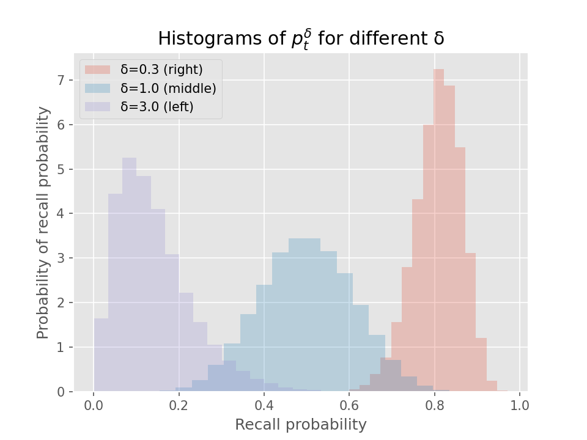

# Ebisu: intelligent quiz scheduling

## Introduction

Given a set of facts that a student is memorizing,

- which facts need reviewing?, and
- how does the student’s performance on a quiz of those facts affect the latter’s future review schedule?

Ebisu is a public-domain library that answers these two questions for developers writing quiz apps.

It aims to provide a simple API to deal with these two aspects of scheduling quizzes.

Under the hood, though, it uses a simple and powerful statistical model of forgetting. It’s recommendations are backed by principled application of Bayesian statistics.

Because of this, Ebisu allows you to ask, at any given moment, “what is the probability that the student has forgotten this fact?”, and it responds with a percentage. Furthermore, Ebisu gives a *confidence interval* around that percentage, giving you an estimate of how sure it is about about its recall score (kind of a “probability about my estimated probability of recall”—meta).

This opens the way for quiz applications to move away from “daily review piles” caused by scheduling algorithms that expect the student to review all the facts scheduled for that day. For instance, a student might have only five minutes to study today—an app using Ebisu can ensure that only the facts most in danger of being forgotten are reviewed. Apps can also provide an infinite stream of quizzes (nightmare!) for students cramming: Ebisu intelligently updates its estimate of memory even when over-reviewing.

Currently, this library comes with a Python implementation, as well as detailed mathematical notes. I plan on porting the algorithm to at least:

- JavaScript, or a compiled-to-JavaScript language, for browsers, and
- PostgreSQL.

This first version was built in Python because of the numerical batteries provided by Scipy, Numpy, PyMC, etc.

## How it works

There are many scheduling schemes, e.g.,

- [Anki](https://apps.ankiweb.net/), an open-source Python flashcard app (and a closed-source mobile app),
- the [SuperMemo](https://www.supermemo.com/help/smalg.htm) family of algorithms ([Anki’s](https://apps.ankiweb.net/docs/manual.html#what-algorithm) is a derivative of SM-2),
- [Memrise.com](https://www.memrise.com), a closed-source webapp,
- [Duolingo](https://www.duolingo.com/), which has published a [blog entry](http://making.duolingo.com/how-we-learn-how-you-learn) and a [conference paper/code repo](https://github.com/duolingo/halflife-regression) on their half-life regression technique,
- the Leitner and Pimsleur spacing schemes (also discussed in some length in Duolingo’s paper).

Many of these are inspired by Hermann Ebbinghaus’ discovery of the [exponential forgetting curve](https://en.wikipedia.org/w/index.php?title=Forgetting_curve&oldid=766120598#History), published in 1885, when he was thirty-five. He [memorized random](https://en.wikipedia.org/w/index.php?title=Hermann_Ebbinghaus&oldid=773908952#Research_on_memory) consonant–vowel–consonant trigrams (‘PED’, e.g.) and found, among other things, that his recall decayed exponentially with some time-constant.

Anki and SuperMemo use carefully-tuned mechanical rules to schedule a fact’s future review immediately after its current review. The rules can get complicated—I wrote a little [field guide](https://gist.github.com/fasiha/31ce46c36371ff57fdbc1254af424174) to Anki’s, with links to the source code—but they are optimized to minimize daily review time while maximizing retention. But because each fact has simply a date of next review, these algorithms do not gracefully accommodate over- or under-reviewing. Even when used as prescribed, they can schedule many facts for review on one day but few on others. (I must note that all three of these issues—over-reviewing (cramming), under-reviewing, and lumpy reviews—have well-supported solutions in Anki: they are tweaks on the rules.)

Duolingo’s half-life regression explicitly models the probability of you recalling a fact as $2^{-Δ/h}$, where Δ is the time since your last review and $h$ is a *half-life*. In this model, your chances of failing a quiz after $h$ days is 50%, which drops to 25% after $2 h$ days. They estimate this half-life by combining your past performance and fact metadata in a machine learning technique called half-life regression (a variant of logistic regression or beta regression, more tuned to this forgetting curve). With each fact associated with a half-life, they can predict the likelihood of forgetting a fact if a quiz was given right now. The results of that quiz (for whichever fact was chosen to review) are used to update that fact’s half-life by re-running the machine learning process with the results from the latest quizzes.

Like Duolingo’s approach, Ebisu can provide a sorted list of facts, from most in danger of being forgotten to least, by explicitly tracking the exponential forgetting curve. However, Ebisu formulates the problem very differently—while memory is understood to decay exponentially, Ebisu posits a *probability distribution* on the half-life and uses quiz results to continually update its beliefs about the half-life in a fully Bayesian way. These updates, while a little more computationally-burdensome than Anki’s scheduler, are much lighter-weight than Duolingo’s industrial-strength approach.

This gives small quiz apps the same intelligent scheduling as Duolingo’s approach—recall probabilities for each fact—but with fast incorporation of quiz results.

> Nerdy details in a nutshell: Ebisu posits a [Beta prior](https://en.wikipedia.org/wiki/Beta_distribution) on recall probabilities. As time passes, the recall probability decays exponentially, and Ebisu handles that nonlinearity exactly and analytically—it evaluates the [Gamma function](http://mathworld.wolfram.com/GammaFunction.html) to predict the current recall probability. A *quiz* is modeled as a Beroulli trial, whose underlying probability prior is this non-conjugate nonlinearly-transformed Beta. Ebisu approximates the true non-standard posterior with a new Beta posterior by matching its mean and variance. This mean and variance are analytically tractable, and again require a few evaluations of the Gamma function.

Currently, Ebisu treats each fact as independent, very much like Ebbinghaus’ nonsense syllables: it does not understand how facts are related the way Duolingo can with its sentences. However, Ebisu can be used in combination with other techniques to accommodate extra information about relationships between facts.

## This document

This document is a literate program. It contains not only source code (currently only Python; JavaScript/compile-to-JavaScript and PostgreSQL versions are planned), but also an explanation of the statistics and mathematics underlying the algorithm.

Therefore, there are three major parts of this document.

1. A brief “too long; didn’t read” section that helps you get going with the library, with minimum of fuss.
1. The math—if you like Beta-distributed random variables, conjugate priors, and marginalization, you’ll want to read this part. If you don’t, I’ll highlight the formulas that Ebisu actually implements.
1. And finally, the source code itself, annotated and explained. If you want to hack on Ebisu’s code, this is the section for you.

## TL;DR

Setup instructions go here

## The math

Let’s begin with a quiz. One way or another, we’ve picked a fact to quiz the student on, $t$ days (the units are arbitrary since $t$ can be any positive real number) after her last quiz on it, or since she learned it for the first time.

We’ll model the results of the quiz as a [Bernoulli experiment](https://en.wikipedia.org/wiki/Bernoulli_distribution), $x_t ∼ Bernoulli(π)$; $x_t$ can be either 1 (success) with probability $π_t$, or 0 (fail) with probability $1-π_t$. Let’s think about $π_t$ as the recall probability at time $t$—then $x_t$ is a coin flip, with a $π_t$-weighted coin.

The [Beta distribution](https://en.wikipedia.org/wiki/Beta_distribution) happens to be the [conjugate prior](https://en.wikipedia.org/wiki/Conjugate_prior) for the Bernoulli distribution. So if our *a priori* belief about $π_t$ follow a Beta distribution, that is, if
$$π_t ∼ Beta(α_t, β_t)$$
for specific $α_t$ and $β_t$, then observing the quiz result updates our belief about the recall probability to be:
$$π_t | x_t ∼ Beta(α_t + x_t, β_t + 1 - x_t).$$

> **Aside 1** Notice that since $x_t$ is either 1 or 0, the updated parameters $(α + x_t, β + 1 - x_t)$ are $(α + 1, β)$ when the student correctly answered the quiz, and $(α, β + 1)$ when she answered incorrectly.
>
> **Aside 2** Even if you’re familiar with Bayesian statistics, if you’ve never worked with priors on probabilities, the meta-ness here might confuse you. What the above means is that, before we flipped our $π_t$-weighted coin (before we administered the quiz), we had a specific probability distribution representing the coin’s weighting $π_t$, *not* just a scalar number. After we observed the result of the coin flip, we updated our belief about the coin’s weighting—it *still* makes total sense to talk about the probability of something happening after it happens. Said another way, since we’re being Bayesian, something actually happening doesn’t preclude us from maintaining beliefs about what *could* have happened.

This is totally ordinary, bread-and-butter Bayesian statistics. However, the major complication arises when the experiment took place not at time $t$ but $t_2$? That is, we have a Beta prior on $π_t$ (probability of  recall at time $t$) but the test is administered at some other time $t_2$.

How can we update our beliefs about the recall probability at time $t$ to another time $t_2$, either earlier or later than $t$?

Our old friend Ebbinghaus comes to our rescue. According to the exponentially-decaying forgetting curve, the probability of recall at time $t$ is
$$π_t = 2^{-t/h},$$
for some notional half-life $h$. Let $t_2 = δ·t$. Then,
$$π_{t_2} = π_{δ t} = 2^{-δt/h} = (2^{-t/h})^δ = (π_t)^δ.$$
That is, to fast-forward or rewind $π_t$ to time $t_2$, we raise it to the $δ = t_2 / t$ power.

Unfortunately, a Beta-distributed $π_t$ becomes not-Beta-distributed when raised to any positive power $δ$.

In the code snippet below, we start out with $π_t ∼ Beta(12, 12)$ and show the distribution of $π_t^δ$ for various $δ$. To make it concrete, imagine $t$ is seven days. The $Beta(12, 12)$ prior on recall probability seven days after the last review is the middle histogram ($δ = 1$). If the student is quizzed on this fact just two days after last review ($δ=0.3$), that density moves from the middle of the plot to the right, meaning a high probability of recall. However, if the student is quizzed three weeks after review, the original density moves to the left: it’s likely the student will fail the quiz.
```py
import matplotlib.pyplot as plt
plt.style.use('ggplot')
plt.rcParams['svg.fonttype'] = 'none'


def generatePis(deltaT, alpha=12.0, beta=12.0):
  import scipy.stats as stats
  import numpy as np
  from scipy.special import beta as fbeta

  piT = stats.beta.rvs(alpha, beta, size=50*1000)
  piT2 = piT ** deltaT

  plt.hist(piT2, bins=20, label='δ={}'.format(deltaT), alpha=0.25, normed=True)
  # p = np.linspace(0, 1, num=1000)
  # a, b, _, _ = stats.beta.fit(piT2, floc=0, fscale=1)
  # plt.plot(p, stats.beta.pdf(p, a, b), ls='dotted', lw=4, alpha=0.5, color='0.5')
  # pr = lambda a,b,d,p: p**((a-d)/d) * (1-p**(1/d))**(b-1) / d / fbeta(a,b)
  # plt.plot(p, pr(alpha,beta,deltaT,p), ls='dashed', color='0.25', alpha=0.35)

  return piT2

generatePis(0.3)
generatePis(1.)
generatePis(3.)
plt.xlabel('π (recall probability)')
plt.ylabel('Probability(π)')
plt.title('Histograms of π_t^δ for different δ')
plt.legend(loc=0)
plt.savefig('figures/pidelta.svg')
plt.savefig('figures/pidelta.png', dpi=150)
plt.show()
```


You’ll have to take my word for it that the histograms where $δ≠1$ as indeed not Beta. I initially fit a Beta distribution to them and sought to make this point visually but alas, for reasonable values of $α$, $β$, and $δ$, a histogram for $π_t^δ$ was well-matched by a Beta distribution.

So let’s derive analytically the probability density function (PDF) for $π_t^δ$. Recall the conventional way to obtain the density of a [nonlinearly-transformed random variable](https://en.wikipedia.org/w/index.php?title=Random_variable&oldid=771423505#Functions_of_random_variables): let $x=π_t$ and $y = g(x) = x^δ$ be the forward transform, so $g^{-1}(y) = x^{1/δ}$ is its inverse. Then, with $x$ being $Beta(α,β)$,
$$P_{Y}(y) = P_{x}(g^{-1}(y)) · \frac{∂}{∂y} g^{-1}(y),$$
and this after some Wolfram Alpha and hand-manipulation becomes
$$P_{Y}(y) = y^{(α-δ)/δ} · (1-y^{1/δ})^{β-1} / (δ · B(α, β)),$$
where $B(α, β) = Γ(α) · Γ(β) / Γ(α + β)$ is [beta function](https://en.wikipedia.org/wiki/Beta_function), also the normalizing denominator in the Beta density (very confusing, sorry; here $Γ(·)$ denotes the [gamma function](https://en.wikipedia.org/wiki/Gamma_function), which is a generalization of factorial).

> To check this, type in `y^((a-1)/d) * (1 - y^(1/d))^(b-1) / Beta[a,b] * D[y^(1/d), y]` at [Wolfram Alpha](https://www.wolframalpha.com).

Replacing the $X$’s and $Y$’s with our usual variables, we have the probability density for $π_{t_2} = π_t^δ$ in terms of the original density for $π_t$:
$$P(π_t^δ) = \frac{π^{(α - δ)/δ} · (1-π^{1/δ})^{β-1}}{δ · B(α, β)}.$$
I tried but failed to rewrite this as a Beta distribution, and indeed, we can show numerically that this density does indeed diverge from the best-approximating Beta density.

We will use the density of {π_t^δ} to reach our two most important goals:
- what’s the recall probability of a given fact right now?, and
- how do I update my estimate of that recall probability given quiz results?

Let’s see how to get the recall probability right now. Recall that we start out with a prior on $π_t ∼ Beta(α, β)$, that is, we believe the recall probability on a quiz conducted $t$ days after the last review for a given fact is $Beta(α, β)$-distributed. This prior is parameterized by three positive real numbers: $[α, β, t]$. Let $δ = t_{now} / t$, where $t_{now}$ is the time currently elapsed since the last review. The expected recall probability right now is
$$\begin{align}
E[π_t^δ] &= \int_0^1 P(π_t^δ) · π \, dπ \\
         &= \frac{Γ(α + β)}{Γ(α)} · \frac{Γ(α + δ)}{Γ(α + β + δ)}.
\end{align}$$

> Mathematica code to verify on Wolfram Alpha: `Integrate[p^((a - d)/d) * (1 - p^(1/d))^(b - 1) / (d * Gamma[a]*Gamma[b]/Gamma[a+b]) * p, {p, 0, 1}]`.

It’s also useful to know how much uncertainty is in our belief about $π_t^δ$. We can evaluate the variance of $π_t^δ$:
$$\begin{align}
Var[π_t^δ] &= \int_0^1 P(π_t^δ) · (π - E[π_t^δ])^2 \, dπ \\
           &= E[π_t^{2 δ}] - (E[π_t^δ])^2.
\end{align}$$

That first value $E[π_t^{2 δ}]$ means evaluate the expected recall probability for $2 δ$, that is, at another $t_{now}$ days in the future. It might be just coincidence but the fact that $2 δ$ shows up in this way surprised me.

> Verifying this in Mathematica/Wolfram Alpha is a bit more involved. First,
> `Assuming[a>0 && b>0 && t>0, {Integrate[p^((a - d)/d) * (1 - p^(1/d))^(b - 1) / (d * Gamma[a]*Gamma[b]/Gamma[a+b]) * (p-m)^2, {p, 0, 1}]}]` gives the result in terms of mean `m` = $E[π_t^δ]$. Then plug in that value for `m` and simplify by hand.

So far we have found three analytical expressions. Suffice it to say that I tested both the derivations as well as my implementations of them in the code thoroughly to confirm that they matched the answers given by quadrature integration as well as Monte Carlo analysis. Code to do that is provided below, and when I present it, I will show how the above formulae are corroborated.

A quiz app can implement at least the expectation $E[π_t^δ]$ above to identify the facts most at risk of being forgotten.

**Important aside** Mentioning a quiz app reminds me—you may be wondering how to pick the prior triple $[α, β, t]$ initially, for example when the student has first learned a fact. I propose setting $t$ equal to your best guess of the fact’s half-life. In Memrise, the first quiz occurs four hours after first learning a fact; in Anki, it’s a day after. To mimic these, set $t$ to four hours or a day, respectively. Then, set $α = β ≥ 2$: the $α = β$ part will center the Beta distribution for $π_t$ at 0.5, and then the actual value will constrain the variability of $π_t$. Specifically, the $Beta(α, β)$ distribution has
- mean $α / (α + β)$ or $0.5$ if $α = β$, and
- variance $α · β / (α + β)^ 2 / (α + β + 1)$ which simplifies to $1/(4 (2 α + 1))$ when $α = β$.
  - (Recall the traditional explanation of $α$ and $β$ are the number of successes and failures, respectively, that have been observed by flipping a weighted coin—or in our application, the number of successful versus unsuccessful quiz results for a sequence of quizzes on the same fact $t$ days apart.)

A higher value for $α = β$ encodes *higher* confidence in the expected half-life $t$, which in turn makes the model (which we’ll detail below) *less* sensitive to quiz results. In our experiments below, $α = β = 12$ is our least sensitive model, while $α = β = 3$ is our most sensitive model. In the absence of strong feelings, a quiz app author can pick a number between these.

Now, let us turn to the final piece of the math, how to update our Beta prior on a fact’s recall probability when a quiz result arrives.

One option could be this: since we have analytical expressions for the mean and variance of the prior on $π_t^δ$, convert these to the [closest Beta distribution](https://en.wikipedia.org/w/index.php?title=Beta_distribution&oldid=774237683#Two_unknown_parameters) and straightforwardly update with the Bernoulli likelihood (straightforward because of conjugacy). However, it is better to delay the Beta fit till we have the posterior, and do the likelihood update analytically. Lucky for us, this is tractable and we will see code later that demonstrates the  boost in accuracy with respect to a computationally-expensive Monte Carlo simulation.

By application of Bayes rule, the posterior is
$$Posterior(π|x) = \frac{Prior(π) · Lik(x|π)}{\int_0^1 Prior(π) · Lik(x|π) \, dπ},$$
where “posterior” and “prior” are the Beta densities, $Lik$ is the Bernoulli likelihood, and the denominator is the marginal probability of the observation $x$. $Lik(x|π) = π$ when $x=1$ and $1-π$ when $x=0$. (Here we’re dropping the time-subscripts since all recall probabilities $π$ and quiz results $x$ are at the same $t_2 = t · δ$.)

Next we compute the mean and variance of this posterior, because that’s how we’ll fit it to a Beta distribution to function as our subsequent prior. We’ll break this down into the $x=1$ (success) and $x=0$ (failure) cases. In the following, let $γ_n = Γ(α + n·δ) / Γ(α+β+n·δ)$; this exposes numerical symmetries that an implementation can take advantage of.

$$E[π | x=1] = \int_0^1 π · Posterior(π|x=1) \, dπ = γ_2 / γ_1.$$

$$\begin{align}
Var[π | x=1] &= \int_0^1 (π - E[π | x=1])^2 · Posterior(π|x=1) \, dπ \\
             &= γ_3 / γ_1 - (E[π|x=1])^2.
\end{align}$$

The posterior mean and variance when $x=0$ (failed quiz) are:

$$E[π | x=0] = \frac{γ_2 - γ_1}{γ_1 - γ_0}.$$

$$Var[π | x=0] = \frac{γ_3 (γ_1 - γ_0) + γ_2 (γ_0 + γ_1 - γ_2) - γ_1^2}{(γ_1 - γ_0)^2}$$

> The Mathematica expressions used in deriving these are given in the source code below. Unlike the first few analytical results above, these required considerable hand-simplification, and we will double-check them against both Monte Carlo and quadrature integration below.

With the mean and variance of the posterior in hand, it is straightforward to find a well-approximating Beta distribution using the [method of moments](https://en.wikipedia.org/w/index.php?title=Beta_distribution&oldid=774237683#Two_unknown_parameters):
- a new $α' = μ (μ (1-μ) / σ^2 - 1)$ and
- $β' = (1-μ) (μ (1-μ) / σ^2 - 1)$,
  - for $μ = E[π|x]$ and $σ^2 = Var[π|x]$.

The updated posterior becomes the new prior, parameterized by this $[α', β', t_2]$, where $t_2$ is the time elapsed between this fact’s last quiz and the one just used in the update.

We are done. That’s all the math.


## Source code

```py
def betafitBeforeLikelihood(a,b,t1,x,t2):
  a2, b2 = meanVarToBeta(recallProbabilityMean(a,b,t1, t2), recallProbabilityVar(a,b, t1, t2))
  return a2 + x, b2 + 1 - x, t2
update(3.3,4.4,1.,0.,2.)
posteriorAnalytic(3.3,4.4,1.,1.,2.)
```

```py
# export ebisu/__init__.py #
from .ebisu import *
from . import alternate
from . import montecarlo
```

```py
# export ebisu/alternate.py #
import numpy as np

def recallProbabilityMode(alpha, beta, t, tnow):
  """Returns the mode of the immediate (pseudo-Beta) prior"""
  # [peak] [WolframAlpha result](https://www.wolframalpha.com/input/?i=Solve%5B+D%5Bp%5E((a-t)%2Ft)+*+(1-p%5E(1%2Ft))%5E(b-1),+p%5D+%3D%3D+0,+p%5D) for `Solve[ D[p**((a-t)/t) * (1-p**(1/t))**(b-1), p] == 0, p]`
  dt = tnow / t
  pr = lambda p: p**((alpha-dt)/dt) * (1-p**(1/dt))**(beta-1)

  # See [peak]. The actual mode is `modeBase ** dt`, but since `modeBase` might be negative or otherwise invalid, check it.
  modeBase = (alpha - dt) / (alpha + beta - dt - 1)
  if modeBase >= 0 and modeBase <= 1:
    # Still need to confirm this is not a minimum (anti-mode). Do this with a coarse check of other points likely to be the mode.
    mode = modeBase ** dt
    modePr = pr(mode)

    eps = 1e-3
    others = [eps,
              mode - eps if mode > eps else mode / 2,
              mode + eps if mode < 1 - eps else (1 + mode) / 2,
              1 - eps]
    otherPr = map(pr, others)
    if max(otherPr) <= modePr:
      return mode
  # If anti-mode detected, that means one of the edges is the mode, likely caused by a very large or very small `dt`. Just use `dt` to guess which extreme it was pushed to. If `dt` == 1.0, and we get to this point, likely we have malformed alpha/beta (i.e., <1)
  return 0.5 if dt == 1. else (0. if dt > 1 else 1.)

def recallProbabilityMedian(alpha, beta, t, tnow, percentile=0.5):
  """"""
  # [cdf] [WolframAlpha result](https://www.wolframalpha.com/input/?i=Integrate%5Bp%5E((a-t)%2Ft)+*+(1-p%5E(1%2Ft))%5E(b-1)+%2F+t+%2F+Beta%5Ba,b%5D,+p%5D) for `Integrate[p**((a-t)/t) * (1-p**(1/t))**(b-1) / t / Beta[a,b], p]`
  from scipy.optimize import brentq
  from scipy.special import beta as fbeta
  from scipy.special import hyp2f1

  dt = tnow / t

  # See [cdf]. If the mode doesn't exist (or can't be found), find the median (or `percentile`) using a root-finder and the cumulative distribution function.
  # N.B. I prefer to try to find the mode (above) because it will be much faster than this.
  cdfPercentile = lambda p: (p**(alpha/dt) *
                             hyp2f1(alpha, 1 - beta, 1 + alpha, p**(1/dt)) /
                             alpha /
                             fbeta(alpha,beta)) - percentile
  return brentq(cdfPercentile, 0, 1)
#
def recallProbabilityMean(alpha, beta, t, tnow):
  # `Integrate[p^((a - t)/t) * (1 - p^(1/t))^(b - 1) * (p)/t/(Gamma[a]*Gamma[b]/Gamma[a+b]), {p, 0, 1}]`
  from scipy.special import beta as fbeta
  dt = tnow / t
  return fbeta(alpha + dt, beta) / fbeta(alpha, beta)

def recallProbabilityVar(alpha, beta, t, tnow):
  # TODO Reduce the number of Gammas required by sharing intermediate results:
  md = recallProbabilityMean(alpha, beta, t, tnow)
  md2 = recallProbabilityMean(alpha, beta, t, 2 * tnow)

  # `Assuming[a>0 && b>0 && t>0, {Integrate[p^((a - t)/t) * (1 - p^(1/t))^(b - 1) * (p-m)^2/t/(Gamma[a]*Gamma[b]/Gamma[a+b]), {p, 0, 1}]}]``
  # And then plug in mean for `m` & simplify to get:
  return md2 - md**2

def recallProbabilityMonteCarlo(alpha, beta, t, tnow, N=1000000):
  import scipy.stats as stats
  tPrior = stats.beta.rvs(alpha, beta, size=N)
  tnowPrior = tPrior ** (tnow / t)
  freqs, bins = np.histogram(tnowPrior,'auto')
  bincenters = bins[:-1] + np.diff(bins) / 2
  return dict(mean=np.mean(tnowPrior),
              median=np.median(tnowPrior),
              mode=bincenters[freqs.argmax()],
              var=np.var(tnowPrior))

# So we have several ways of evaluating the posterior mean/var:
# - Monte Carlo
# - Quadrature integration
# - Analytic expression, with several hyp2f1
# - Simplified analytic expression with fewer hyp2f1 (recurrence relations)

def posteriorAnalytic(alpha, beta, t, result, tnow):
  from scipy.special import gammaln, gamma

  dt = tnow / t
  if result == 1:
    # marginal: `Integrate[p^((a - t)/t)*(1 - p^(1/t))^(b - 1)*p, {p,0,1}]`
    # mean: `Integrate[p^((a - t)/t)*(1 - p^(1/t))^(b - 1)*p*p, {p,0,1}]`
    # variance: `Integrate[p^((a - t)/t)*(1 - p^(1/t))^(b - 1)*p*(p - m)^2, {p,0,1}]`
    # Simplify all three to get the following:
    same = gammaln(alpha+beta+dt) - gammaln(alpha+dt)
    mu = np.exp(gammaln(alpha + 2*dt)
              - gammaln(alpha + beta + 2*dt)
              + same)
    var = np.exp(same + gammaln(alpha + 3*dt) - gammaln(alpha + beta + 3*dt)) - mu**2
  else:
    # Mathematica code is same as above, but replace one `p` with `(1-p)`
    # marginal: `Integrate[p^((a - t)/t)*(1 - p^(1/t))^(b - 1)*(1-p), {p,0,1}]`
    # mean: `Integrate[p^((a - t)/t)*(1 - p^(1/t))^(b - 1)*(1-p)*p, {p,0,1}]`
    # var: `Integrate[p^((a - t)/t)*(1 - p^(1/t))^(b - 1)*(1-p)*(p - m)^2, {p,0,1}]`
    # Then simplify and combine
    same0 = gamma(alpha) / gamma(alpha+beta)
    same1 = gamma(alpha+dt) / gamma(alpha+beta+dt)
    same2 = gamma(alpha+2*dt) / gamma(alpha+beta+2*dt)
    same3 = gamma(alpha+3*dt) / gamma(alpha+beta+3*dt)
    mu = (same1 - same2) / (same0 - same1)
    var = (same3 * (same1 - same0) + same2 * (same0 + same1 - same2) - same1**2) / (same1 - same0) ** 2
  newAlpha, newBeta = meanVarToBeta(mu, var)
  return newAlpha, newBeta, tnow


def posteriorQuad(alpha, beta, t, result, tnow, analyticMarginal=True, maxiter=100):
  """Update a time-dependent Beta distribution with a new data sample"""
  from scipy.integrate import quadrature

  dt = tnow / t

  if result == 1:
    marginalInt = lambda p: p**((alpha-dt)/dt) * (1-p**(1/dt))**(beta-1)*p
  else:
    # difference from above: -------------------------------------------^vvvv
    marginalInt = lambda p: p**((alpha-dt)/dt) * (1-p**(1/dt))**(beta-1)*(1-p)

  if analyticMarginal:
    from scipy.special import beta as fbeta
    if result == 1:
      marginal = dt * fbeta(alpha+dt, beta)
    else:
      marginal = dt * (fbeta(alpha, beta) - fbeta(alpha+dt, beta))
  else:
    marginalEst = quadrature(marginalInt, 0, 1, maxiter=maxiter)
    marginal = marginalEst[0]

  muInt = lambda p: marginalInt(p) * p
  muEst = quadrature(muInt, 0, 1, maxiter=maxiter)
  mu = muEst[0] / marginal

  varInt = lambda p: marginalInt(p) * (p - mu)**2
  varEst = quadrature(varInt, 0, 1, maxiter=maxiter)
  var = varEst[0] / marginal

  newAlpha, newBeta = meanVarToBeta(mu, var)
  return newAlpha, newBeta, tnow


def meanVarToBeta(mean, var):
  # [betaFit] https://en.wikipedia.org/w/index.php?title=Beta_distribution&oldid=774237683#Two_unknown_parameters

  tmp = mean * (1 - mean) / var - 1
  alpha = mean * tmp
  beta = (1 - mean) * tmp
  return alpha, beta


def posteriorMonteCarlo(alpha, beta, t, result, tnow, N=10000):
  """Update a time-dependent Beta distribution with a new data sample"""
  # [bernoulliLikelihood] https://en.wikipedia.org/w/index.php?title=Bernoulli_distribution&oldid=769806318#Properties_of_the_Bernoulli_Distribution, third (last) equation
  # [weightedMean] https://en.wikipedia.org/w/index.php?title=Weighted_arithmetic_mean&oldid=770608018#Mathematical_definition
  # [weightedVar] https://en.wikipedia.org/w/index.php?title=Weighted_arithmetic_mean&oldid=770608018#Weighted_sample_variance
  import scipy.stats as stats

  tPrior = stats.beta.rvs(alpha, beta, size=N)

  # To see where this comes from, read the rest of this document!
  tnowPrior = tPrior ** (tnow / t)

  # This is the Bernoulli likelihood [bernoulliLikelihood]
  weights = (tnowPrior)**result * ((1 - tnowPrior)**(1 - result))

  # See [weightedMean]
  weightedMean = np.sum(weights * tnowPrior) / np.sum(weights)
  # See [weightedVar]
  weightedVar = np.sum(weights * (tnowPrior - weightedMean)**2) / np.sum(weights)

  newAlpha, newBeta = meanVarToBeta(weightedMean, weightedVar)

  return newAlpha, newBeta, tnow

def priorToHalflife(alpha, beta, t, percentile=0.5, maxt=100, mint=0):
  from scipy.optimize import brentq
  h = brentq(lambda now: recallProbabilityMean(alpha, beta, t, now) - percentile,
             mint, maxt)
  # `h` is the expected half-life, i.e., the time at which recall probability drops to 0.5.
  # To get the variance about this half-life, we have to convert probability variance (around 0.5) to a time variance. This is a really dumb way to do that:
  # - `v` is the probability variance around 0.5, so `sqrt(v)` is the standard deviation
  # - find the times for which `0.5 +/- sqrt(v)`. This is a kind of one-sigma confidence interval in time
  # - convert these times to a 'time variance' by taking their mean-absolute-distance to `h` and squaring that.
  # Open to suggestions for improving this. The second 'variance' number should not be taken seriously, but it can be used for notional plotting.
  v = recallProbabilityVar(alpha, beta, t, h)
  h2 = brentq(lambda now: recallProbabilityMean(alpha, beta, t, now) - (percentile - np.sqrt(v)),
              mint, maxt)
  h3 = brentq(lambda now: recallProbabilityMean(alpha, beta, t, now) - (percentile + np.sqrt(v)),
              mint, maxt)

  return h, ((np.abs(h2 - h) + np.abs(h3 - h)) / 2)**2

```

```py
import scipy.stats as stats
import matplotlib.pyplot as plt

plt.style.use('ggplot')
plt.rcParams['svg.fonttype'] = 'none'


betaa = 4./3
betab = 4./3

betaa = 12.
betab = 12.

betaa = 3.3
betab = 4.4

t0 = 7.
dt = 2.
# dt=.01

print([posteriorMonteCarlo(betaa, betab, t0, 1., t0 * dt, N=100000), posteriorQuad(betaa, betab, t0, 1., t0 * dt, analyticMarginal=True), posteriorQuad(betaa, betab, t0, 1., t0 * dt, analyticMarginal=False), posteriorAnalytic(betaa, betab, t0, 1., t0 * dt)])

print([posteriorMonteCarlo(betaa, betab, t0, 0., t0 * dt, N=100000), posteriorQuad(betaa, betab, t0, 0., t0 * dt, analyticMarginal=True), posteriorQuad(betaa, betab, t0, 0., t0 * dt, analyticMarginal=False), posteriorAnalytic(betaa, betab, t0, 0., t0 * dt)])

print('gamma pass', priorToHalflife(*posteriorAnalytic(betaa, betab, t0, 1., t0 * dt)))
print('gamma fail', priorToHalflife(*posteriorAnalytic(betaa, betab, t0, 0., t0 * dt)))

def priorToHalflifeMonteCarlo(a, b, t, N=10000):
  pis = stats.beta.rvs(a, b, size=N)
  hs = -t / np.log2(pis)
  return np.mean(hs), np.var(hs)


print('MC gamma pass', priorToHalflifeMonteCarlo(*posteriorAnalytic(betaa, betab, t0, 1., t0 * dt)))
print('MC gamma fail', priorToHalflifeMonteCarlo(*posteriorAnalytic(betaa, betab, t0, 0., t0 * dt)))

alls = [recallProbabilityMean(betaa,betab,t0, dt*t0), recallProbabilityMedian(betaa,betab,t0, dt*t0), recallProbabilityMode(betaa,betab,t0, dt*t0), recallProbabilityVar(betaa,betab,t0, dt*t0), recallProbabilityMonteCarlo(betaa,betab,t0, dt*t0)]
alls
print(alls)
# All 2.5 methods above (mode doesn't make sense for PDFs going to infinity) are about equally fast. Which to use?

v2s = lambda var: np.sqrt(var)

ts = np.arange(1, 31.)

plt.close('all')
plt.figure()
ax = plt.subplot(111)
plt.axhline(y=t0, linewidth=1, color='0.5')
[plt.errorbar(ts,
          np.array(list(map(lambda t: priorToHalflife(*posteriorAnalytic(a, a, t0, xobs, t))[0],
                            ts))),
          v2s(np.array(list(map(lambda t: priorToHalflife(*posteriorAnalytic(a, a, t0, xobs, t))[1],
                            ts)))),
          fmt='x-' if xobs == 1 else 'o-',
          color='C{}'.format(aidx),
          label='a=b={}, {}'.format(a, 'pass' if xobs==1 else 'fail'))
 for (aidx, a) in enumerate([3, 6, 12])
 for xobs in [1, 0]]
plt.grid(True)
plt.legend(loc=0)
plt.title('New interval, for old interval={} days'.format(t0))
plt.xlabel('Time test taken (days)')
plt.ylabel('New interval (days)')
plt.savefig('figures/halflife.svg')
plt.savefig('figures/halflife.png',dpi=150)
plt.show()


```

```py

plt.figure();
modelA = posteriorAnalytic(3., 3., 7., 1, 15.)
modelB = posteriorAnalytic(12., 12., 7., 1, 15.)
hlA = priorToHalflife(*modelA)
hlB = priorToHalflife(*modelB)
plt.errorbar(ts,
             recallProbabilityMean(*modelA, ts),
             v2s(recallProbabilityVar(*modelA, ts)),
             fmt='.-', label='Model A', color='C0')
plt.plot(ts, 2**(-ts / hlA[0]), '--', label='approx A', color='C0')
plt.errorbar(ts,
             recallProbabilityMean(*modelB, ts),
             v2s(recallProbabilityVar(*modelB, ts)),
             fmt='.-', label='Model B', color='C1')
plt.plot(ts, 2**(-ts / hlB[0]), '--', label='approx B', color='C1')
plt.legend(loc=0)
plt.ylim([0, 1])
plt.grid(True)
plt.xlabel('Time (days)')
plt.ylabel('Recall probability')
plt.title('Predicted forgetting curves (A: a=b=3, B: a=b=12)')
plt.savefig('figures/forgetting-curve.svg')
plt.savefig('figures/forgetting-curve.png',dpi=150)
plt.show()


```


### Details (😱😪)
```py
import numpy as np
import scipy.stats as stats
import pylab

from pymc3 import Model, Gamma, Bernoulli
from pymc3 import NUTS, sample
from pymc3 import traceplot


t = 3.
xobs = 1.

def unscented(a,b,dt):
  # https://www.mitre.org/sites/default/files/pdf/vanzandt_unscented.pdf
  mean = a/(a+b)
  var = a*b/((a+b)**2*(a+b+1))
  xset = np.array([-1., 1.]) * np.sqrt(var) + mean
  yset = xset**dt
  mean2 = np.mean(yset)
  var2 = np.var(yset)
  a2 = mean2 * (mean2*(1-mean2)/var2 - 1)
  b2 = (1-mean2) * (mean2*(1-mean2)/var2 - 1)
  return a2, b2


def up(pis,t0,t,xobs):
  pis2 = pis ** (t / t0)
  b2, a2, pis3 = piposterior(pis2, xobs)
  return pis2gammaest(pis3, t)

t0 = 7.
betaa = 12.
betab = 12.
betaa = 4.
betab = 4.
pis = stats.beta.rvs(betaa, betab, size=50000)
pis2 = pis ** (t / t0)
_, _, pis3 = piposterior(pis2, xobs)

dt = t/t0
ps = np.linspace(0 + np.spacing(1), 1 - np.spacing(1))

newprior = lambda dt: mkpdf(ps, stats.beta.pdf(ps**(1/dt), betaa-dt+1, betab))
# via wolfram alpha: zeros of derivative of "new prior"
peakpi = lambda dt: ((betaa - dt)/(betaa + betab - dt - 1))**dt
peakpi(3/7.)


[np.mean(pis3), np.var(pis3)]
w = (pis2)**xobs*(1-pis2)**(1-xobs)
foo = [np.sum(w*pis2) / np.sum(w), np.sum(w * (pis2 - foo[0])**2) / np.sum(w)]
foo


stats.beta.fit(w, floc=0,fscale=1)
pylab.close('all')
pylab.figure()
# pylab.hist(pis,20,normed=True,alpha=.25,label='prior');
# pylab.hist(pis2,20,normed=True,alpha=.25,label='new prior');
pylab.hist(pis3,20,range=[0,1.],normed=True,alpha=.25, label='posterior');
pylab.hist(pis2,20,weights=w,range=[0,1.], normed=True,alpha=.25, label='weighted');
pylab.legend(loc=0);
# pylab.hist(w,20,normed=True,alpha=.5);

##
pispost = stats.beta.rvs(betaa+xobs, betab+1-xobs, size=50000)
foo = stats.beta.pdf(pis, betaa+xobs, betab+1-xobs) / stats.beta.pdf(pis, betaa, betab)
pylab.figure()
pylab.hist(pispost,20,normed=True,alpha=.5);
pylab.hist(pis,20,weights=foo,normed=True,alpha=.5);

##


up(pis, t0, t, xobs)
up(pis, t0, 40, 1)
up(pis, t0, 40, 0)
up(pis, t0, .1, 1)

stats.beta.fit(pis, floc=0,fscale=1)
stats.beta.fit(stats.beta.rvs(betaa, betab, size=50000)**(t/t0), floc=0,fscale=1)
stats.beta.fit(stats.beta.rvs(betaa, betab, size=500)**(t/t0), floc=0,fscale=1)
unscented(betaa, betab, t/t0)

pylab.close('all')
pylab.hist(pis2, 50, alpha=0.5,normed=True, range=[0,1.]);
pylab.hist(pis3, 50, alpha=0.33, normed=True, range=[0,1.]);

stats.beta.fit(pis3, floc=0,fscale=1)

# true PDF of posterior, likely not Beta
dt = t/t0
ps = np.linspace(0 + np.spacing(1), 1 - np.spacing(1))

pylab.plot(ps, stats.beta.pdf(ps**(1/dt), betaa, betab) * ps**(1/dt-1)/dt);

from scipy.special import beta
def mkpdf(x,f):
  return f / f.sum() / (x[1]-x[0])

pylab.hist(pis2, 50, alpha=0.5,normed=True, range=[0,1.]);
pylab.hist(pis3, 50, alpha=0.33, normed=True, range=[0,1.]);
# this is the "new" prior
pylab.plot(ps, mkpdf(ps, stats.beta.pdf(ps**(1/dt), betaa, betab) * ps**(1/dt-1)/dt), '.-');
pylab.plot(ps, mkpdf(ps, stats.beta.pdf(ps**(1/dt), betaa-dt+1, betab)),'--');

# this is the posterior, after Bernoulli likelihood
pylab.plot(ps, mkpdf(ps,ps**(xobs + (betaa-dt)/dt) * (1-ps)**(1-xobs) * (1-ps**(1/dt))**(betab-1) / t / beta(betaa, betab)));

post = mkpdf(ps,ps**(xobs + (betaa-dt)/dt) * (1-ps)**(1-xobs) * (1-ps**(1/dt))**(betab-1) / t / beta(betaa, betab))
postbare = ps**(xobs + (betaa-dt)/dt) * (1-ps)**(1-xobs) * (1-ps**(1/dt))**(betab-1)
from numpy.linalg import lstsq

import scipy.linalg as sla
Amat = np.vstack([np.log(ps), np.log(1-ps)]).T
apm1, bpm1 = lstsq(Amat, np.log(post))[0]
ap, bp = apm1 + 1, bpm1 + 1

import scipy.optimize as opt
apo, bpo = opt.leastsq(lambda v: stats.beta.pdf(ps, v[0], v[1]) - post, np.array([10., 3.5]))
apo, bpo
stats.beta.fit(pis3, floc=0,fscale=1)


##

pylab.close('all')
pylab.hist(pis3, 50, alpha=0.33, normed=True, range=[0,1.], label='post beta');
pylab.plot(ps, mkpdf(ps,ps**(xobs + (betaa-dt)/dt) * (1-ps)**(1-xobs) * (1-ps**(1/dt))**(betab-1)), label='true post');
pylab.plot(ps, stats.beta.pdf(ps, ap, bp), label='fit post')
pylab.legend(loc=0)

ts = np.arange(1,40)
success = np.array(list(map(lambda t: up(pis,t0,t,1.), ts)))
fail = np.array(list(map(lambda t: up(pis,t0,t,0.), ts)))
pylab.close('all')
pylab.errorbar(ts, success[:,0], yerr=success[:,1]/3,fmt='x-');
pylab.errorbar(ts, fail[:,0], yerr=fail[:,1]/3,fmt='o-');
pylab.grid(True)

pylab.grid(True)


def anki(i, d=0, m=1., m4=1.3, f=1.3):
  i2 = max(i + 1, (i + d/4) * 1.2 * m)
  i3 = max(i2 + 1, (i + d/2) * (f / 1000) * m)
  i4 = max(i3 + 1, (i + d) * (f / 1000) * m * m4)
  return (i2, i3, i4)

anki(7)
anki(7,-3)
anki(7,3)

def piposterior(priorpis, x):
  betaa, betab, _, _ = stats.beta.fit(priorpis, floc=0, fscale=1)
  betaa2 = betaa + x
  betab2 = betab + 1 - x
  postsamples = stats.beta.rvs(betaa2, betab2, size=hs.size)
  return betaa2, betab2, postsamples


def pis2gammaest(pis, t):
  h2s = -t / np.log2(pis)
  alpha2, _, beta2inv = stats.gamma.fit(h2s, floc=0)
  beta2 = 1 / beta2inv

  uh2, vh2 = (alpha2/beta2, alpha2 / beta2**2)
  return (uh2, np.sqrt(vh2))


pis2gammaest(pis, t0)
pis2gammaest(pis2, t)
pylab.close('all')
pylab.hist(pis,40)
pylab.hist(pis2,40)
pylab.show()


uh = 7. # days (mean)
vh = 4. # days**2 (variance)

beta = uh / vh
alpha = vh * beta**2

assert(np.isclose(uh, alpha / beta))
assert(np.isclose(vh, alpha / beta**2))

hs = stats.gamma.rvs(alpha, scale=1/beta, size=50000)
hs.mean()
hs.var()

def newMeanVar(t):
  π = 2.**(-t/hs)

  betaa, betab, _, _ = stats.beta.fit(π,floc=0,fscale=1)

  betaa2 = betaa + xobs
  betab2 = betab + 1 - xobs

  beta2s = stats.beta.rvs(betaa2, betab2, size=hs.size)
  h2s = -t / np.log2(beta2s)
  alpha2, _, beta2inv = stats.gamma.fit(h2s, floc=0)
  beta2 = 1 / beta2inv

  uh2, vh2 = (alpha2/beta2, alpha2 / beta2**2)
  return (uh2, vh2)

ts = np.arange(1,20)
news = np.array(list(map(newMeanVar, ts)))
pylab.plot(ts,news,'.-')
pylab.grid(True)

pylab.plot(ts,news,'.-')
pylab.grid(True)

betas = stats.beta.rvs(betaa, betab, size=10000)
pylab.close('all')
pylab.hist(π,40)
pylab.hist(betas,40)
pylab.hist(beta2s,40)
pylab.show()


basic_model = Model()
with basic_model:
  h = Gamma('h', alpha, beta)
  pi = 2 ** (-t / h)
  x = Bernoulli('x', pi, observed=xobs)

with basic_model:
  trace = sample(5000)
[trace['h'].mean(), trace['h'].var()]

# [6.6263918353576061, 2.0113573783697993] with vh = 2 & x=0, t=3
# [6.4593888708603382, 3.512451646364334] with vh = 4 & x = 0, t=3
# [7.1920570690327379, 3.7075010758265678] with v=4 & x = 1, t=3
# [7.6331225997896226, 4.0075803038947049] with v=4 & x = 1 & t=12
# [6.7015398215486259, 3.5228654317357759] v=4, x=0, t=12

pylab.ion()
traceplot(trace);

pylab.close('all')
pylab.figure()
pylab.hist(posteriors, bins=100)
pylab.show()

```
## Implementation thoughts

Lua, Erlang, Elixir, Red, F#, OCaml, Reason, PureScript, JS, TypeScript, Rust, …

Postgres (w/ or w/o GraphQL), SQLite, LevelDB, Redis, Lovefield, …
