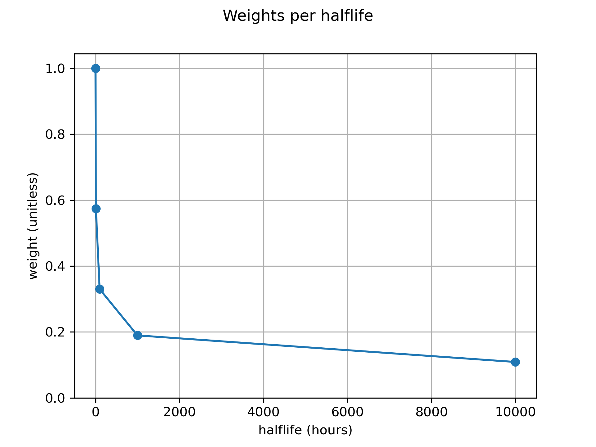
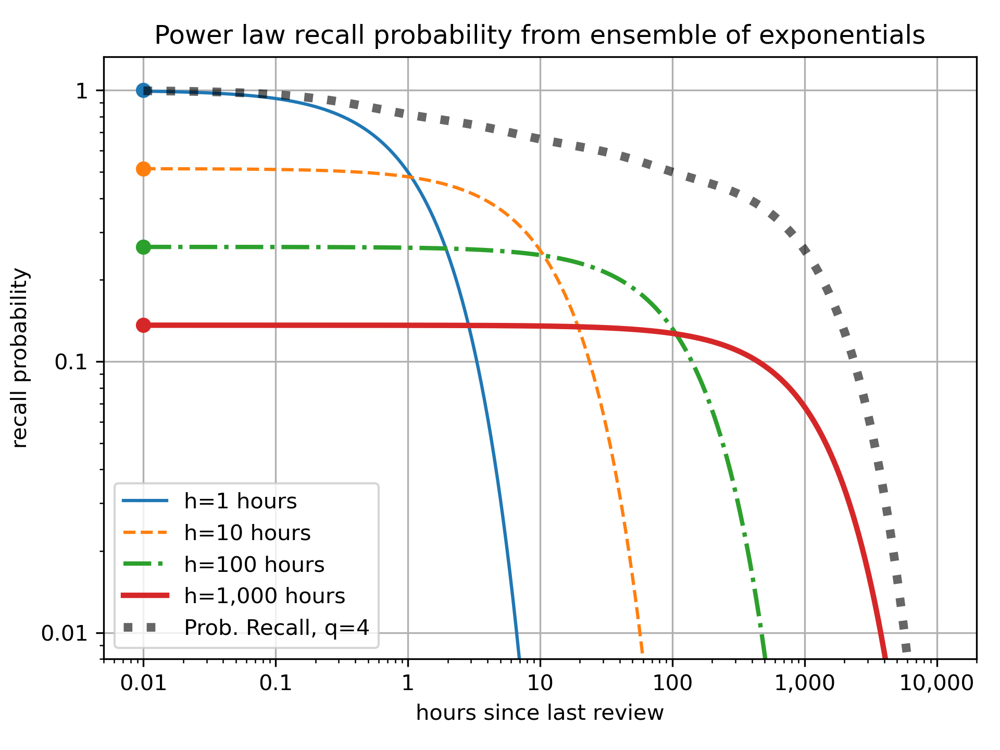

# Ebisu: intelligent quiz scheduling

- [Ebisu: intelligent quiz scheduling](#ebisu-intelligent-quiz-scheduling)
  - [Introduction](#introduction)
  - [Install](#install)
  - [API Quickstart](#api-quickstart)
    - [Data model](#data-model)
    - [Predict recall probability](#predict-recall-probability)
    - [Quick-update halflife after a quiz](#quick-update-halflife-after-a-quiz)
    - [Fully-update halflife and boost](#fully-update-halflife-and-boost)
    - [Reset a model to a new halflife](#reset-a-model-to-a-new-halflife)
  - [How it works](#how-it-works)
  - [Math](#math)
  - [Acknowledgments](#acknowledgments)


## Introduction
- [Literate document](https://fasiha.github.io/ebisu/)
- [GitHub repo](https://github.com/fasiha/ebisu)
- [PyPI package](https://pypi.python.org/pypi/ebisu/)
- [Changelog](https://github.com/fasiha/ebisu/blob/gh-pages/CHANGELOG.md)
- [Contact](https://fasiha.github.io/#contact)

Consider a student memorizing a set of facts.

- Which facts need reviewing?
- How does the student’s performance on a review change the fact’s future review schedule?

Ebisu is an open-source public-domain library that answers these two questions. It is intended to be used by software developers writing quiz apps, and provides a simple API to deal with these two aspects of scheduling quizzes, centered on two functions:
- `predictRecall` gives the current recall probability for a given fact.
- `updateRecall` adjusts the belief about future recall probability given a quiz result.

Behind this simple API, Ebisu is using a simple yet powerful model of forgetting, a model that is founded on Bayesian statistics and sum-of-exponentials (power law) forgetting.

With Ebisu, quiz applications can move away from “daily review piles” caused by less flexible scheduling algorithms. For instance, a student might have only five minutes to study today, so an app using Ebisu can ensure that only the facts most in danger of being forgotten are reviewed. And since every flashcard always has a recall probability at any given time, Ebisu also enables apps to provide an infinite stream of quizzes for students who are cramming. Thus, Ebisu intelligently handles over-reviewing as well as under-reviewing.

This document contains both a detailed mathematical description of the underlying algorithm as well as the software API it exports. Separate implementations in other languages are detailed below.

The next sections are installation and an [API Quickstart](#qpi-quickstart). See these if you know you want to use Ebisu in your app.

Then in the [How It Works](#how-it-works) section, I contrast Ebisu to other scheduling algorithms and describe, non-technically, why you should use it.

Then there’s a long [Math](#the-math) section that details Ebisu’s algorithm mathematically. If you like Gamma-distributed random variables, importance sampling, and maximum likelihood, this is for you.

> Nerdy details in a nutshell: Ebisu largely follows Mozer et al.’s multiscale context model (MCM) of \(n\) leaky integrators, published at [NIPS 2009](https://home.cs.colorado.edu/~mozer/Research/Selected%20Publications/reprints/MozerPashlerCepedaLindseyVul2009.pdf) ([local copy](./MozerPashlerCepedaLindseyVul2009.pdf)), but with a Bayesian twist. The probability of recall for a given fact is assumed to be governed by an ensemble of decaying exponentials with *fixed* time constants (these increase from an hour to ten years) but *uncertain* mixture weights. The weights themselves decay according to an exponential to a single uncertain value governed by a single Beta random variable. Therefore, the recall probability at any given time is a straightforward arithmetic expression of elapsed time, time constants, and weights. And after a quiz, the new best estimate of the weights is computed via a simple MAP (maximum a posteriori) estimator implemented as a simple hill-climbing algorithm.
 
Finally, in the [Source Code](#source-code) section, we describe the software testing done to validate the math, including tests comparing Ebisu’s output to Monte Carlo sampling.

A quick note on history—more information is in the [Changelog](https://github.com/fasiha/ebisu/blob/gh-pages/CHANGELOG.md). This document discusses Ebisu v3. Versions 2 and before used a very different model that was both more complex and that failed to handle the *strenghening* of memory that accompanied quizzes. If you are interested, see the [Changelog](https://github.com/fasiha/ebisu/blob/gh-pages/CHANGELOG.md) for details and a migration guide.

## Install
```sh
python -m pip install ebisu
```

## API Quickstart

### Data model
```py
def initModel(
    wmaxMean: Optional[float] = None,
    hmax: float = 1e5,
    n: int = 10,
    initHlMean: Optional[float] = None,
    now: Optional[float] = None,
) -> Model
```
For each fact in your quiz app, create an Ebisu `Model` via `ebisu.initModel`. The three optional keyword arguments, `wmaxMean`, `hmax`, and `n`, govern the collection of leaky integrators (weighted exponentials) that are at the heart of the Ebisu framework. Let’s talk about how they work.

1. There are `n` leaky integrators (decaying exponentials), each with a halflife that’s strictly logarithmically increasing, starting at 1 hour and ending at `hmax` hours.
2. Each of the `n` leaky integrators also has a weight, indicating its maximum recall probability at time 0. The weights are strictly exponentially decreasing: the first leaky integrator gets a weight of 1 and the `n`th gets `wmaxMean`. A single leaky integrator predicts a recall probability \\(p_i(t) ∝ w_i ⋅ 2^{-t / h_i}\\) (here \\(t\\) indicates hours since last review).

Putting these together, you get the Ebisu formula for probability of recall, just take the *max* of each leaky integrator: \\(p(t) = \max_i(w_i ⋅ 2^{-t / h_i})\\).

For example, with `n=5` leaky integrators going from 1 hour to `hmax=1e4` hours (10⁴ hours is 13.7-ish months), and with `wmaxMean=0.1` (the longest-duration exponential starts off with 10% probability) yields this profile of weights:



Note how the exponential is not in terms of the actual values of the halflives themselves but rather their index (0, 1, 2...), in keeping with Mozer et al.’s MCM forumation (and just for simplicity).

The next plot shows each of the five leaky integrators’ contribution to the recall probability as well as the max among them, indicating the predicted probability of recall—


At the left-most part of the plot), the first leaky integrator dominates, but very quickly fades away due to the crush of its exponential. As it decays however, the subsequent integrator, with a strictly lower starting value, steps up to keep the recall probability from entirely collapsing.

Switching the above plot’s x and y scales to log-log gives and zooming out to see more time gives us this:



By taking the *max* of each the output of each leaky integrator, we get this *sequence* of bumps which roughly follow the ubiquitous memory *power law*, for times between 6 minutes and 1+ year. As `n` and `hmax` increase, this can be expected to converge to a power law (proof by plotting 🙃).

In this example, after more than a year since review, the probability of recall gets crushed by exponential decay—the last leaky integrator. This can be avoided by using higher `hmax`, and this is why the default `hmax=1e5`, i.e., 11.4-ish years.

Having said *all* this, the most import input to `initModel` is `maxMean`, a number between 0 and 1 that represents the weight of the final `n`th leaky integrator and therefore all other weights. Given how likely it is that you have *no* interest in specifying such a strange quantity, whereas you probably have a good sense of the overall halflife of this fact, `initModel` also lets you specify `initHlMean`, your best guess as to this fact’s initial memory halflife, in hours.

> Math note: we expand on this below but in a nutshell, we find the `wmaxMean` that yields this halflife.

`now` is milliseconds since the Unix epoch (midnight UTC, Jan 1, 1970). Provide this to customize when the student learned this fact, otherwise Ebisu will use the current time.

You can serialize this `Model` with the `to_json` method provided by [Dataclasses-JSON](https://github.com/lidatong/dataclasses-json), which also provides its complement, `from_json`. Therefore, this will work:
```py
ebisu.Model.from_json(ebisu.initModel(24, 6, 2, 1).to_json())
```

It's expected that apps using Ebisu will save the serialized JSON to a database. The model contains all historic quiz information and numbers describing the probabilistic state. `Model.pred` has a two useful keys that will be useful for quiz apps directly:
- `Model.pred.lastEncounterMs`: a timestamp (milliseconds in Unix epoch) of when the student last encountered this quiz;
- `Model.pred.currentHalflifeHours`: the current estimate of this fact’s halflife.

### Predict recall probability
```py
def predictRecall(
    model: Model,
    now: Optional[float] = None,
    logDomain=True,
) -> float
```
This functions answers one of the core questions any flashcard app asks: what fact is most in danger of being forgotten? You can run this function against all Ebisu models, with an optional `now` (milliseconds in the Unix epoch), to get a log-probability of recall. A higher number implies more likely to recall; the lower the number, the more risk of of forgetting.

If you pass in `logDomain=False`, this function will call `exp` to convert log-probability (-∞ to 0) to actual probability (0 to 1). (This is not done by default because `exp`, a transcendental function, is actually expensive compared to arithmetic. No, I don’t have an explicit reference. Yes, profiling is important.)

**Nota bene** if you’re storing Ebisu models as JSON in SQL, you most likely do not need this function! The following snippet selects all columns and a new column, `scaledLogPredictRecall`, assuming a SQLite table called `mytable` with Ebisu models in a column called `model_json`:
```sql
SELECT *, 
       (JSON_EXTRACT(model_json, '$.pred.lastEncounterMs') - 
        strftime('%s','now') * 1000) /
       JSON_EXTRACT(model_json, '$.pred.currentHalflifeHours') AS scaledLogPredictRecall
FROM mytable
```
For reference, `scaledLogPredictRecall * math.log(2) / 3600e3` matches the ouput of `predictRecall`: `log(2)` to convert `exp` to `exp2`, and `3600e3` is milliseconds per hour.

### Quick-update halflife after a quiz
```py
def updateRecall(
    model: Model,
    successes: Union[float, int],
    total: int = 1,
    q0: Optional[float] = None,
    left=0.3,
    right=1.0,
    now: Optional[float] = None,
) -> Model
```
The other really important question flashcard apps ask is: “I've done a quiz, now what?” Ebisu has a two-step process to handle quiz results:
1. After each quiz, call `updateRecall` to get a new model, and save that to the database. This does a quick Bayesian update on just the halflife using just this quiz, assuming the boost to be fixed.
2. Once in a while, call the next function described below, `updateRecallHistory`, to perform a joint Bayesian update on both halflife *and* boost, incorporating *all* quizzes.

Via `updateRecall`, Ebisu supports **two** distinct kinds of quizzes:
- with `total=1` you get *noisy-binary* (or *soft-binary*) quizzes where `0 <= successes <= 1` can be a float.
- With `total>1` you get *binomial* quizzes, meaning out of a `total` number of points the student could get, she got `successes` (must be integer).

Example 1. For the bog-standard flashcard review, where you show the student a flashcard and they get it right (or wrong), you can pass in `successes=1` (or `successes=0`), and use the default `total=1`.

Example 2. For a Duolingo-style review, where you review the same fact multiple times in a single short quiz session, you provide the number of `successes` and `total>1` (the number of points received versus the maximum number of points, both integers).

Example 3. For more complex apps, where you have deep probabilistic insight into the student’s performance, you can use the noisy-binary by passing in `total=1` and `0 <= successes <= 1`. In the noisy-binary model, we assume the existence of a “real” binary quiz result which was scrambled by going through a noisy channel such that flips the “real” quiz result with some probability.
- `max(successes, 1 - successes)` is `Probability(observed pass | real quiz pass)` and
- `q0` is `Probability(observed pass | real quiz failed)`, defaults to the complement of the above (`1 - max(successes, 1 - successes)`).

A good example of a use for this quiz type: your app is a foreign language reader app and you know the student read a word and they did *not* ask for its definition. You don’t know that the student would have gotten it right if you’d *actually* prompted them for the definition of the word, so you don’t want to treat this as a normal “successful” quiz. So you can say
- `Probability(did not ask for definition | they know the word) = successes = 1.0`, i.e., if they know the word, they would never ask for the definition, but
- `Probability(did not ask for definition | they forgot the word) = q0 = 0.1`: if they actually had forgotten the word, there’s a low but non-zero chance of observing the same behavior (didn’t ask for the definition).

The two keyword arguments `left` and `right` let you customize a key feature of Ebisu's boosting mechanism. This is discussed more in the math section below.

As with other functions, `updateRecall` also accepts `now`, milliseconds since the Unix epoch.

### Fully-update halflife and boost
```py
def updateRecallHistory(
    model: Model,
    left=0.3,
    right=1.0,
    size=10_000,
    likelihoodFitWeight=0.9,
    likelihoodFitPower=2,
    likelihoodFitSize=600,
) -> Model
```
As mentioned above, flashcard apps are expected to call `updateRecall` after each quiz to quickly evolve the probability distribution around the memory halflife while holding the boost as fixed (by collapsing the boost’s probability distribution to its mean), using just a single quiz.

In contrast, this function `updateRecallHistory` will use all quizzes for this fact to jointly update an Ebisu model’s probability distributions for halflife *and* boost. The specifics are detailed in the math section below, but this is a computationally-intensive operation (matrix least-squares and importance sampling), taking between 100 milliseconds for five quizzes to ~700 milliseconds for twenty quizzes, on an old Mac laptop.

You could of course run `updateRecallHistory` after every quiz (call `updateRecall` and immediately call `updateRecallHistory`, and save its output to your app’s database).

Or you could run `updateRecallHistory` only once a day (after a quiz has been added to a model).

Or you could run `updateRecallHistory` every five quizzes.

Or some combination thereof, because after several quizzes, the initial priors you placed on the boost and halflife in `initModel` will become solidified, and `updateRecallHistory` will change these probability distributions less and less.

### Reset a model to a new halflife
```py
def resetHalflife(
    model: Model,
    initHlMean: float,
    initHlStd: Optional[float] = None,
    now: Optional[float] = None,
) -> Model
```
As mentioned above, once you have ten or twenty quizzes, each additional quiz result doesn’t make much of a difference in the probabilistic beliefs Ebisu has about that fact’s halflife and boost. Usually, this is a good thing! But it can also mean that when a fact becomes meaningfully easier (the student has internalized it) or harder (the student has learned a confuser fact, that interferes with the first), the Bayesian framework makes it hard to throw away the mass of old data and adapt to new information.

This function is a backdoor around that. It keeps all the old quiz data but reinitializes the halflife with a new mean and standard deviation (akin to `initModel`, though note how this function `resetHalflife` doesn’t change its belief about boost). Each new quiz can have a big impact on the probabilistic belief about the halflife. 

> You might not need this function. If it turns out you just initialized the model with a bad mean/standard deviation for halfife and boost (perhaps they were too narrow and the new quiz data cannot overcome the prior?), you can just reset `Model.prob.initHlPrior` and `Model.prob.boostPrior` and rerun `updateModelHistory` to see if thath elps.

That's it. Five functions in the API.

## How it works

There are many scheduling schemes, e.g.,

- [Anki](https://apps.ankiweb.net/), an open-source Python flashcard app (and a closed-source mobile app),
- the [SuperMemo](https://www.supermemo.com/help/smalg.htm) family of algorithms ([Anki’s](https://apps.ankiweb.net/docs/manual.html#what-algorithm) is a derivative of SM-2),
- [Memrise.com](https://www.memrise.com), a closed-source webapp,
- [Duolingo](https://www.duolingo.com/) has published a [blog entry](http://making.duolingo.com/how-we-learn-how-you-learn) and a [conference paper/code repo](https://github.com/duolingo/halflife-regression) on their half-life regression technique,
- the Leitner and Pimsleur spacing schemes (also discussed in some length in Duolingo’s paper).
- Also worth noting is Michael Mozer’s team’s Bayesian multiscale models, e.g., [Mozer, Pashler, Cepeda, Lindsey, and Vul](http://www.cs.colorado.edu/~mozer/Research/Selected%20Publications/reprints/MozerPashlerCepedaLindseyVul2009.pdf)’s 2009 <cite>NIPS</cite> paper and subsequent work.

Many of these are inspired by Hermann Ebbinghaus’ discovery of the [exponential forgetting curve](https://en.wikipedia.org/w/index.php?title=Forgetting_curve&oldid=766120598#History), published in 1885, when he was thirty-five. He [memorized random](https://en.wikipedia.org/w/index.php?title=Hermann_Ebbinghaus&oldid=773908952#Research_on_memory) consonant–vowel–consonant trigrams (‘PED’, e.g.) and found, among other things, that his recall decayed exponentially with some time-constant.

Anki and SuperMemo use carefully-tuned mechanical rules to schedule a fact’s future review immediately after its current review. The rules can get complicated—I wrote a little [field guide](https://gist.github.com/fasiha/31ce46c36371ff57fdbc1254af424174) to Anki’s, with links to the source code—since they are optimized to minimize daily review time while maximizing retention. However, because each fact has simply a date of next review, these algorithms do not gracefully accommodate over- or under-reviewing. Even when used as prescribed, they can schedule many facts for review on one day but few on others. (I must note that all three of these issues—over-reviewing (cramming), under-reviewing, and lumpy reviews—have well-supported solutions in Anki by tweaking the rules and third-party plugins.)

Duolingo’s half-life regression explicitly models the probability of you recalling a fact as \\(2^{-Δ/h}\\), where Δ is the time since your last review and \\(h\\) is a *half-life*. In this model, your chances of passing a quiz after \\(h\\) days is 50%, which drops to 25% after \\(2 h\\) days. They estimate this half-life by combining your past performance and fact metadata in a large-scale machine learning technique called half-life regression (a variant of logistic regression or beta regression, more tuned to this forgetting curve). With each fact associated with a half-life, they can predict the likelihood of forgetting a fact if a quiz was given right now. The results of that quiz (for whichever fact was chosen to review) are used to update that fact’s half-life by re-running the machine learning process with the results from the latest quizzes.

The Mozer group’s algorithms also fit a hierarchical Bayesian model that links quiz performance to memory, taking into account inter-fact and inter-student variability, but the training step is again computationally-intensive.

Like Duolingo and Mozer’s approaches, Ebisu explicitly tracks the exponential forgetting curve to provide a list of facts sorted by most to least likely to be forgotten. However, Ebisu formulates the problem very differently—while memory is understood to decay exponentially, Ebisu posits a *probability distribution* on the half-life and uses quiz results to update its beliefs in a fully Bayesian way. These updates, while definitely more computationally-burdensome than Anki’s scheduler, are much lighter-weight than Duolingo’s industrial-strength approach.

This gives small quiz apps the same intelligent scheduling as Duolingo’s approach—real-time recall probabilities for any fact—but with quick incorporation of quiz results, even on mobile apps.

This allows Ebisu to seamlessly handle the over-reviewing and under-reviewing case (cramming and lazing, respectively), while also moving away from 

## Math
(Forthcoming.)

## Acknowledgments

A huge thank you to [bug reporters and math experts](https://github.com/fasiha/ebisu/issues?utf8=%E2%9C%93&q=is%3Aissue) and [contributors](https://github.com/fasiha/ebisu/graphs/contributors)!

Many thanks to [mxwsn and commenters](https://stats.stackexchange.com/q/273221/31187) as well as [jth](https://stats.stackexchange.com/q/272834/31187) for their advice and patience with my statistical incompetence.

Many thanks also to Drew Benedetti for reviewing this manuscript.

John Otander’s [Modest CSS](http://markdowncss.github.io/modest/) is used to style the Markdown output.
